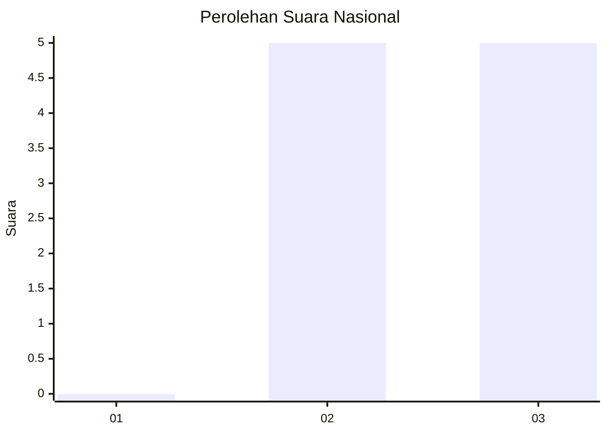
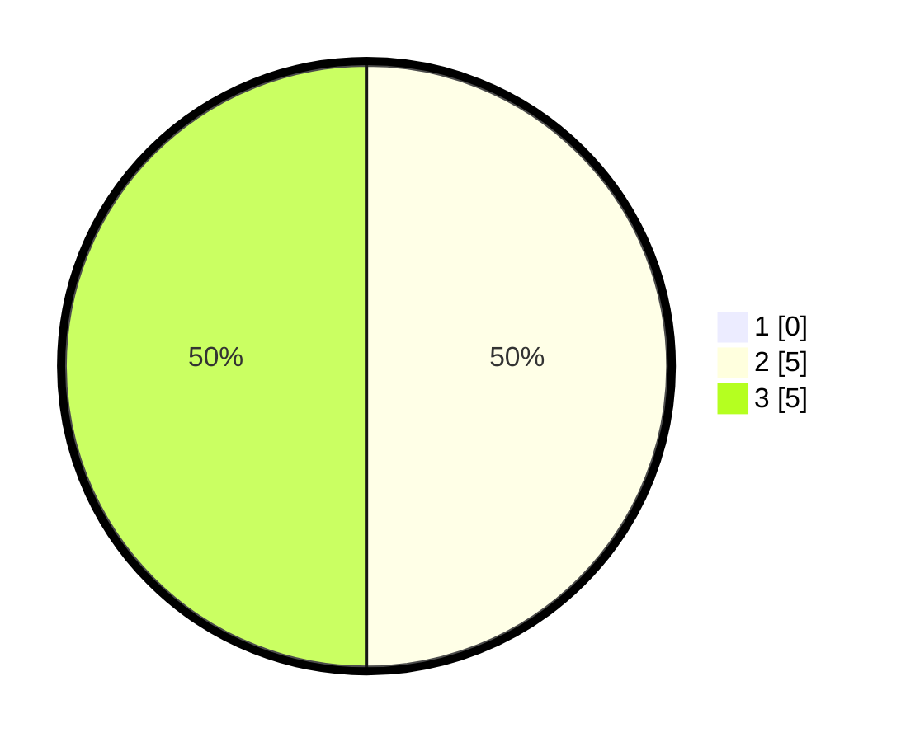

# Hasil

## Grafik

## Tabel

| No. | Nama Paslon    | Suara | Suara (raw) | Persentase |
|:--- |:-------------- | -----:| -----------:| ----------:|
| 1   | ANIES MUHAIMIN | 0     | [0][p-1]    | 0,00       |
| 2   | PRABOWO GIBRAN | 5     | [5][p-2]    | 50,00      |
| 3   | GANJAR MAHFUD  | 5     | [5][p-3]    | 50,00      |

[p-1]: https://github.com/gigit-pemilu/pemilu-2024/blob/main/pilpres/hitung-suara/sub/99-luar-negeri/sub/28-caracas-venezuela/sub/01-caracas-venezuela/sub/0001-caracas-venezuela/sub/002-pos-002/sub/paslon-1.txt
[p-2]: https://github.com/gigit-pemilu/pemilu-2024/blob/main/pilpres/hitung-suara/sub/99-luar-negeri/sub/28-caracas-venezuela/sub/01-caracas-venezuela/sub/0001-caracas-venezuela/sub/002-pos-002/sub/paslon-2.txt
[p-3]: https://github.com/gigit-pemilu/pemilu-2024/blob/main/pilpres/hitung-suara/sub/99-luar-negeri/sub/28-caracas-venezuela/sub/01-caracas-venezuela/sub/0001-caracas-venezuela/sub/002-pos-002/sub/paslon-3.txt

## Foto C Plano

https://sirekap-obj-formc.kpu.go.id/6331/pemilu/ppwp/99/28/01/00/01/9928010001002-20240217-081927--fc842d01-0386-4d44-938f-4b2b36f78938.jpg

https://sirekap-obj-formc.kpu.go.id/6331/pemilu/ppwp/99/28/01/00/01/9928010001002-20240217-082003--3d6928a7-c2a9-4415-959a-6972b2590f50.jpg

https://sirekap-obj-formc.kpu.go.id/6331/pemilu/ppwp/99/28/01/00/01/9928010001002-20240217-094011--ca0a3922-5cd0-4411-afec-f50ae7c3aa48.jpg

## Metadata

| Key        | Value               |
| ---------- | ------------------- |
| Time Stamp | 2024-02-17 10:00:02 |

## DATA PEMILIH TETAP

Jumlah pemilih dalam DPT: **12**.
 * L: **6**.
 * P: **6**.

## DATA PENGGUNA HAK PILIH

Jumlah pengguna hak pilih dalam DPT: **9**.
 * L: **4**.
 * P: **5**.

Jumlah pengguna hak pilih dalam DPTb: **1**.
 * L: **0**.
 * P: **1**.

Jumlah pengguna hak pilih dalam DPK: **0**.
 * L: **0**.
 * P: **0**.

Jumlah pengguna hak pilih: **10**.
 * L: **4**.
 * P: **6**.

## JUMLAH SUARA SAH DAN TIDAK SAH

JUMLAH SELURUH SUARA SAH: **10**.

JUMLAH SUARA TIDAK SAH: **0**.

JUMLAH SELURUH SUARA SAH DAN SUARA TIDAK SAH: **10**.

