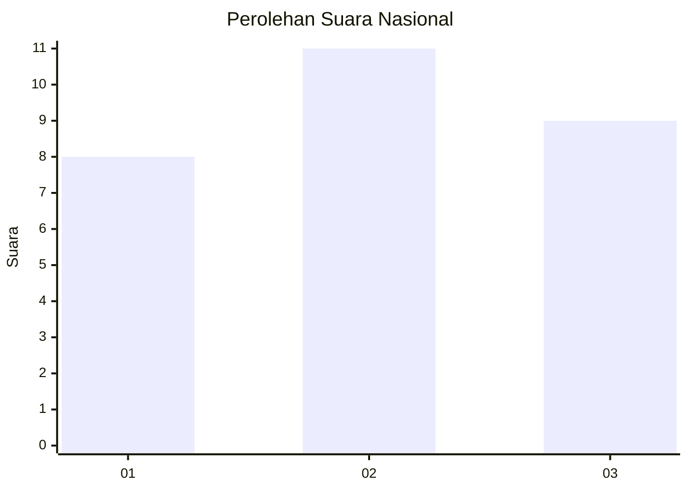
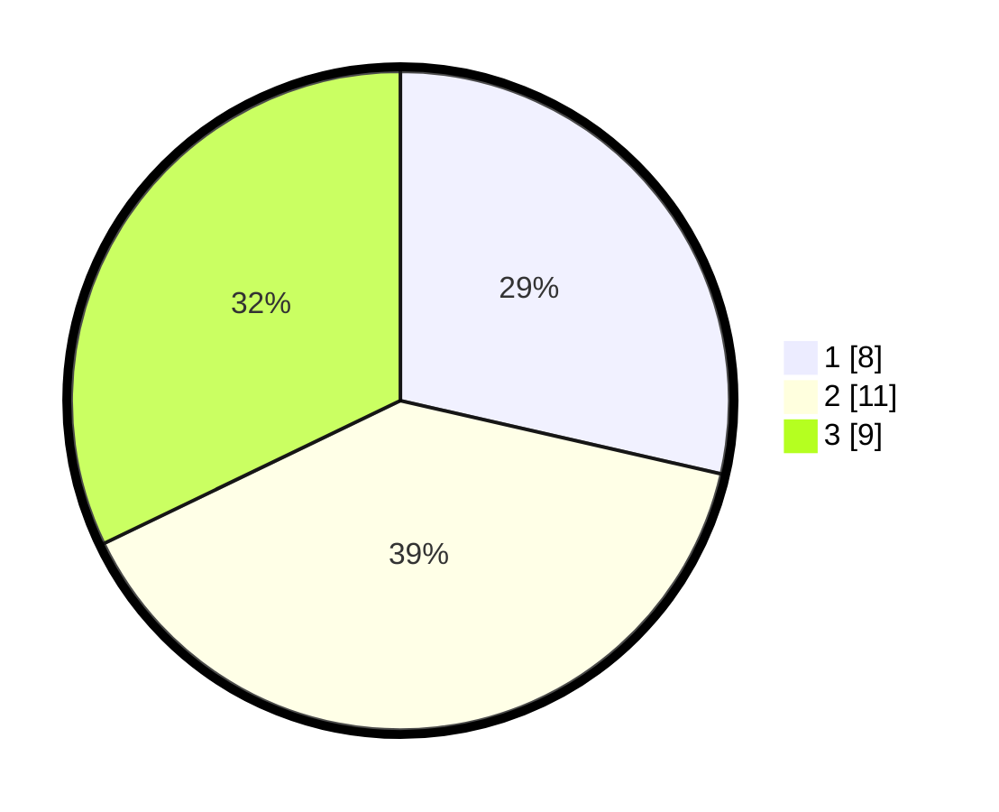

# Hasil

## Grafik

## Tabel

| No. | Nama Paslon    | Suara | Suara (raw) | Persentase |
|:--- |:-------------- | -----:| -----------:| ----------:|
| 1   | ANIES MUHAIMIN | 8     | [8][p-1]    | 28,57      |
| 2   | PRABOWO GIBRAN | 11    | [11][p-2]   | 39,29      |
| 3   | GANJAR MAHFUD  | 9     | [9][p-3]    | 32,14      |

[p-1]: https://github.com/gigit-pemilu/pemilu-2024/blob/main/pilpres/hitung-suara/sub/99-luar-negeri/sub/28-caracas-venezuela/sub/01-caracas-venezuela/sub/0001-caracas-venezuela/sub/003-tps-001/sub/paslon-1.txt
[p-2]: https://github.com/gigit-pemilu/pemilu-2024/blob/main/pilpres/hitung-suara/sub/99-luar-negeri/sub/28-caracas-venezuela/sub/01-caracas-venezuela/sub/0001-caracas-venezuela/sub/003-tps-001/sub/paslon-2.txt
[p-3]: https://github.com/gigit-pemilu/pemilu-2024/blob/main/pilpres/hitung-suara/sub/99-luar-negeri/sub/28-caracas-venezuela/sub/01-caracas-venezuela/sub/0001-caracas-venezuela/sub/003-tps-001/sub/paslon-3.txt

## Foto C Plano

https://sirekap-obj-formc.kpu.go.id/aa6a/pemilu/ppwp/99/28/01/00/01/9928010001003-20240215-031645--ae108f09-d470-48dc-8113-381b95768f36.jpg

https://sirekap-obj-formc.kpu.go.id/aa6a/pemilu/ppwp/99/28/01/00/01/9928010001003-20240215-014538--ecc9e852-0faf-4938-bf75-34311e42d33b.jpg

https://sirekap-obj-formc.kpu.go.id/aa6a/pemilu/ppwp/99/28/01/00/01/9928010001003-20240215-014609--4780f720-abf6-4c91-afdd-b2799b1ef463.jpg

## Metadata

| Key        | Value               |
| ---------- | ------------------- |
| Time Stamp | 2024-02-17 19:30:00 |

## DATA PEMILIH TETAP

Jumlah pemilih dalam DPT: **26**.
 * L: **14**.
 * P: **12**.

## DATA PENGGUNA HAK PILIH

Jumlah pengguna hak pilih dalam DPT: **19**.
 * L: **12**.
 * P: **7**.

Jumlah pengguna hak pilih dalam DPTb: **7**.
 * L: **5**.
 * P: **2**.

Jumlah pengguna hak pilih dalam DPK: **2**.
 * L: **1**.
 * P: **1**.

Jumlah pengguna hak pilih: **28**.
 * L: **18**.
 * P: **10**.

## JUMLAH SUARA SAH DAN TIDAK SAH

JUMLAH SELURUH SUARA SAH: **28**.

JUMLAH SUARA TIDAK SAH: **0**.

JUMLAH SELURUH SUARA SAH DAN SUARA TIDAK SAH: **28**.

