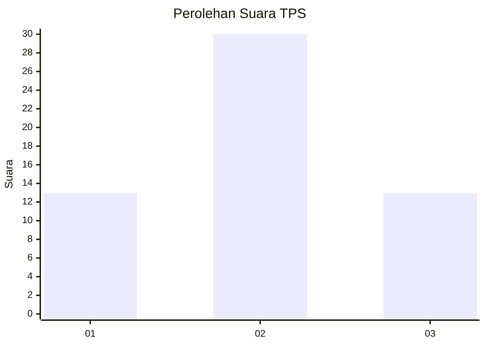
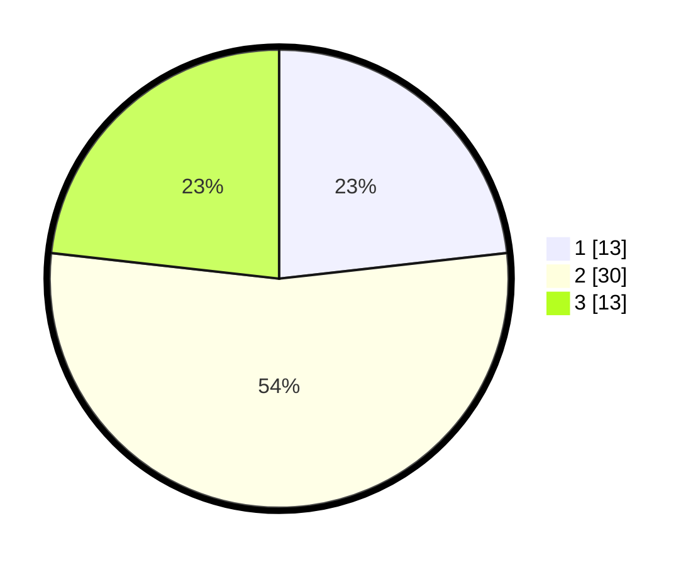

# Hasil

## Grafik

## Tabel

| No. | Nama Paslon    | Suara | Suara (raw) | Persentase |
|:--- |:-------------- | -----:| -----------:| ----------:|
| 1   | ANIES MUHAIMIN | 13    | [13][p-1]   | 23,21      |
| 2   | PRABOWO GIBRAN | 30    | [30][p-2]   | 53,57      |
| 3   | GANJAR MAHFUD  | 13    | [13][p-3]   | 23,21      |

[p-1]: https://github.com/gigit-pemilu/pemilu-2024-99-luar-negeri/blob/main/pilpres/hitung-suara/sub/99-luar-negeri/sub/28-caracas-venezuela/sub/01-caracas-venezuela/sub/0001-caracas-venezuela/sub/004-ksk-001/sub/paslon-1.txt
[p-2]: https://github.com/gigit-pemilu/pemilu-2024-99-luar-negeri/blob/main/pilpres/hitung-suara/sub/99-luar-negeri/sub/28-caracas-venezuela/sub/01-caracas-venezuela/sub/0001-caracas-venezuela/sub/004-ksk-001/sub/paslon-2.txt
[p-3]: https://github.com/gigit-pemilu/pemilu-2024-99-luar-negeri/blob/main/pilpres/hitung-suara/sub/99-luar-negeri/sub/28-caracas-venezuela/sub/01-caracas-venezuela/sub/0001-caracas-venezuela/sub/004-ksk-001/sub/paslon-3.txt

## Foto C Plano

https://sirekap-obj-formc.kpu.go.id/4b4b/pemilu/ppwp/99/28/01/00/01/9928010001004-20240216-041616--09f804d3-ce53-4994-848a-eac59b2cbd84.jpg

https://sirekap-obj-formc.kpu.go.id/4b4b/pemilu/ppwp/99/28/01/00/01/9928010001004-20240216-041632--958d9159-6b09-4472-b364-7d2cba8d0340.jpg

https://sirekap-obj-formc.kpu.go.id/4b4b/pemilu/ppwp/99/28/01/00/01/9928010001004-20240216-041623--b05515f4-438f-45dc-8a70-af36e7643ceb.jpg

## Metadata

| Key        | Value               |
| ---------- | ------------------- |
| Time Stamp | 2024-02-16 13:30:32 |

## DATA PEMILIH TETAP

Jumlah pemilih dalam DPT: **54**.
 * L: **43**.
 * P: **11**.

## DATA PENGGUNA HAK PILIH

Jumlah pengguna hak pilih dalam DPT: **28**.
 * L: **19**.
 * P: **9**.

Jumlah pengguna hak pilih dalam DPTb: **6**.
 * L: **6**.
 * P: **0**.

Jumlah pengguna hak pilih dalam DPK: **23**.
 * L: **22**.
 * P: **1**.

Jumlah pengguna hak pilih: **57**.
 * L: **47**.
 * P: **10**.

## JUMLAH SUARA SAH DAN TIDAK SAH

JUMLAH SELURUH SUARA SAH: **56**.

JUMLAH SUARA TIDAK SAH: **1**.

JUMLAH SELURUH SUARA SAH DAN SUARA TIDAK SAH: **57**.

