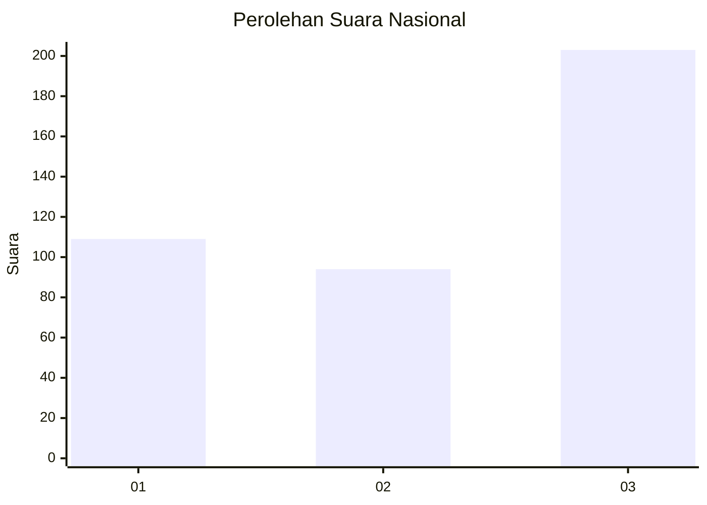
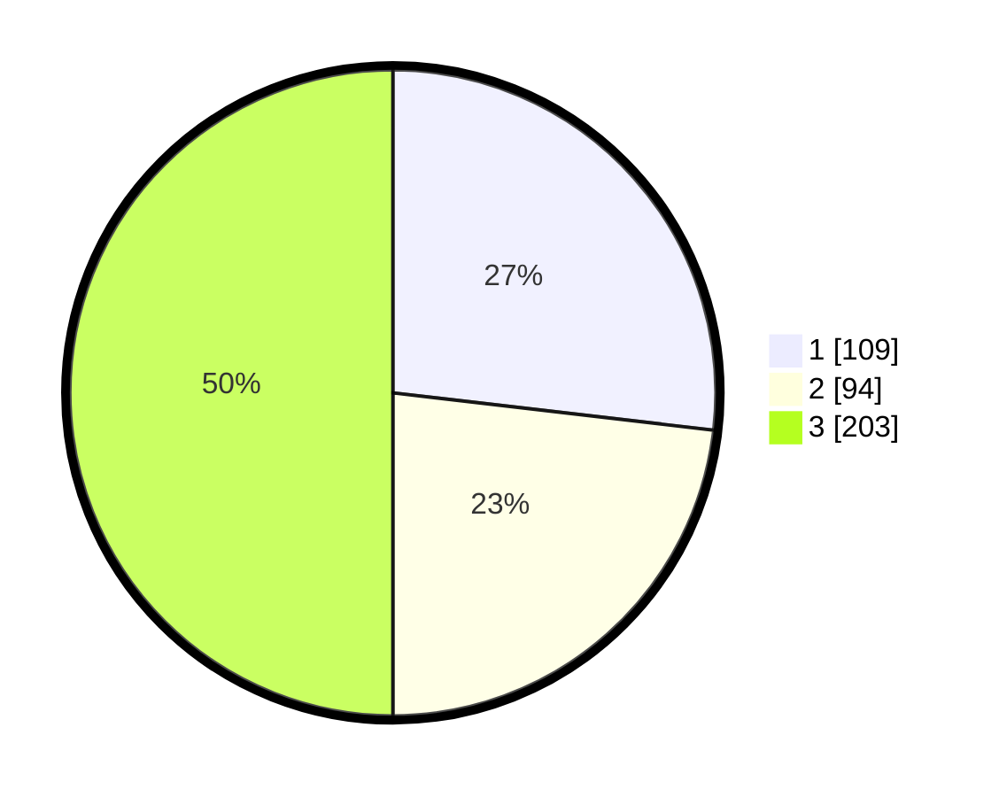

# Hasil

## Grafik

## Tabel

| No. | Nama Paslon    | Suara | Suara (raw) | Persentase |
|:--- |:-------------- | -----:| -----------:| ----------:|
| 1   | ANIES MUHAIMIN | 109   | [109][p-1]  | 26,85      |
| 2   | PRABOWO GIBRAN | 94    | [94][p-2]   | 23,15      |
| 3   | GANJAR MAHFUD  | 203   | [203][p-3]  | 50,00      |

[p-1]: https://github.com/gigit-pemilu/pemilu-2024/blob/main/pilpres/hitung-suara/sub/99-luar-negeri/sub/29-chicago-amerika-serikat/sub/01-chicago-amerika-serikat/sub/0001-chicago-amerika-serikat/sub/001-pos-001/sub/paslon-1.txt
[p-2]: https://github.com/gigit-pemilu/pemilu-2024/blob/main/pilpres/hitung-suara/sub/99-luar-negeri/sub/29-chicago-amerika-serikat/sub/01-chicago-amerika-serikat/sub/0001-chicago-amerika-serikat/sub/001-pos-001/sub/paslon-2.txt
[p-3]: https://github.com/gigit-pemilu/pemilu-2024/blob/main/pilpres/hitung-suara/sub/99-luar-negeri/sub/29-chicago-amerika-serikat/sub/01-chicago-amerika-serikat/sub/0001-chicago-amerika-serikat/sub/001-pos-001/sub/paslon-3.txt

## Foto C Plano

https://sirekap-obj-formc.kpu.go.id/ea48/pemilu/ppwp/99/29/01/00/01/9929010001001-20240216-103329--3398667d-9394-4d24-bed5-564e22f7c368.jpg

https://sirekap-obj-formc.kpu.go.id/ea48/pemilu/ppwp/99/29/01/00/01/9929010001001-20240216-092312--25ef8dac-d053-44a4-be1c-8517e23521d7.jpg

https://sirekap-obj-formc.kpu.go.id/ea48/pemilu/ppwp/99/29/01/00/01/9929010001001-20240216-092305--394c5066-5a1e-4222-9122-3152141bd0c7.jpg

## Metadata

| Key        | Value               |
| ---------- | ------------------- |
| Time Stamp | 2024-02-16 13:30:32 |

## DATA PEMILIH TETAP

Jumlah pemilih dalam DPT: **519**.
 * L: **202**.
 * P: **317**.

## DATA PENGGUNA HAK PILIH

Jumlah pengguna hak pilih dalam DPT: **519**.
 * L: **202**.
 * P: **317**.

Jumlah pengguna hak pilih dalam DPTb: **0**.
 * L: **0**.
 * P: **0**.

Jumlah pengguna hak pilih dalam DPK: **0**.
 * L: **0**.
 * P: **0**.

Jumlah pengguna hak pilih: **519**.
 * L: **202**.
 * P: **317**.

## JUMLAH SUARA SAH DAN TIDAK SAH

JUMLAH SELURUH SUARA SAH: **406**.

JUMLAH SUARA TIDAK SAH: **18**.

JUMLAH SELURUH SUARA SAH DAN SUARA TIDAK SAH: **424**.

