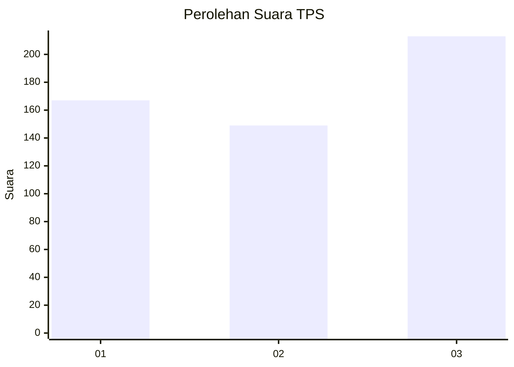
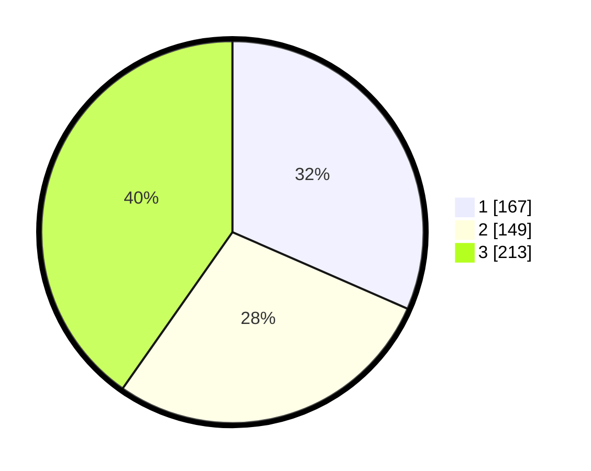

# Hasil

## Grafik

## Tabel

| No. | Nama Paslon    | Suara | Suara (raw) | Persentase |
|:--- |:-------------- | -----:| -----------:| ----------:|
| 1   | ANIES MUHAIMIN | 167   | [167][p-1]  | 31,57      |
| 2   | PRABOWO GIBRAN | 149   | [149][p-2]  | 28,17      |
| 3   | GANJAR MAHFUD  | 213   | [213][p-3]  | 40,26      |

[p-1]: https://github.com/gigit-pemilu/pemilu-2024-99-luar-negeri/blob/main/pilpres/hitung-suara/sub/99-luar-negeri/sub/29-chicago-amerika-serikat/sub/01-chicago-amerika-serikat/sub/0001-chicago-amerika-serikat/sub/002-tps-001/sub/paslon-1.txt
[p-2]: https://github.com/gigit-pemilu/pemilu-2024-99-luar-negeri/blob/main/pilpres/hitung-suara/sub/99-luar-negeri/sub/29-chicago-amerika-serikat/sub/01-chicago-amerika-serikat/sub/0001-chicago-amerika-serikat/sub/002-tps-001/sub/paslon-2.txt
[p-3]: https://github.com/gigit-pemilu/pemilu-2024-99-luar-negeri/blob/main/pilpres/hitung-suara/sub/99-luar-negeri/sub/29-chicago-amerika-serikat/sub/01-chicago-amerika-serikat/sub/0001-chicago-amerika-serikat/sub/002-tps-001/sub/paslon-3.txt

## Foto C Plano

https://sirekap-obj-formc.kpu.go.id/2499/pemilu/ppwp/99/29/01/00/01/9929010001002-20240216-101552--e90bd59e-9298-419a-9763-dd13fe1dda73.jpg

https://sirekap-obj-formc.kpu.go.id/2499/pemilu/ppwp/99/29/01/00/01/9929010001002-20240216-101554--28bf4a1d-1132-4dc1-afee-261f1d20d49f.jpg

https://sirekap-obj-formc.kpu.go.id/2499/pemilu/ppwp/99/29/01/00/01/9929010001002-20240216-101553--7421ed14-ed62-4bd3-bbb7-0af7ce7162c6.jpg

## Metadata

| Key        | Value               |
| ---------- | ------------------- |
| Time Stamp | 2024-02-16 13:30:32 |

## DATA PEMILIH TETAP

Jumlah pemilih dalam DPT: **2644**.
 * L: **1229**.
 * P: **1415**.

## DATA PENGGUNA HAK PILIH

Jumlah pengguna hak pilih dalam DPT: **217**.
 * L: **102**.
 * P: **115**.

Jumlah pengguna hak pilih dalam DPTb: **141**.
 * L: **64**.
 * P: **77**.

Jumlah pengguna hak pilih dalam DPK: **177**.
 * L: **72**.
 * P: **105**.

Jumlah pengguna hak pilih: **535**.
 * L: **238**.
 * P: **297**.

## JUMLAH SUARA SAH DAN TIDAK SAH

JUMLAH SELURUH SUARA SAH: **529**.

JUMLAH SUARA TIDAK SAH: **6**.

JUMLAH SELURUH SUARA SAH DAN SUARA TIDAK SAH: **535**.

