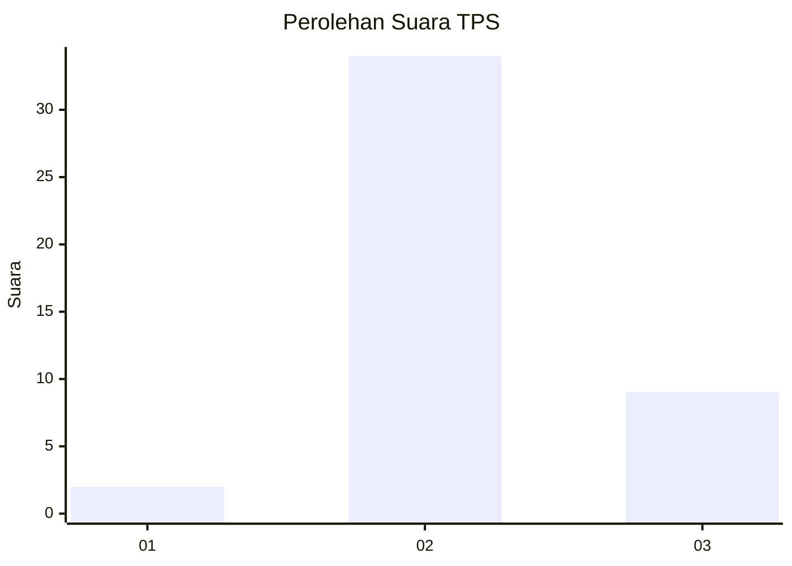

# Hasil

## Grafik

## Tabel

| No. | Nama Paslon    | Suara | Suara (raw) | Persentase |
|:--- |:-------------- | -----:| -----------:| ----------:|
| 1   | ANIES MUHAIMIN | 2     | [2][p-1]    | 4,44       |
| 2   | PRABOWO GIBRAN | 34    | [34][p-2]   | 75,56      |
| 3   | GANJAR MAHFUD  | 9     | [9][p-3]    | 20,00      |

[p-1]: https://github.com/gigit-pemilu/pemilu-2024-99-luar-negeri/blob/main/pilpres/hitung-suara/sub/99-luar-negeri/sub/30-colombo-sri-langka/sub/01-colombo-sri-langka/sub/0001-colombo-sri-langka/sub/001-pos-001/sub/paslon-1.txt
[p-2]: https://github.com/gigit-pemilu/pemilu-2024-99-luar-negeri/blob/main/pilpres/hitung-suara/sub/99-luar-negeri/sub/30-colombo-sri-langka/sub/01-colombo-sri-langka/sub/0001-colombo-sri-langka/sub/001-pos-001/sub/paslon-2.txt
[p-3]: https://github.com/gigit-pemilu/pemilu-2024-99-luar-negeri/blob/main/pilpres/hitung-suara/sub/99-luar-negeri/sub/30-colombo-sri-langka/sub/01-colombo-sri-langka/sub/0001-colombo-sri-langka/sub/001-pos-001/sub/paslon-3.txt

## Foto C Plano

https://sirekap-obj-formc.kpu.go.id/9121/pemilu/ppwp/99/30/01/00/01/9930010001001-20240222-131231--4f523a82-4e88-4b84-a83e-4cd2669e43cb.jpg

https://sirekap-obj-formc.kpu.go.id/9121/pemilu/ppwp/99/30/01/00/01/9930010001001-20240222-120524--1f82d8e5-dcf1-4ef7-a8e4-dc0595338fdf.jpg

https://sirekap-obj-formc.kpu.go.id/9121/pemilu/ppwp/99/30/01/00/01/9930010001001-20240222-120608--095ffe97-21a9-4fe1-ace8-952445af0130.jpg

## Metadata

| Key        | Value               |
| ---------- | ------------------- |
| Time Stamp | 2024-02-22 14:00:00 |

## DATA PEMILIH TETAP

Jumlah pemilih dalam DPT: **173**.
 * L: **18**.
 * P: **155**.

## DATA PENGGUNA HAK PILIH

Jumlah pengguna hak pilih dalam DPT: **47**.
 * L: **3**.
 * P: **44**.

Jumlah pengguna hak pilih dalam DPTb: **5**.
 * L: **0**.
 * P: **5**.

Jumlah pengguna hak pilih dalam DPK: **0**.
 * L: **0**.
 * P: **0**.

Jumlah pengguna hak pilih: **52**.
 * L: **3**.
 * P: **49**.

## JUMLAH SUARA SAH DAN TIDAK SAH

JUMLAH SELURUH SUARA SAH: **45**.

JUMLAH SUARA TIDAK SAH: **7**.

JUMLAH SELURUH SUARA SAH DAN SUARA TIDAK SAH: **52**.

