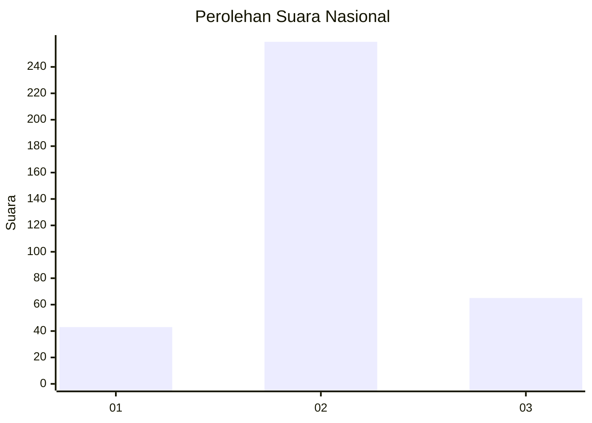
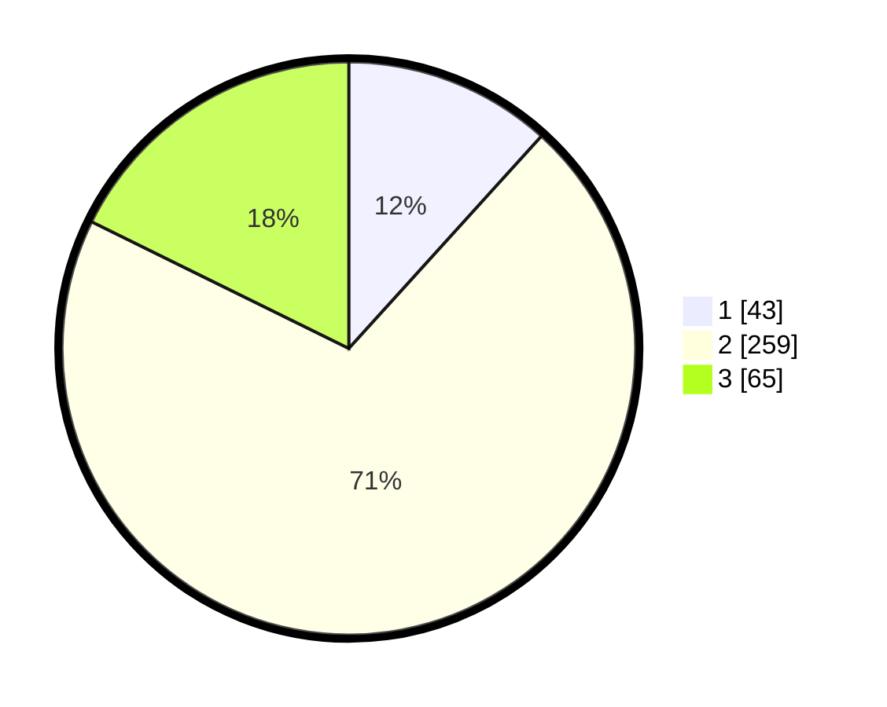

# Hasil

## Grafik

## Tabel

| No. | Nama Paslon    | Suara | Suara (raw) | Persentase |
|:--- |:-------------- | -----:| -----------:| ----------:|
| 1   | ANIES MUHAIMIN | 43    | [43][p-1]   | 11,72      |
| 2   | PRABOWO GIBRAN | 259   | [259][p-2]  | 70,57      |
| 3   | GANJAR MAHFUD  | 65    | [65][p-3]   | 17,71      |

[p-1]: https://github.com/gigit-pemilu/pemilu-2024/blob/main/pilpres/hitung-suara/sub/99-luar-negeri/sub/30-colombo-sri-langka/sub/01-colombo-sri-langka/sub/0001-colombo-sri-langka/sub/002-pos-002/sub/paslon-1.txt
[p-2]: https://github.com/gigit-pemilu/pemilu-2024/blob/main/pilpres/hitung-suara/sub/99-luar-negeri/sub/30-colombo-sri-langka/sub/01-colombo-sri-langka/sub/0001-colombo-sri-langka/sub/002-pos-002/sub/paslon-2.txt
[p-3]: https://github.com/gigit-pemilu/pemilu-2024/blob/main/pilpres/hitung-suara/sub/99-luar-negeri/sub/30-colombo-sri-langka/sub/01-colombo-sri-langka/sub/0001-colombo-sri-langka/sub/002-pos-002/sub/paslon-3.txt

## Foto C Plano

https://sirekap-obj-formc.kpu.go.id/3604/pemilu/ppwp/99/30/01/00/01/9930010001002-20240222-180901--3b8279c8-b6a2-4602-a64d-a01237d52ffd.jpg

https://sirekap-obj-formc.kpu.go.id/3604/pemilu/ppwp/99/30/01/00/01/9930010001002-20240222-181220--50b89b40-ea96-4a8c-a4d5-955029b2b707.jpg

https://sirekap-obj-formc.kpu.go.id/3604/pemilu/ppwp/99/30/01/00/01/9930010001002-20240222-181324--fbb7277f-cc68-45e4-90f4-cd58c64e96c9.jpg

## Metadata

| Key        | Value               |
| ---------- | ------------------- |
| Time Stamp | 2024-02-22 19:00:00 |

## DATA PEMILIH TETAP

Jumlah pemilih dalam DPT: **2043**.
 * L: **779**.
 * P: **1264**.

## DATA PENGGUNA HAK PILIH

Jumlah pengguna hak pilih dalam DPT: **389**.
 * L: **113**.
 * P: **276**.

Jumlah pengguna hak pilih dalam DPTb: **5**.
 * L: **1**.
 * P: **4**.

Jumlah pengguna hak pilih dalam DPK: **0**.
 * L: **0**.
 * P: **0**.

Jumlah pengguna hak pilih: **394**.
 * L: **114**.
 * P: **280**.

## JUMLAH SUARA SAH DAN TIDAK SAH

JUMLAH SELURUH SUARA SAH: **367**.

JUMLAH SUARA TIDAK SAH: **27**.

JUMLAH SELURUH SUARA SAH DAN SUARA TIDAK SAH: **394**.

