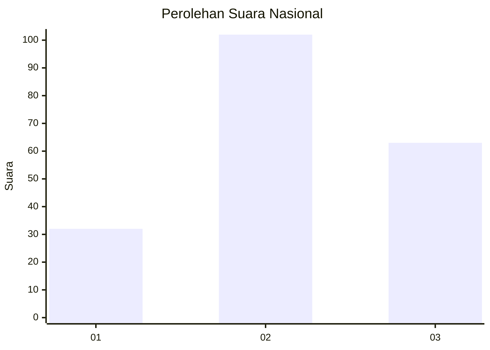
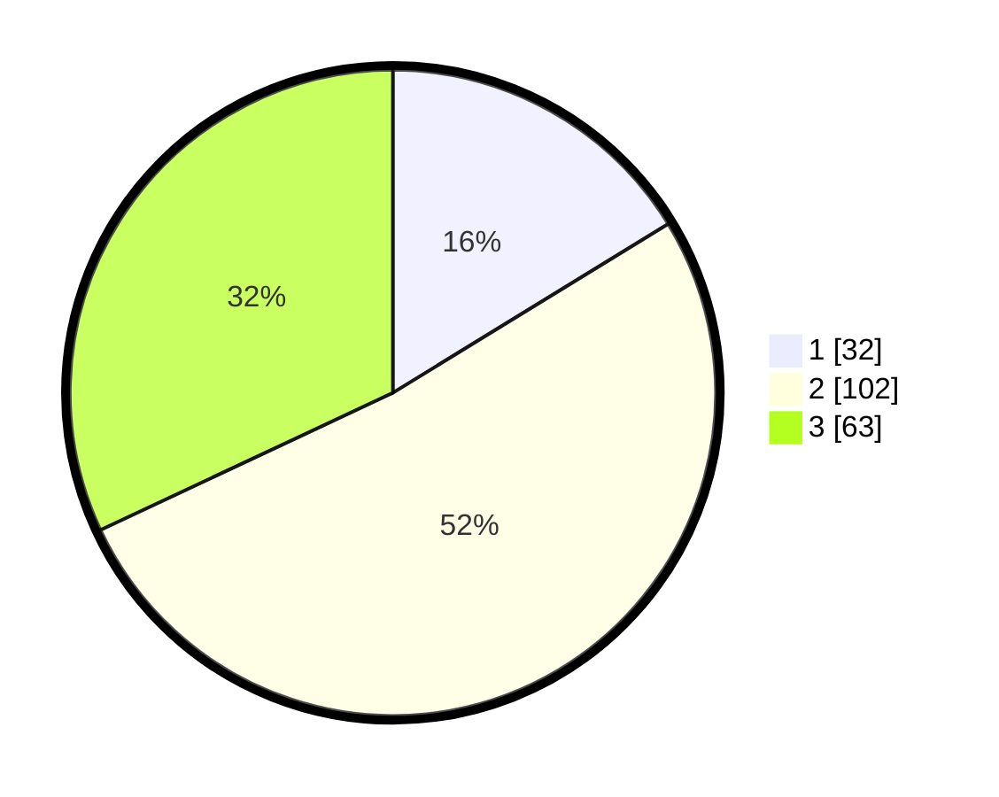

# Hasil

## Grafik

## Tabel

| No. | Nama Paslon    | Suara | Suara (raw) | Persentase |
|:--- |:-------------- | -----:| -----------:| ----------:|
| 1   | ANIES MUHAIMIN | 32    | [32][p-1]   | 16,24      |
| 2   | PRABOWO GIBRAN | 102   | [102][p-2]  | 51,78      |
| 3   | GANJAR MAHFUD  | 63    | [63][p-3]   | 31,98      |

[p-1]: https://github.com/gigit-pemilu/pemilu-2024/blob/main/pilpres/hitung-suara/sub/99-luar-negeri/sub/30-colombo-sri-langka/sub/01-colombo-sri-langka/sub/0001-colombo-sri-langka/sub/003-tps-001/sub/paslon-1.txt
[p-2]: https://github.com/gigit-pemilu/pemilu-2024/blob/main/pilpres/hitung-suara/sub/99-luar-negeri/sub/30-colombo-sri-langka/sub/01-colombo-sri-langka/sub/0001-colombo-sri-langka/sub/003-tps-001/sub/paslon-2.txt
[p-3]: https://github.com/gigit-pemilu/pemilu-2024/blob/main/pilpres/hitung-suara/sub/99-luar-negeri/sub/30-colombo-sri-langka/sub/01-colombo-sri-langka/sub/0001-colombo-sri-langka/sub/003-tps-001/sub/paslon-3.txt

## Foto C Plano

https://sirekap-obj-formc.kpu.go.id/6a11/pemilu/ppwp/99/30/01/00/01/9930010001003-20240214-194528--5da79240-9295-43ce-b6d6-c31d18d54d71.jpg

https://sirekap-obj-formc.kpu.go.id/6a11/pemilu/ppwp/99/30/01/00/01/9930010001003-20240214-194546--6febc87d-1f5b-4000-9e03-fdf4261a0fdb.jpg

https://sirekap-obj-formc.kpu.go.id/6a11/pemilu/ppwp/99/30/01/00/01/9930010001003-20240214-194612--ee9914f5-7a23-470c-a3d8-f2dcca5d0ba6.jpg

## Metadata

| Key        | Value               |
| ---------- | ------------------- |
| Time Stamp | 2024-02-14 21:46:01 |

## DATA PEMILIH TETAP

Jumlah pemilih dalam DPT: **268**.
 * L: **91**.
 * P: **177**.

## DATA PENGGUNA HAK PILIH

Jumlah pengguna hak pilih dalam DPT: **147**.
 * L: **51**.
 * P: **96**.

Jumlah pengguna hak pilih dalam DPTb: **43**.
 * L: **17**.
 * P: **26**.

Jumlah pengguna hak pilih dalam DPK: **11**.
 * L: **5**.
 * P: **6**.

Jumlah pengguna hak pilih: **201**.
 * L: **73**.
 * P: **128**.

## JUMLAH SUARA SAH DAN TIDAK SAH

JUMLAH SELURUH SUARA SAH: **197**.

JUMLAH SUARA TIDAK SAH: **4**.

JUMLAH SELURUH SUARA SAH DAN SUARA TIDAK SAH: **201**.

