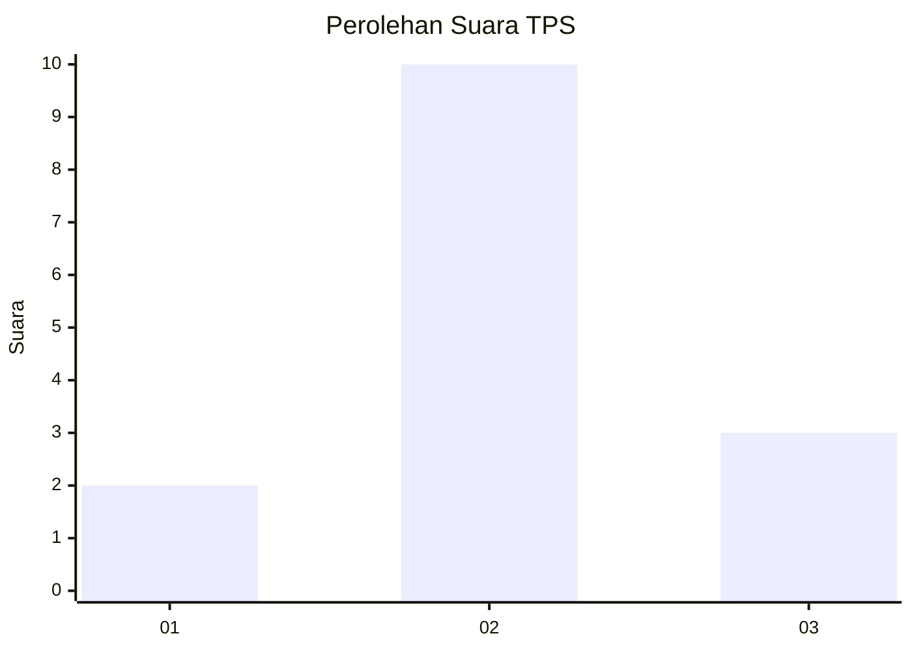
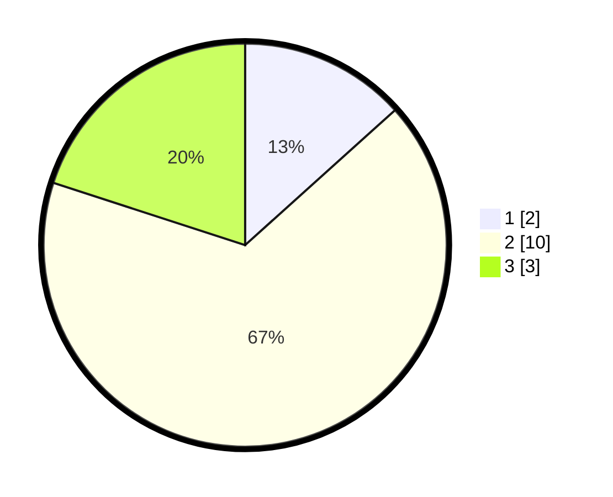

# Hasil

## Grafik

## Tabel

| No. | Nama Paslon    | Suara | Suara (raw) | Persentase |
|:--- |:-------------- | -----:| -----------:| ----------:|
| 1   | ANIES MUHAIMIN | 2     | [2][p-1]    | 13,33      |
| 2   | PRABOWO GIBRAN | 10    | [10][p-2]   | 66,67      |
| 3   | GANJAR MAHFUD  | 3     | [3][p-3]    | 20,00      |

[p-1]: https://github.com/gigit-pemilu/pemilu-2024-99-luar-negeri/blob/main/pilpres/hitung-suara/sub/99-luar-negeri/sub/31-dakar-senegal/sub/01-dakar-senegal/sub/0001-dakar-senegal/sub/001-pos-001/sub/paslon-1.txt
[p-2]: https://github.com/gigit-pemilu/pemilu-2024-99-luar-negeri/blob/main/pilpres/hitung-suara/sub/99-luar-negeri/sub/31-dakar-senegal/sub/01-dakar-senegal/sub/0001-dakar-senegal/sub/001-pos-001/sub/paslon-2.txt
[p-3]: https://github.com/gigit-pemilu/pemilu-2024-99-luar-negeri/blob/main/pilpres/hitung-suara/sub/99-luar-negeri/sub/31-dakar-senegal/sub/01-dakar-senegal/sub/0001-dakar-senegal/sub/001-pos-001/sub/paslon-3.txt

## Foto C Plano

https://sirekap-obj-formc.kpu.go.id/1653/pemilu/ppwp/99/31/01/00/01/9931010001001-20240216-061935--a7588a6b-68d6-4246-9f25-429a894ea20a.jpg

https://sirekap-obj-formc.kpu.go.id/1653/pemilu/ppwp/99/31/01/00/01/9931010001001-20240216-061942--8bc66cc2-f7f3-40da-b227-09be9c5d75ef.jpg

https://sirekap-obj-formc.kpu.go.id/1653/pemilu/ppwp/99/31/01/00/01/9931010001001-20240216-061936--58c10ffd-b027-4f19-958c-3a8e6f34c481.jpg

## Metadata

| Key        | Value               |
| ---------- | ------------------- |
| Time Stamp | 2024-02-16 13:30:32 |

## DATA PEMILIH TETAP

Jumlah pemilih dalam DPT: **21**.
 * L: **9**.
 * P: **12**.

## DATA PENGGUNA HAK PILIH

Jumlah pengguna hak pilih dalam DPT: **15**.
 * L: **5**.
 * P: **10**.

Jumlah pengguna hak pilih dalam DPTb: **0**.
 * L: **0**.
 * P: **0**.

Jumlah pengguna hak pilih dalam DPK: **0**.
 * L: **0**.
 * P: **0**.

Jumlah pengguna hak pilih: **15**.
 * L: **5**.
 * P: **10**.

## JUMLAH SUARA SAH DAN TIDAK SAH

JUMLAH SELURUH SUARA SAH: **15**.

JUMLAH SUARA TIDAK SAH: **0**.

JUMLAH SELURUH SUARA SAH DAN SUARA TIDAK SAH: **15**.

