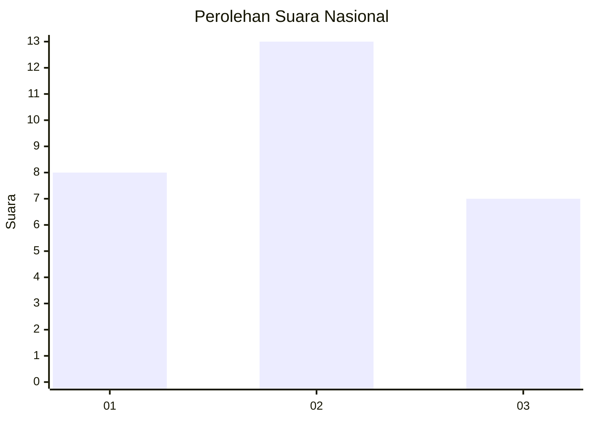
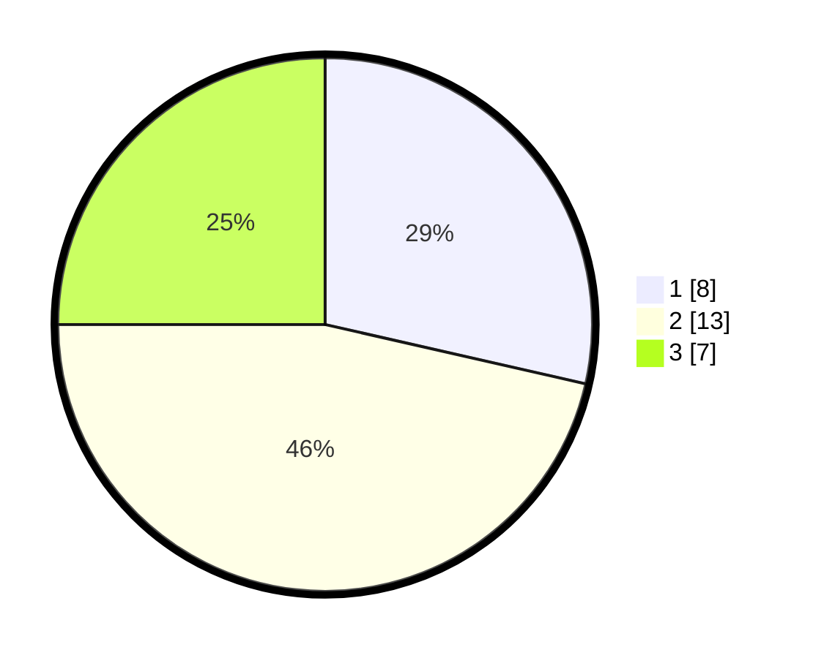

# Hasil

## Grafik

## Tabel

| No. | Nama Paslon    | Suara | Suara (raw) | Persentase |
|:--- |:-------------- | -----:| -----------:| ----------:|
| 1   | ANIES MUHAIMIN | 8     | [8][p-1]    | 28,57      |
| 2   | PRABOWO GIBRAN | 13    | [13][p-2]   | 46,43      |
| 3   | GANJAR MAHFUD  | 7     | [7][p-3]    | 25,00      |

[p-1]: https://github.com/gigit-pemilu/pemilu-2024/blob/main/pilpres/hitung-suara/sub/99-luar-negeri/sub/31-dakar-senegal/sub/01-dakar-senegal/sub/0001-dakar-senegal/sub/002-tps-001/sub/paslon-1.txt
[p-2]: https://github.com/gigit-pemilu/pemilu-2024/blob/main/pilpres/hitung-suara/sub/99-luar-negeri/sub/31-dakar-senegal/sub/01-dakar-senegal/sub/0001-dakar-senegal/sub/002-tps-001/sub/paslon-2.txt
[p-3]: https://github.com/gigit-pemilu/pemilu-2024/blob/main/pilpres/hitung-suara/sub/99-luar-negeri/sub/31-dakar-senegal/sub/01-dakar-senegal/sub/0001-dakar-senegal/sub/002-tps-001/sub/paslon-3.txt

## Foto C Plano

https://sirekap-obj-formc.kpu.go.id/5bf8/pemilu/ppwp/99/31/01/00/01/9931010001002-20240216-030709--952700f2-c4dc-402d-ac63-15e07226e8b7.jpg

https://sirekap-obj-formc.kpu.go.id/5bf8/pemilu/ppwp/99/31/01/00/01/9931010001002-20240216-030800--c3952700-3ad0-48a1-9a5a-3dffdddac7d5.jpg

https://sirekap-obj-formc.kpu.go.id/5bf8/pemilu/ppwp/99/31/01/00/01/9931010001002-20240216-030835--24e9b2ff-4b46-4ada-8835-d2237241a721.jpg

## Metadata

| Key        | Value               |
| ---------- | ------------------- |
| Time Stamp | 2024-02-16 03:30:26 |

## DATA PEMILIH TETAP

Jumlah pemilih dalam DPT: **29**.
 * L: **18**.
 * P: **11**.

## DATA PENGGUNA HAK PILIH

Jumlah pengguna hak pilih dalam DPT: **9**.
 * L: **5**.
 * P: **4**.

Jumlah pengguna hak pilih dalam DPTb: **19**.
 * L: **14**.
 * P: **5**.

Jumlah pengguna hak pilih dalam DPK: **1**.
 * L: **1**.
 * P: **0**.

Jumlah pengguna hak pilih: **29**.
 * L: **20**.
 * P: **9**.

## JUMLAH SUARA SAH DAN TIDAK SAH

JUMLAH SELURUH SUARA SAH: **28**.

JUMLAH SUARA TIDAK SAH: **1**.

JUMLAH SELURUH SUARA SAH DAN SUARA TIDAK SAH: **29**.

