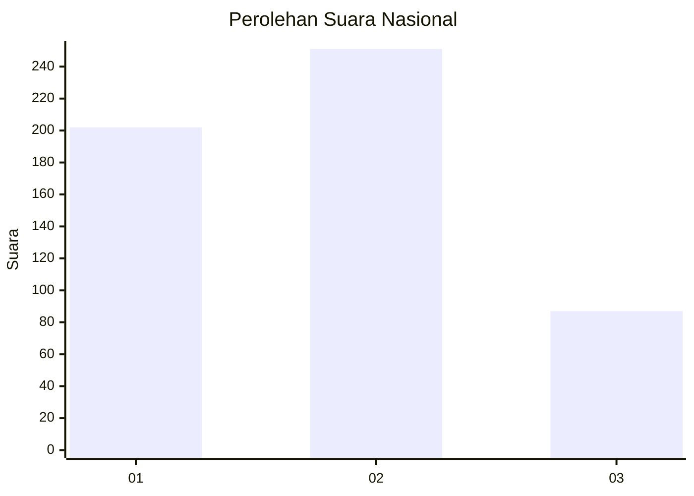
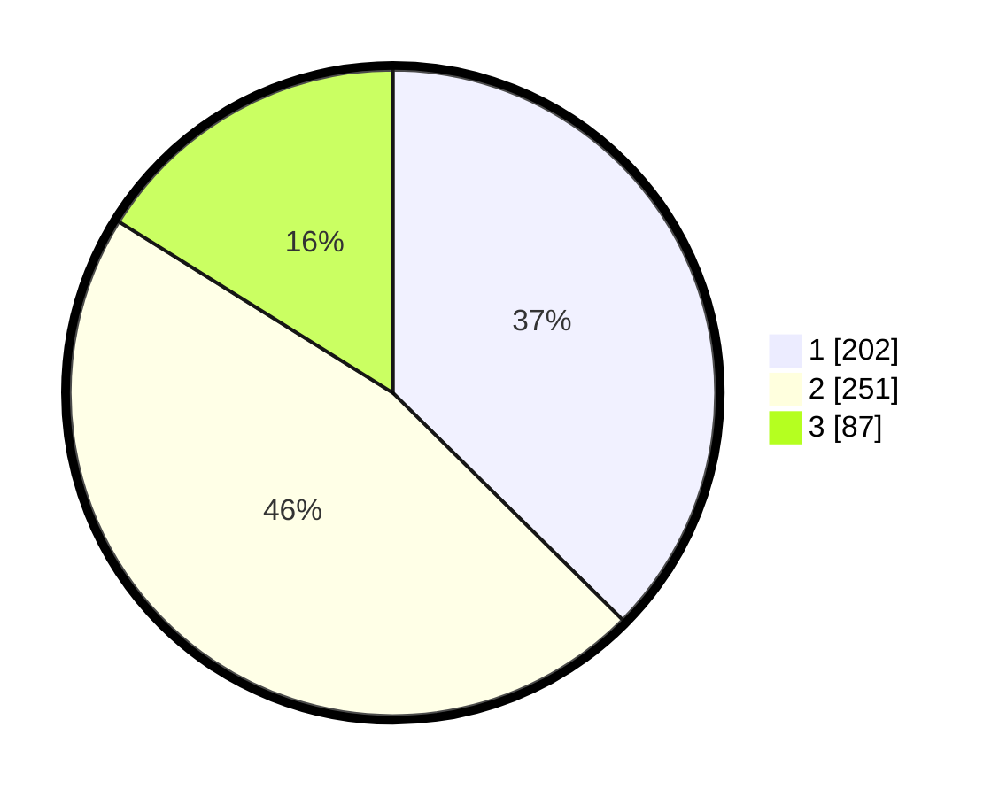

# Hasil

## Grafik

## Tabel

| No. | Nama Paslon    | Suara | Suara (raw) | Persentase |
|:--- |:-------------- | -----:| -----------:| ----------:|
| 1   | ANIES MUHAIMIN | 202   | [202][p-1]  | 37,41      |
| 2   | PRABOWO GIBRAN | 251   | [251][p-2]  | 46,48      |
| 3   | GANJAR MAHFUD  | 87    | [87][p-3]   | 16,11      |

[p-1]: https://github.com/gigit-pemilu/pemilu-2024/blob/main/pilpres/hitung-suara/sub/99-luar-negeri/sub/31-dakar-senegal/sub/01-dakar-senegal/sub/0001-dakar-senegal/sub/003-ksk-001/sub/paslon-1.txt
[p-2]: https://github.com/gigit-pemilu/pemilu-2024/blob/main/pilpres/hitung-suara/sub/99-luar-negeri/sub/31-dakar-senegal/sub/01-dakar-senegal/sub/0001-dakar-senegal/sub/003-ksk-001/sub/paslon-2.txt
[p-3]: https://github.com/gigit-pemilu/pemilu-2024/blob/main/pilpres/hitung-suara/sub/99-luar-negeri/sub/31-dakar-senegal/sub/01-dakar-senegal/sub/0001-dakar-senegal/sub/003-ksk-001/sub/paslon-3.txt

## Foto C Plano

https://sirekap-obj-formc.kpu.go.id/ef3e/pemilu/ppwp/99/31/01/00/01/9931010001003-20240216-024655--ed99e661-470e-4560-96d7-94c8c8c6b96d.jpg

https://sirekap-obj-formc.kpu.go.id/ef3e/pemilu/ppwp/99/31/01/00/01/9931010001003-20240216-024813--9a7a188d-6965-45bc-acb8-5f6ada23a631.jpg

https://sirekap-obj-formc.kpu.go.id/ef3e/pemilu/ppwp/99/31/01/00/01/9931010001003-20240216-024917--68ed3bca-a047-4dab-bcf2-3c7778834c56.jpg

## Metadata

| Key        | Value               |
| ---------- | ------------------- |
| Time Stamp | 2024-02-16 04:00:27 |

## DATA PEMILIH TETAP

Jumlah pemilih dalam DPT: **649**.
 * L: **646**.
 * P: **3**.

## DATA PENGGUNA HAK PILIH

Jumlah pengguna hak pilih dalam DPT: **448**.
 * L: **445**.
 * P: **3**.

Jumlah pengguna hak pilih dalam DPTb: **108**.
 * L: **108**.
 * P: **0**.

Jumlah pengguna hak pilih dalam DPK: **0**.
 * L: **0**.
 * P: **0**.

Jumlah pengguna hak pilih: **556**.
 * L: **553**.
 * P: **3**.

## JUMLAH SUARA SAH DAN TIDAK SAH

JUMLAH SELURUH SUARA SAH: **540**.

JUMLAH SUARA TIDAK SAH: **17**.

JUMLAH SELURUH SUARA SAH DAN SUARA TIDAK SAH: **557**.

