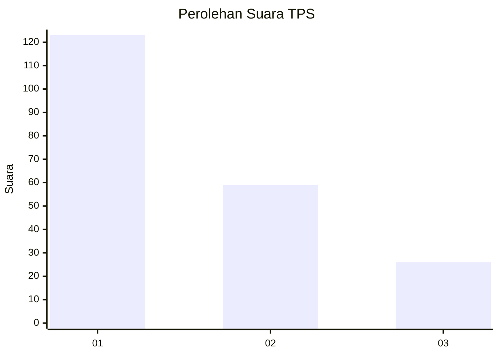
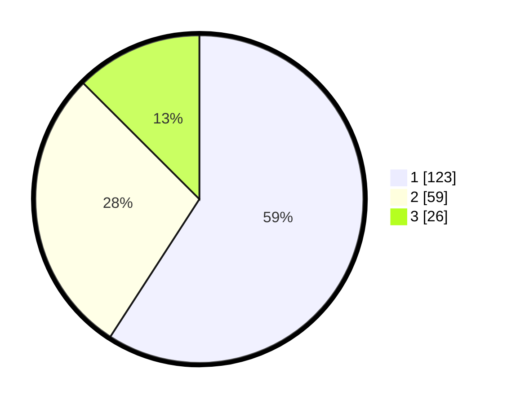

# Hasil

## Grafik

## Tabel

| No. | Nama Paslon    | Suara | Suara (raw) | Persentase |
|:--- |:-------------- | -----:| -----------:| ----------:|
| 1   | ANIES MUHAIMIN | 123   | [123][p-1]  | 59,13      |
| 2   | PRABOWO GIBRAN | 59    | [59][p-2]   | 28,37      |
| 3   | GANJAR MAHFUD  | 26    | [26][p-3]   | 12,50      |

[p-1]: https://github.com/gigit-pemilu/pemilu-2024-99-luar-negeri/blob/main/pilpres/hitung-suara/sub/99-luar-negeri/sub/32-damascus-suriah/sub/01-damascus-suriah/sub/0001-damascus-suriah/sub/001-tps/sub/paslon-1.txt
[p-2]: https://github.com/gigit-pemilu/pemilu-2024-99-luar-negeri/blob/main/pilpres/hitung-suara/sub/99-luar-negeri/sub/32-damascus-suriah/sub/01-damascus-suriah/sub/0001-damascus-suriah/sub/001-tps/sub/paslon-2.txt
[p-3]: https://github.com/gigit-pemilu/pemilu-2024-99-luar-negeri/blob/main/pilpres/hitung-suara/sub/99-luar-negeri/sub/32-damascus-suriah/sub/01-damascus-suriah/sub/0001-damascus-suriah/sub/001-tps/sub/paslon-3.txt

## Foto C Plano

https://sirekap-obj-formc.kpu.go.id/7bcc/pemilu/ppwp/99/32/01/00/01/9932010001001-20240214-221954--25d04ae4-2030-489f-ade5-9aab59331d99.jpg

https://sirekap-obj-formc.kpu.go.id/7bcc/pemilu/ppwp/99/32/01/00/01/9932010001001-20240215-163650--5a2df274-5ee1-40f3-92bd-d5b0374facfa.jpg

https://sirekap-obj-formc.kpu.go.id/7bcc/pemilu/ppwp/99/32/01/00/01/9932010001001-20240214-222111--faa1f8a4-89f5-4c85-89da-d525f000de45.jpg

## Metadata

| Key        | Value               |
| ---------- | ------------------- |
| Time Stamp | 2024-02-15 20:30:46 |

## DATA PEMILIH TETAP

Jumlah pemilih dalam DPT: **366**.
 * L: **139**.
 * P: **227**.

## DATA PENGGUNA HAK PILIH

Jumlah pengguna hak pilih dalam DPT: **152**.
 * L: **120**.
 * P: **32**.

Jumlah pengguna hak pilih dalam DPTb: **27**.
 * L: **22**.
 * P: **5**.

Jumlah pengguna hak pilih dalam DPK: **33**.
 * L: **1**.
 * P: **32**.

Jumlah pengguna hak pilih: **212**.
 * L: **143**.
 * P: **69**.

## JUMLAH SUARA SAH DAN TIDAK SAH

JUMLAH SELURUH SUARA SAH: **208**.

JUMLAH SUARA TIDAK SAH: **4**.

JUMLAH SELURUH SUARA SAH DAN SUARA TIDAK SAH: **212**.

