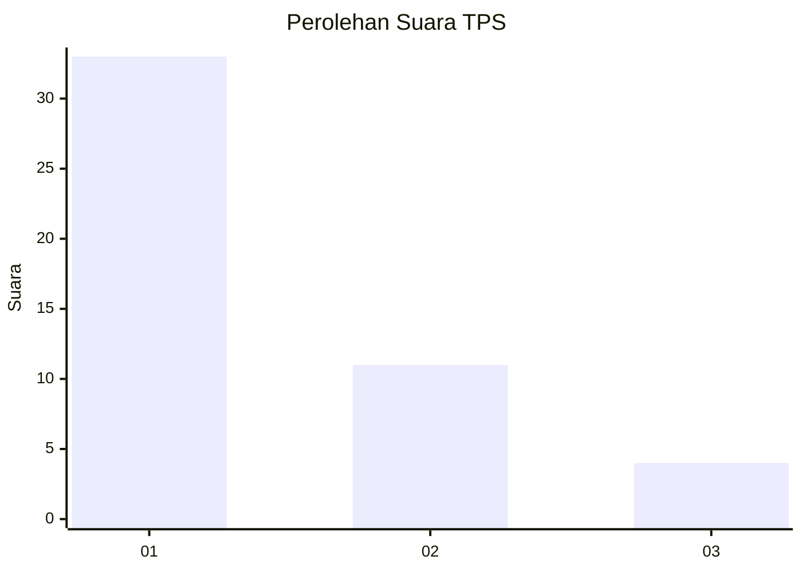
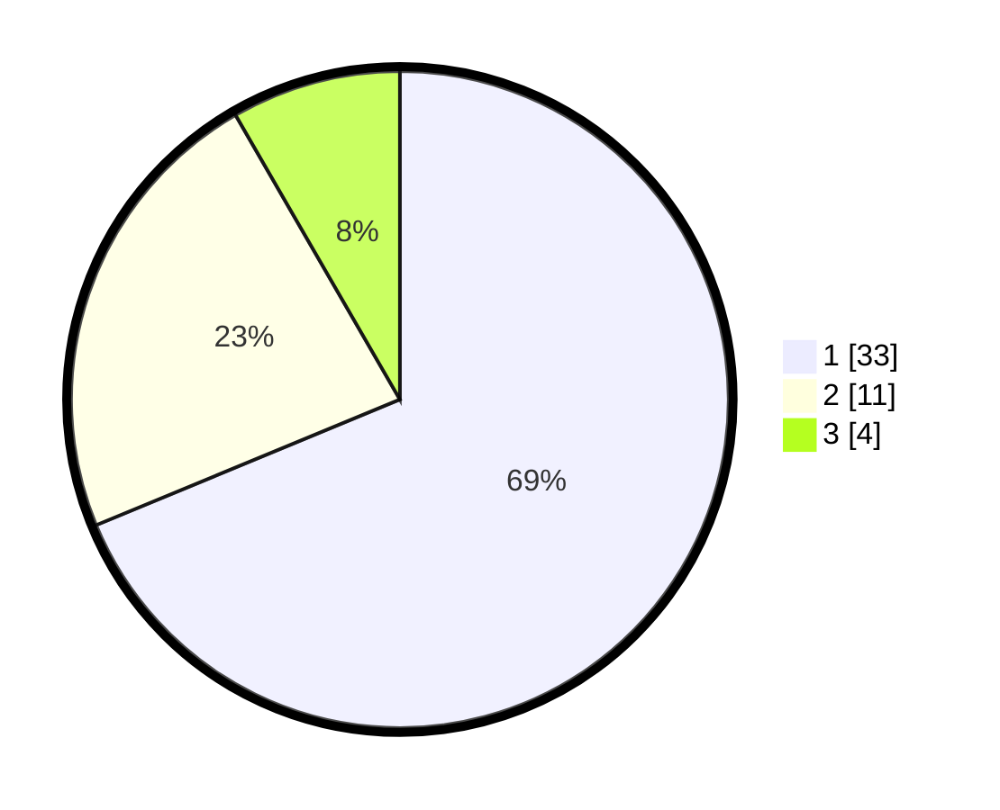

# Hasil

## Grafik

## Tabel

| No. | Nama Paslon    | Suara | Suara (raw) | Persentase |
|:--- |:-------------- | -----:| -----------:| ----------:|
| 1   | ANIES MUHAIMIN | 33    | [33][p-1]   | 68,75      |
| 2   | PRABOWO GIBRAN | 11    | [11][p-2]   | 22,92      |
| 3   | GANJAR MAHFUD  | 4     | [4][p-3]    | 8,33       |

[p-1]: https://github.com/gigit-pemilu/pemilu-2024-99-luar-negeri/blob/main/pilpres/hitung-suara/sub/99-luar-negeri/sub/32-damascus-suriah/sub/01-damascus-suriah/sub/0001-damascus-suriah/sub/002-tps/sub/paslon-1.txt
[p-2]: https://github.com/gigit-pemilu/pemilu-2024-99-luar-negeri/blob/main/pilpres/hitung-suara/sub/99-luar-negeri/sub/32-damascus-suriah/sub/01-damascus-suriah/sub/0001-damascus-suriah/sub/002-tps/sub/paslon-2.txt
[p-3]: https://github.com/gigit-pemilu/pemilu-2024-99-luar-negeri/blob/main/pilpres/hitung-suara/sub/99-luar-negeri/sub/32-damascus-suriah/sub/01-damascus-suriah/sub/0001-damascus-suriah/sub/002-tps/sub/paslon-3.txt

## Foto C Plano

https://sirekap-obj-formc.kpu.go.id/c1ca/pemilu/ppwp/99/32/01/00/01/9932010001002-20240214-221755--93086336-e212-4ba0-a8bb-c62522c883a7.jpg

https://sirekap-obj-formc.kpu.go.id/c1ca/pemilu/ppwp/99/32/01/00/01/9932010001002-20240214-221854--0e27eee4-ad29-4d70-b592-93a3d7e16a86.jpg

https://sirekap-obj-formc.kpu.go.id/c1ca/pemilu/ppwp/99/32/01/00/01/9932010001002-20240214-222014--57fc2664-56a6-4fe4-b08c-dfee1bbe744e.jpg

## Metadata

| Key        | Value               |
| ---------- | ------------------- |
| Time Stamp | 2024-02-16 13:30:32 |

## DATA PEMILIH TETAP

Jumlah pemilih dalam DPT: **48**.
 * L: **48**.
 * P: **0**.

## DATA PENGGUNA HAK PILIH

Jumlah pengguna hak pilih dalam DPT: **46**.
 * L: **46**.
 * P: **0**.

Jumlah pengguna hak pilih dalam DPTb: **0**.
 * L: **0**.
 * P: **0**.

Jumlah pengguna hak pilih dalam DPK: **2**.
 * L: **2**.
 * P: **0**.

Jumlah pengguna hak pilih: **48**.
 * L: **48**.
 * P: **0**.

## JUMLAH SUARA SAH DAN TIDAK SAH

JUMLAH SELURUH SUARA SAH: **48**.

JUMLAH SUARA TIDAK SAH: **0**.

JUMLAH SELURUH SUARA SAH DAN SUARA TIDAK SAH: **48**.

