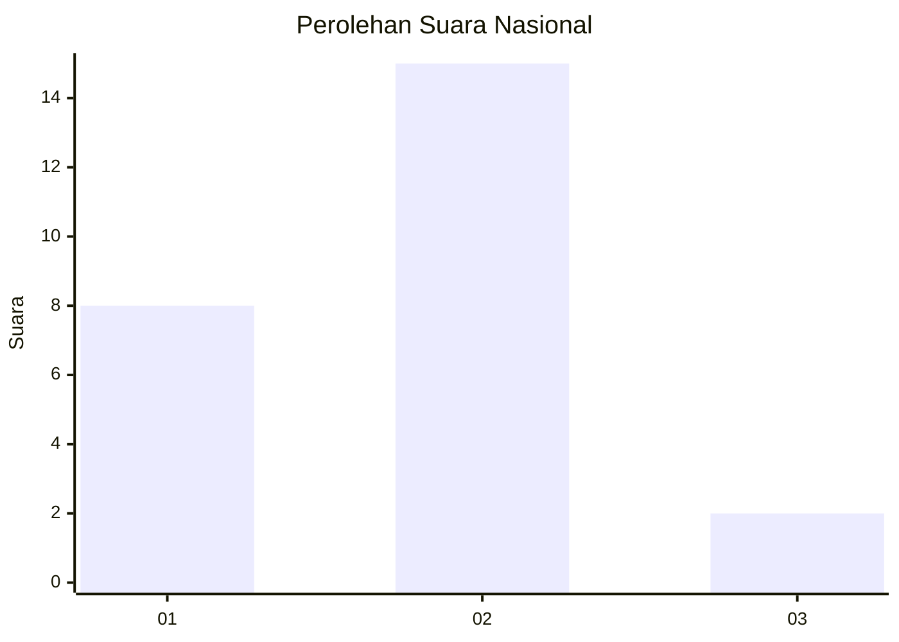
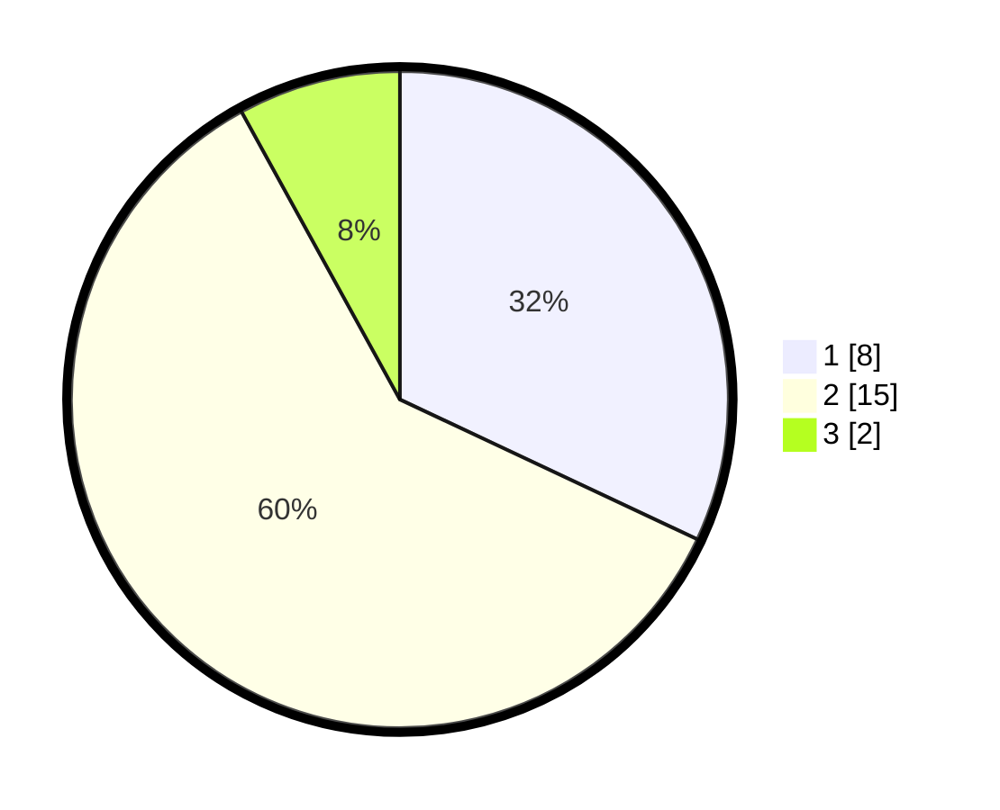

# Hasil

## Grafik

## Tabel

| No. | Nama Paslon    | Suara | Suara (raw) | Persentase |
|:--- |:-------------- | -----:| -----------:| ----------:|
| 1   | ANIES MUHAIMIN | 8     | [8][p-1]    | 32,00      |
| 2   | PRABOWO GIBRAN | 15    | [15][p-2]   | 60,00      |
| 3   | GANJAR MAHFUD  | 2     | [2][p-3]    | 8,00       |

[p-1]: https://github.com/gigit-pemilu/pemilu-2024/blob/main/pilpres/hitung-suara/sub/99-luar-negeri/sub/32-damascus-suriah/sub/01-damascus-suriah/sub/0001-damascus-suriah/sub/003-tps/sub/paslon-1.txt
[p-2]: https://github.com/gigit-pemilu/pemilu-2024/blob/main/pilpres/hitung-suara/sub/99-luar-negeri/sub/32-damascus-suriah/sub/01-damascus-suriah/sub/0001-damascus-suriah/sub/003-tps/sub/paslon-2.txt
[p-3]: https://github.com/gigit-pemilu/pemilu-2024/blob/main/pilpres/hitung-suara/sub/99-luar-negeri/sub/32-damascus-suriah/sub/01-damascus-suriah/sub/0001-damascus-suriah/sub/003-tps/sub/paslon-3.txt

## Foto C Plano

https://sirekap-obj-formc.kpu.go.id/855d/pemilu/ppwp/99/32/01/00/01/9932010001003-20240214-204703--ec250f72-040c-4ad9-ae76-367dbe943d0d.jpg

https://sirekap-obj-formc.kpu.go.id/855d/pemilu/ppwp/99/32/01/00/01/9932010001003-20240214-205029--59bf205f-5dce-43f9-a1f6-77f46d226267.jpg

https://sirekap-obj-formc.kpu.go.id/855d/pemilu/ppwp/99/32/01/00/01/9932010001003-20240214-205152--9da182ac-4258-4d9c-a3b0-826f2b35c2e1.jpg

## Metadata

| Key        | Value               |
| ---------- | ------------------- |
| Time Stamp | 2024-02-15 17:30:25 |

## DATA PEMILIH TETAP

Jumlah pemilih dalam DPT: **87**.
 * L: **0**.
 * P: **87**.

## DATA PENGGUNA HAK PILIH

Jumlah pengguna hak pilih dalam DPT: **8**.
 * L: **0**.
 * P: **8**.

Jumlah pengguna hak pilih dalam DPTb: **0**.
 * L: **0**.
 * P: **0**.

Jumlah pengguna hak pilih dalam DPK: **17**.
 * L: **0**.
 * P: **17**.

Jumlah pengguna hak pilih: **25**.
 * L: **0**.
 * P: **25**.

## JUMLAH SUARA SAH DAN TIDAK SAH

JUMLAH SELURUH SUARA SAH: **25**.

JUMLAH SUARA TIDAK SAH: **0**.

JUMLAH SELURUH SUARA SAH DAN SUARA TIDAK SAH: **25**.

