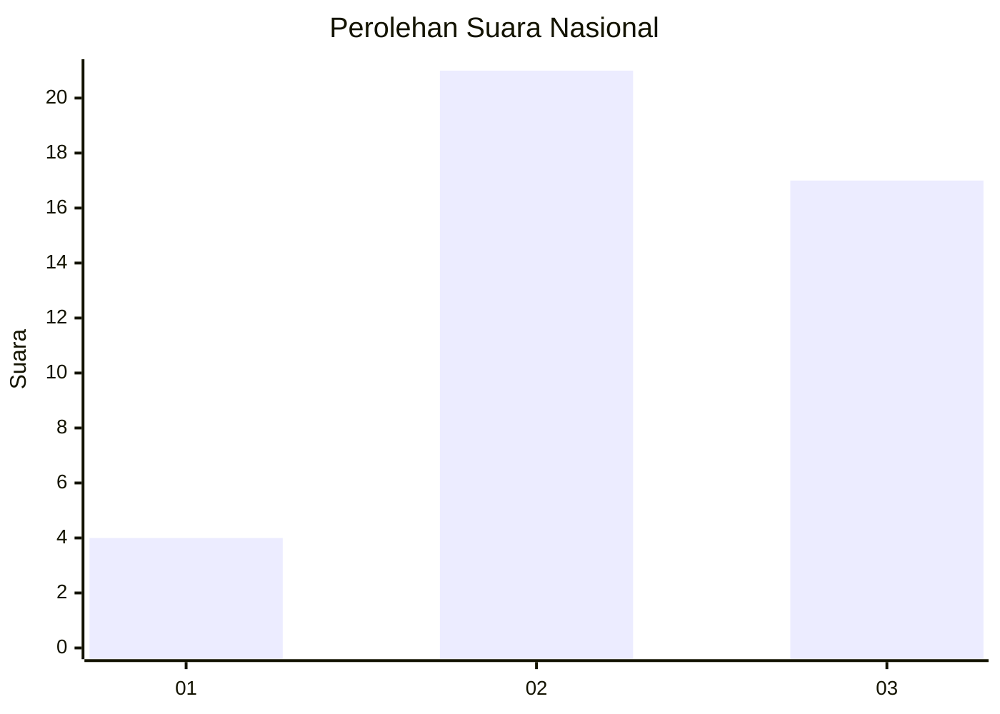
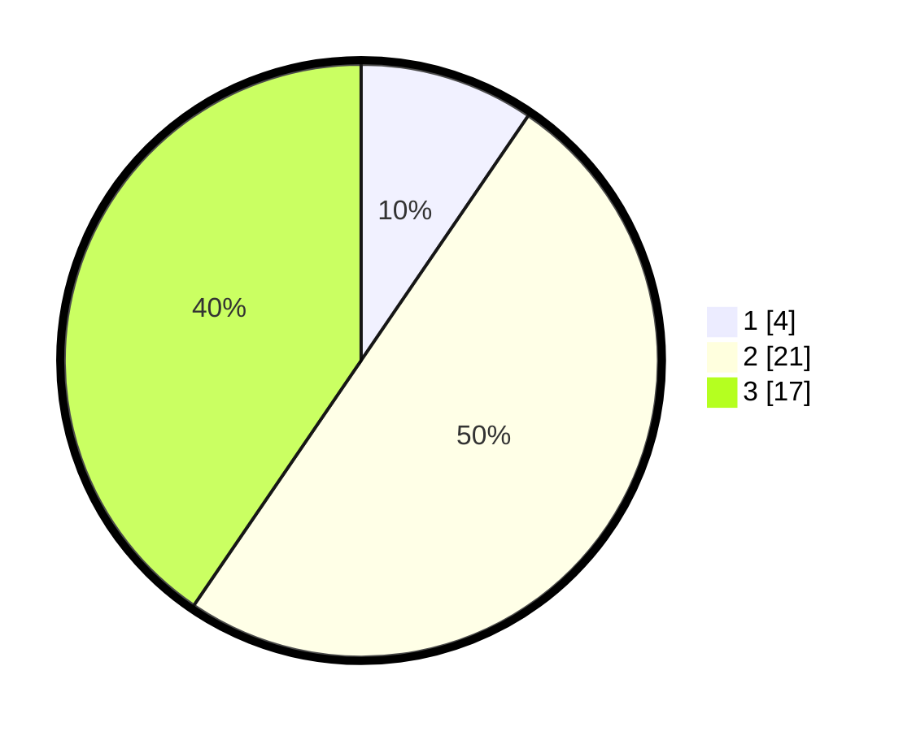

# Hasil

## Grafik

## Tabel

| No. | Nama Paslon    | Suara | Suara (raw) | Persentase |
|:--- |:-------------- | -----:| -----------:| ----------:|
| 1   | ANIES MUHAIMIN | 4     | [4][p-1]    | 9,52       |
| 2   | PRABOWO GIBRAN | 21    | [21][p-2]   | 50,00      |
| 3   | GANJAR MAHFUD  | 17    | [17][p-3]   | 40,48      |

[p-1]: https://github.com/gigit-pemilu/pemilu-2024/blob/main/pilpres/hitung-suara/sub/99-luar-negeri/sub/33-dar-es-salaam-tanzania/sub/01-dar-es-salaam-tanzania/sub/0001-dar-es-salaam-tanzania/sub/001-pos-001/sub/paslon-1.txt
[p-2]: https://github.com/gigit-pemilu/pemilu-2024/blob/main/pilpres/hitung-suara/sub/99-luar-negeri/sub/33-dar-es-salaam-tanzania/sub/01-dar-es-salaam-tanzania/sub/0001-dar-es-salaam-tanzania/sub/001-pos-001/sub/paslon-2.txt
[p-3]: https://github.com/gigit-pemilu/pemilu-2024/blob/main/pilpres/hitung-suara/sub/99-luar-negeri/sub/33-dar-es-salaam-tanzania/sub/01-dar-es-salaam-tanzania/sub/0001-dar-es-salaam-tanzania/sub/001-pos-001/sub/paslon-3.txt

## Foto C Plano

https://sirekap-obj-formc.kpu.go.id/816a/pemilu/ppwp/99/33/01/00/01/9933010001001-20240216-140252--03212ef6-d96d-4a65-99b9-c08c98585582.jpg

https://sirekap-obj-formc.kpu.go.id/816a/pemilu/ppwp/99/33/01/00/01/9933010001001-20240216-140253--21cebe65-47c3-43c4-8d7c-764560e40ce4.jpg

https://sirekap-obj-formc.kpu.go.id/816a/pemilu/ppwp/99/33/01/00/01/9933010001001-20240216-140253--1d996889-f3bd-4fd0-9307-ffaf6921e6da.jpg

## Metadata

| Key        | Value               |
| ---------- | ------------------- |
| Time Stamp | 2024-02-19 06:16:00 |

## DATA PEMILIH TETAP

Jumlah pemilih dalam DPT: **51**.
 * L: **11**.
 * P: **40**.

## DATA PENGGUNA HAK PILIH

Jumlah pengguna hak pilih dalam DPT: **38**.
 * L: **9**.
 * P: **29**.

Jumlah pengguna hak pilih dalam DPTb: **5**.
 * L: **4**.
 * P: **1**.

Jumlah pengguna hak pilih dalam DPK: **0**.
 * L: **0**.
 * P: **0**.

Jumlah pengguna hak pilih: **43**.
 * L: **13**.
 * P: **30**.

## JUMLAH SUARA SAH DAN TIDAK SAH

JUMLAH SELURUH SUARA SAH: **42**.

JUMLAH SUARA TIDAK SAH: **1**.

JUMLAH SELURUH SUARA SAH DAN SUARA TIDAK SAH: **43**.

