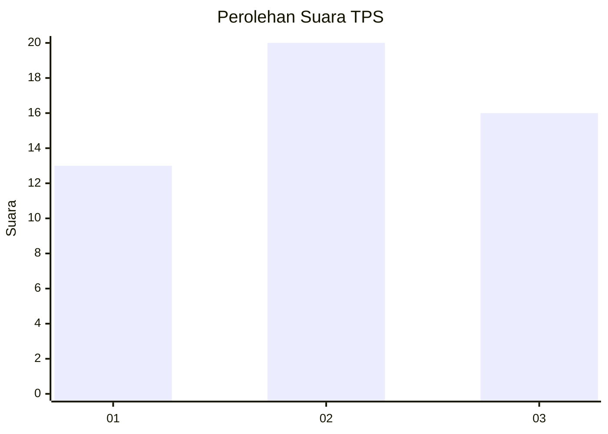
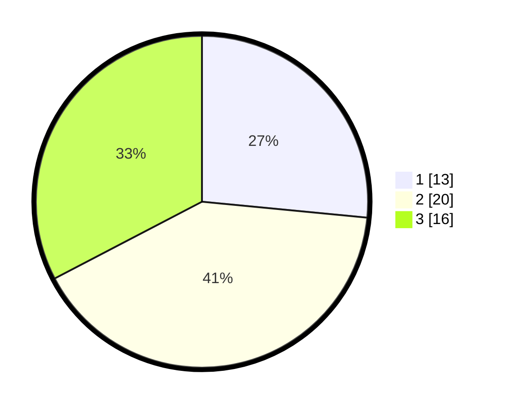

# Hasil

## Grafik

## Tabel

| No. | Nama Paslon    | Suara | Suara (raw) | Persentase |
|:--- |:-------------- | -----:| -----------:| ----------:|
| 1   | ANIES MUHAIMIN | 13    | [13][p-1]   | 26,53      |
| 2   | PRABOWO GIBRAN | 20    | [20][p-2]   | 40,82      |
| 3   | GANJAR MAHFUD  | 16    | [16][p-3]   | 32,65      |

[p-1]: https://github.com/gigit-pemilu/pemilu-2024-99-luar-negeri/blob/main/pilpres/hitung-suara/sub/99-luar-negeri/sub/33-dar-es-salaam-tanzania/sub/01-dar-es-salaam-tanzania/sub/0001-dar-es-salaam-tanzania/sub/002-tps-001/sub/paslon-1.txt
[p-2]: https://github.com/gigit-pemilu/pemilu-2024-99-luar-negeri/blob/main/pilpres/hitung-suara/sub/99-luar-negeri/sub/33-dar-es-salaam-tanzania/sub/01-dar-es-salaam-tanzania/sub/0001-dar-es-salaam-tanzania/sub/002-tps-001/sub/paslon-2.txt
[p-3]: https://github.com/gigit-pemilu/pemilu-2024-99-luar-negeri/blob/main/pilpres/hitung-suara/sub/99-luar-negeri/sub/33-dar-es-salaam-tanzania/sub/01-dar-es-salaam-tanzania/sub/0001-dar-es-salaam-tanzania/sub/002-tps-001/sub/paslon-3.txt

## Foto C Plano

https://sirekap-obj-formc.kpu.go.id/33f8/pemilu/ppwp/99/33/01/00/01/9933010001002-20240214-220206--cdb2a2bc-ac2b-40ab-bf31-b9db0f2190e2.jpg

https://sirekap-obj-formc.kpu.go.id/33f8/pemilu/ppwp/99/33/01/00/01/9933010001002-20240214-220508--4cd1e093-4ee8-4178-b279-89445c72522b.jpg

https://sirekap-obj-formc.kpu.go.id/33f8/pemilu/ppwp/99/33/01/00/01/9933010001002-20240216-154314--3a7e4060-ec62-4040-b785-dea04db7ad15.jpg

## Metadata

| Key        | Value               |
| ---------- | ------------------- |
| Time Stamp | 2024-02-16 16:25:10 |

## DATA PEMILIH TETAP

Jumlah pemilih dalam DPT: **44**.
 * L: **22**.
 * P: **22**.

## DATA PENGGUNA HAK PILIH

Jumlah pengguna hak pilih dalam DPT: **39**.
 * L: **20**.
 * P: **19**.

Jumlah pengguna hak pilih dalam DPTb: **9**.
 * L: **7**.
 * P: **2**.

Jumlah pengguna hak pilih dalam DPK: **1**.
 * L: **1**.
 * P: **0**.

Jumlah pengguna hak pilih: **49**.
 * L: **28**.
 * P: **21**.

## JUMLAH SUARA SAH DAN TIDAK SAH

JUMLAH SELURUH SUARA SAH: **49**.

JUMLAH SUARA TIDAK SAH: **0**.

JUMLAH SELURUH SUARA SAH DAN SUARA TIDAK SAH: **49**.

