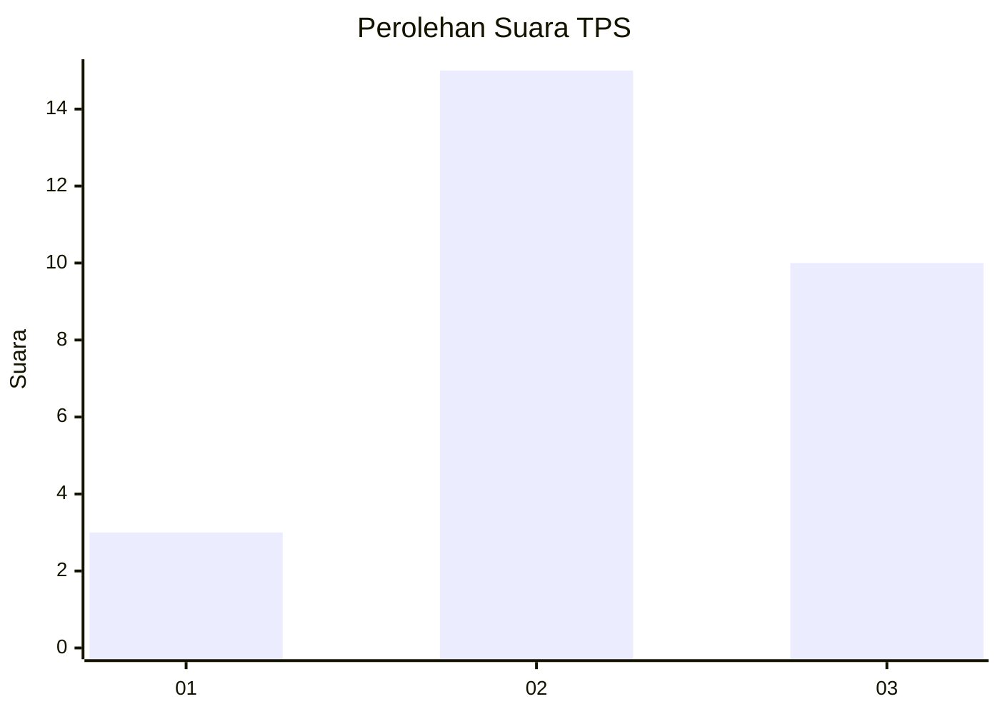
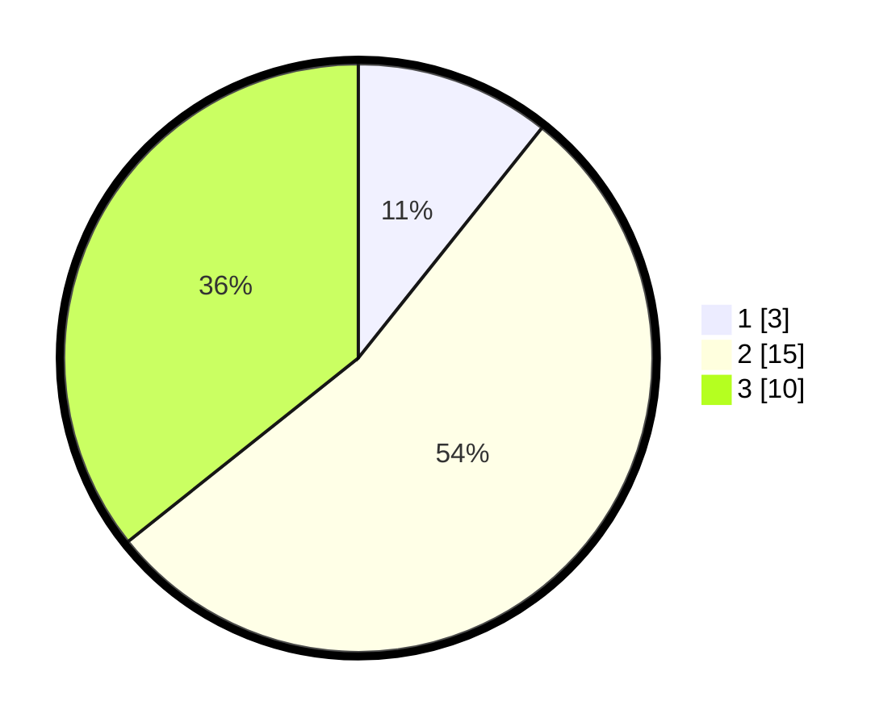

# Hasil

## Grafik

## Tabel

| No. | Nama Paslon    | Suara | Suara (raw) | Persentase |
|:--- |:-------------- | -----:| -----------:| ----------:|
| 1   | ANIES MUHAIMIN | 3     | [3][p-1]    | 10,71      |
| 2   | PRABOWO GIBRAN | 15    | [15][p-2]   | 53,57      |
| 3   | GANJAR MAHFUD  | 10    | [10][p-3]   | 35,71      |

[p-1]: https://github.com/gigit-pemilu/pemilu-2024-99-luar-negeri/blob/main/pilpres/hitung-suara/sub/99-luar-negeri/sub/34-darwin-australia/sub/01-darwin-australia/sub/0001-darwin-australia/sub/001-pos-001/sub/paslon-1.txt
[p-2]: https://github.com/gigit-pemilu/pemilu-2024-99-luar-negeri/blob/main/pilpres/hitung-suara/sub/99-luar-negeri/sub/34-darwin-australia/sub/01-darwin-australia/sub/0001-darwin-australia/sub/001-pos-001/sub/paslon-2.txt
[p-3]: https://github.com/gigit-pemilu/pemilu-2024-99-luar-negeri/blob/main/pilpres/hitung-suara/sub/99-luar-negeri/sub/34-darwin-australia/sub/01-darwin-australia/sub/0001-darwin-australia/sub/001-pos-001/sub/paslon-3.txt

## Foto C Plano

https://sirekap-obj-formc.kpu.go.id/1254/pemilu/ppwp/99/34/01/00/01/9934010001001-20240217-091007--56448b7d-027c-4538-8b38-98d5e2d78c74.jpg

https://sirekap-obj-formc.kpu.go.id/1254/pemilu/ppwp/99/34/01/00/01/9934010001001-20240217-091304--06e439ce-85f7-4033-81f9-af0c191ed912.jpg

https://sirekap-obj-formc.kpu.go.id/1254/pemilu/ppwp/99/34/01/00/01/9934010001001-20240217-091548--9dbb7c48-fb1e-49dc-a3a6-22bb48921434.jpg

## Metadata

| Key        | Value               |
| ---------- | ------------------- |
| Time Stamp | 2024-02-17 13:37:34 |

## DATA PEMILIH TETAP

Jumlah pemilih dalam DPT: **64**.
 * L: **31**.
 * P: **33**.

## DATA PENGGUNA HAK PILIH

Jumlah pengguna hak pilih dalam DPT: **28**.
 * L: **10**.
 * P: **18**.

Jumlah pengguna hak pilih dalam DPTb: **0**.
 * L: **0**.
 * P: **0**.

Jumlah pengguna hak pilih dalam DPK: **0**.
 * L: **0**.
 * P: **0**.

Jumlah pengguna hak pilih: **28**.
 * L: **10**.
 * P: **18**.

## JUMLAH SUARA SAH DAN TIDAK SAH

JUMLAH SELURUH SUARA SAH: **28**.

JUMLAH SUARA TIDAK SAH: **0**.

JUMLAH SELURUH SUARA SAH DAN SUARA TIDAK SAH: **28**.

