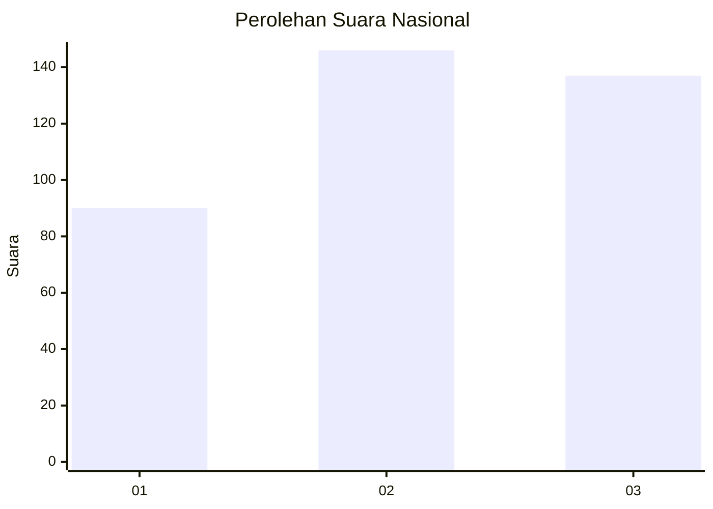
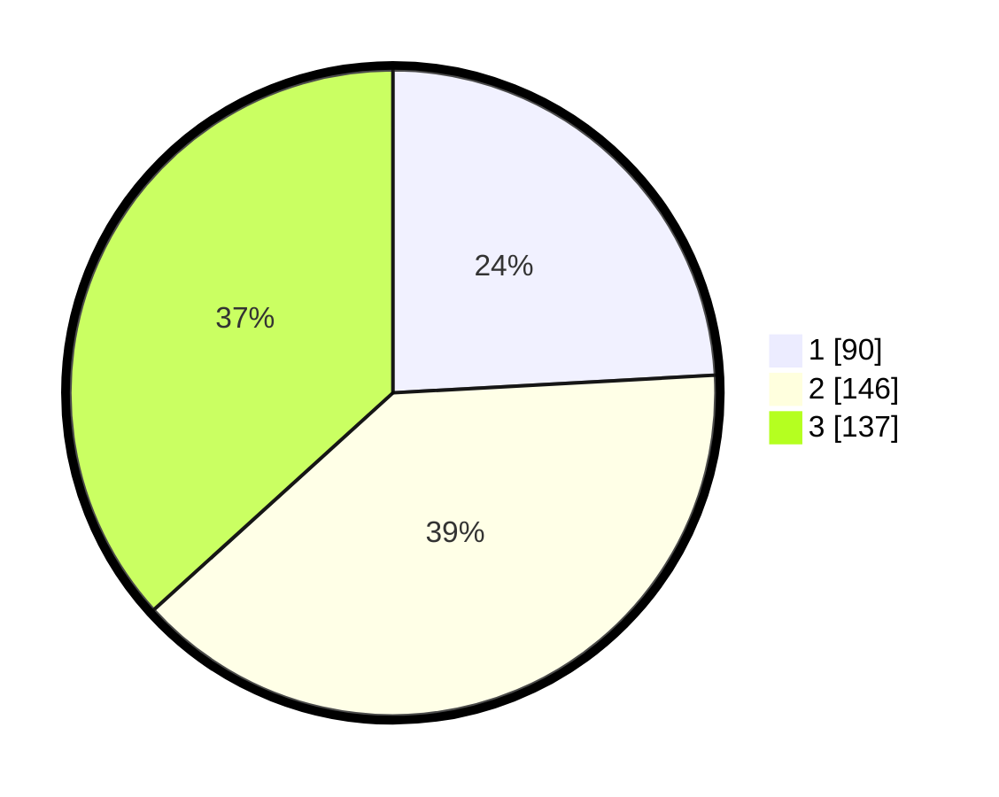

# Hasil

## Grafik

## Tabel

| No. | Nama Paslon    | Suara | Suara (raw) | Persentase |
|:--- |:-------------- | -----:| -----------:| ----------:|
| 1   | ANIES MUHAIMIN | 90    | [90][p-1]   | 24,13      |
| 2   | PRABOWO GIBRAN | 146   | [146][p-2]  | 39,14      |
| 3   | GANJAR MAHFUD  | 137   | [137][p-3]  | 36,73      |

[p-1]: https://github.com/gigit-pemilu/pemilu-2024/blob/main/pilpres/hitung-suara/sub/99-luar-negeri/sub/34-darwin-australia/sub/01-darwin-australia/sub/0001-darwin-australia/sub/002-tps-001/sub/paslon-1.txt
[p-2]: https://github.com/gigit-pemilu/pemilu-2024/blob/main/pilpres/hitung-suara/sub/99-luar-negeri/sub/34-darwin-australia/sub/01-darwin-australia/sub/0001-darwin-australia/sub/002-tps-001/sub/paslon-2.txt
[p-3]: https://github.com/gigit-pemilu/pemilu-2024/blob/main/pilpres/hitung-suara/sub/99-luar-negeri/sub/34-darwin-australia/sub/01-darwin-australia/sub/0001-darwin-australia/sub/002-tps-001/sub/paslon-3.txt

## Foto C Plano

https://sirekap-obj-formc.kpu.go.id/7bca/pemilu/ppwp/99/34/01/00/01/9934010001002-20240214-152738--de2c2831-a251-431a-824d-89762d421176.jpg

https://sirekap-obj-formc.kpu.go.id/7bca/pemilu/ppwp/99/34/01/00/01/9934010001002-20240214-153037--6e5e0de1-dc33-4e02-82ad-9809d1d6e919.jpg

https://sirekap-obj-formc.kpu.go.id/7bca/pemilu/ppwp/99/34/01/00/01/9934010001002-20240214-153217--a438e400-5cba-4b50-8cf8-7c553bda9ffa.jpg

## Metadata

| Key        | Value               |
| ---------- | ------------------- |
| Time Stamp | 2024-02-15 15:00:29 |

## DATA PEMILIH TETAP

Jumlah pemilih dalam DPT: **974**.
 * L: **331**.
 * P: **643**.

## DATA PENGGUNA HAK PILIH

Jumlah pengguna hak pilih dalam DPT: **313**.
 * L: **93**.
 * P: **220**.

Jumlah pengguna hak pilih dalam DPTb: **37**.
 * L: **18**.
 * P: **19**.

Jumlah pengguna hak pilih dalam DPK: **26**.
 * L: **10**.
 * P: **16**.

Jumlah pengguna hak pilih: **376**.
 * L: **121**.
 * P: **255**.

## JUMLAH SUARA SAH DAN TIDAK SAH

JUMLAH SELURUH SUARA SAH: **373**.

JUMLAH SUARA TIDAK SAH: **3**.

JUMLAH SELURUH SUARA SAH DAN SUARA TIDAK SAH: **376**.

