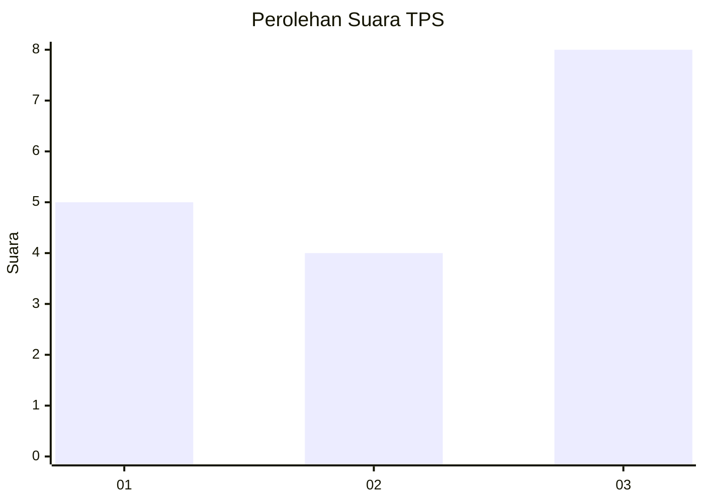
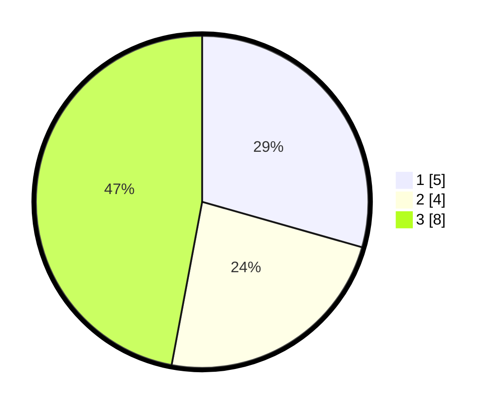

# Hasil

## Grafik

## Tabel

| No. | Nama Paslon    | Suara | Suara (raw) | Persentase |
|:--- |:-------------- | -----:| -----------:| ----------:|
| 1   | ANIES MUHAIMIN | 5     | [5][p-1]    | 29,41      |
| 2   | PRABOWO GIBRAN | 4     | [4][p-2]    | 23,53      |
| 3   | GANJAR MAHFUD  | 8     | [8][p-3]    | 47,06      |

[p-1]: https://github.com/gigit-pemilu/pemilu-2024-99-luar-negeri/blob/main/pilpres/hitung-suara/sub/99-luar-negeri/sub/35-davao-city-filipina/sub/01-davao-city-filipina/sub/0001-davao-city-filipina/sub/001-pos-001/sub/paslon-1.txt
[p-2]: https://github.com/gigit-pemilu/pemilu-2024-99-luar-negeri/blob/main/pilpres/hitung-suara/sub/99-luar-negeri/sub/35-davao-city-filipina/sub/01-davao-city-filipina/sub/0001-davao-city-filipina/sub/001-pos-001/sub/paslon-2.txt
[p-3]: https://github.com/gigit-pemilu/pemilu-2024-99-luar-negeri/blob/main/pilpres/hitung-suara/sub/99-luar-negeri/sub/35-davao-city-filipina/sub/01-davao-city-filipina/sub/0001-davao-city-filipina/sub/001-pos-001/sub/paslon-3.txt

## Foto C Plano

https://sirekap-obj-formc.kpu.go.id/2e26/pemilu/ppwp/99/35/01/00/01/9935010001001-20240217-123736--0c3cbe4c-1dd4-4a1c-9aaa-eff12bf846c9.jpg

https://sirekap-obj-formc.kpu.go.id/2e26/pemilu/ppwp/99/35/01/00/01/9935010001001-20240217-123825--aac7e967-9d8f-417c-9ef1-0766cbc51a4e.jpg

https://sirekap-obj-formc.kpu.go.id/2e26/pemilu/ppwp/99/35/01/00/01/9935010001001-20240217-124153--8b24d5f7-82e8-49ce-9050-bbf5296f0b2a.jpg

## Metadata

| Key        | Value               |
| ---------- | ------------------- |
| Time Stamp | 2024-02-17 13:37:34 |

## DATA PEMILIH TETAP

Jumlah pemilih dalam DPT: **30**.
 * L: **14**.
 * P: **16**.

## DATA PENGGUNA HAK PILIH

Jumlah pengguna hak pilih dalam DPT: **18**.
 * L: **8**.
 * P: **10**.

Jumlah pengguna hak pilih dalam DPTb: **0**.
 * L: **0**.
 * P: **0**.

Jumlah pengguna hak pilih dalam DPK: **0**.
 * L: **0**.
 * P: **0**.

Jumlah pengguna hak pilih: **18**.
 * L: **8**.
 * P: **10**.

## JUMLAH SUARA SAH DAN TIDAK SAH

JUMLAH SELURUH SUARA SAH: **17**.

JUMLAH SUARA TIDAK SAH: **1**.

JUMLAH SELURUH SUARA SAH DAN SUARA TIDAK SAH: **18**.

