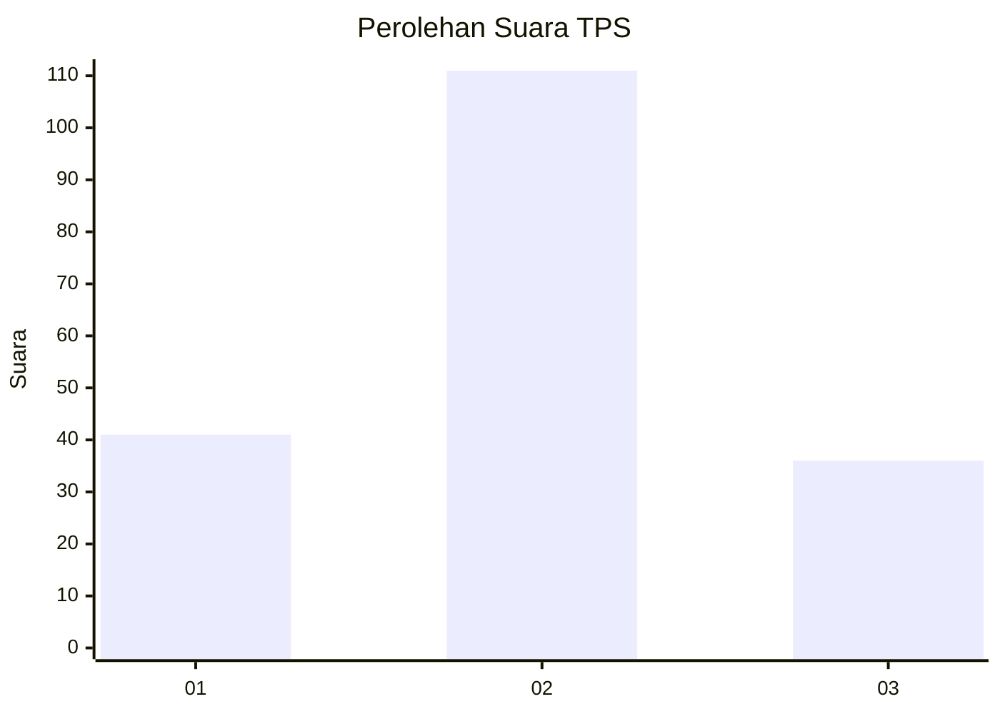
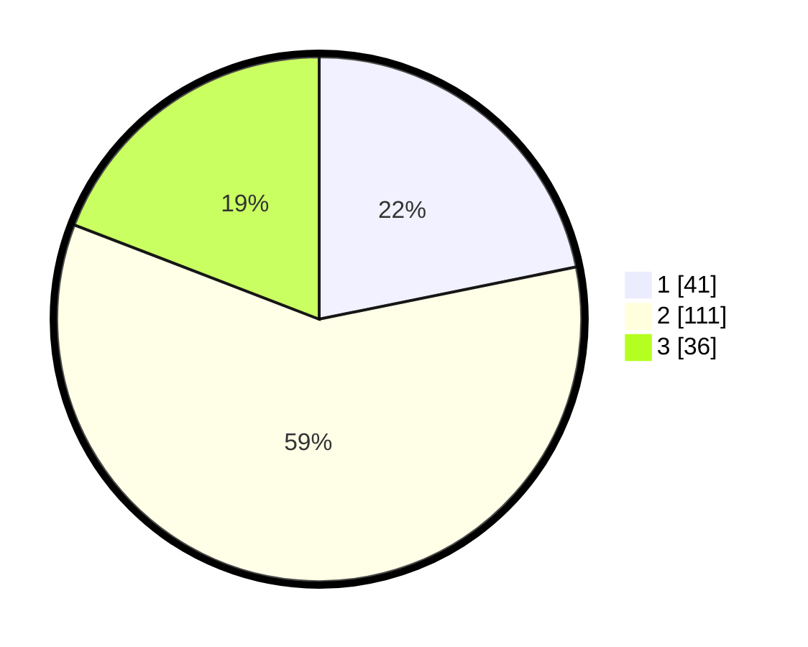

# Hasil

## Grafik

## Tabel

| No. | Nama Paslon    | Suara | Suara (raw) | Persentase |
|:--- |:-------------- | -----:| -----------:| ----------:|
| 1   | ANIES MUHAIMIN | 41    | [41][p-1]   | 21,81      |
| 2   | PRABOWO GIBRAN | 111   | [111][p-2]  | 59,04      |
| 3   | GANJAR MAHFUD  | 36    | [36][p-3]   | 19,15      |

[p-1]: https://github.com/gigit-pemilu/pemilu-2024-99-luar-negeri/blob/main/pilpres/hitung-suara/sub/99-luar-negeri/sub/35-davao-city-filipina/sub/01-davao-city-filipina/sub/0001-davao-city-filipina/sub/002-tps-001/sub/paslon-1.txt
[p-2]: https://github.com/gigit-pemilu/pemilu-2024-99-luar-negeri/blob/main/pilpres/hitung-suara/sub/99-luar-negeri/sub/35-davao-city-filipina/sub/01-davao-city-filipina/sub/0001-davao-city-filipina/sub/002-tps-001/sub/paslon-2.txt
[p-3]: https://github.com/gigit-pemilu/pemilu-2024-99-luar-negeri/blob/main/pilpres/hitung-suara/sub/99-luar-negeri/sub/35-davao-city-filipina/sub/01-davao-city-filipina/sub/0001-davao-city-filipina/sub/002-tps-001/sub/paslon-3.txt

## Foto C Plano

https://sirekap-obj-formc.kpu.go.id/52b5/pemilu/ppwp/99/35/01/00/01/9935010001002-20240216-131509--22bedaec-a0af-44de-91e2-d50f3c300447.jpg

https://sirekap-obj-formc.kpu.go.id/52b5/pemilu/ppwp/99/35/01/00/01/9935010001002-20240216-131510--8b1b3c17-7d5c-4698-93e4-53caedc543e0.jpg

https://sirekap-obj-formc.kpu.go.id/52b5/pemilu/ppwp/99/35/01/00/01/9935010001002-20240214-155503--c7e2d36b-0d17-460a-91ba-930f9c726062.jpg

## Metadata

| Key        | Value               |
| ---------- | ------------------- |
| Time Stamp | 2024-02-16 13:30:32 |

## DATA PEMILIH TETAP

Jumlah pemilih dalam DPT: **203**.
 * L: **139**.
 * P: **64**.

## DATA PENGGUNA HAK PILIH

Jumlah pengguna hak pilih dalam DPT: **152**.
 * L: **103**.
 * P: **49**.

Jumlah pengguna hak pilih dalam DPTb: **26**.
 * L: **7**.
 * P: **19**.

Jumlah pengguna hak pilih dalam DPK: **13**.
 * L: **4**.
 * P: **9**.

Jumlah pengguna hak pilih: **191**.
 * L: **114**.
 * P: **77**.

## JUMLAH SUARA SAH DAN TIDAK SAH

JUMLAH SELURUH SUARA SAH: **188**.

JUMLAH SUARA TIDAK SAH: **3**.

JUMLAH SELURUH SUARA SAH DAN SUARA TIDAK SAH: **191**.

