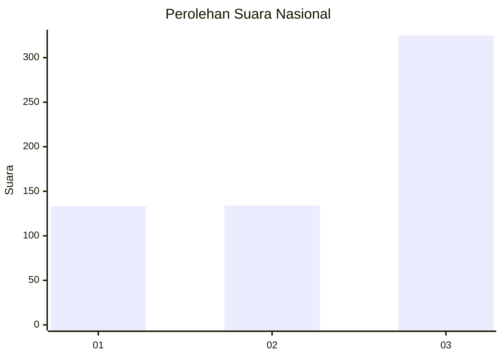
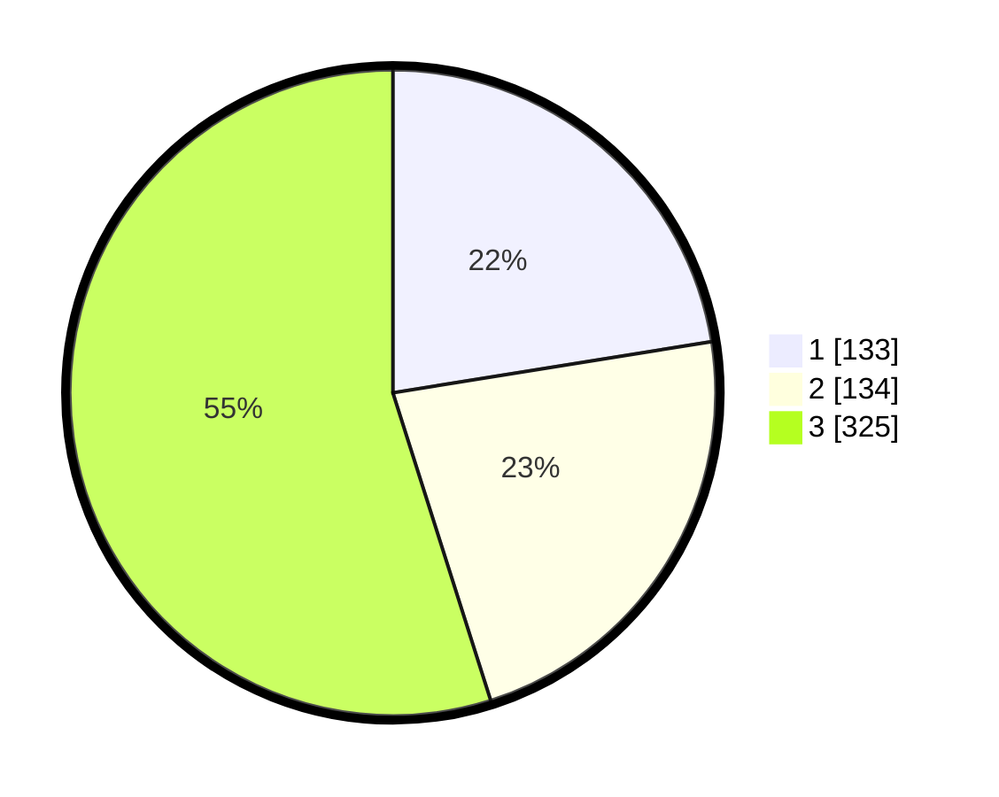

# Hasil

## Grafik

## Tabel

| No. | Nama Paslon    | Suara | Suara (raw) | Persentase |
|:--- |:-------------- | -----:| -----------:| ----------:|
| 1   | ANIES MUHAIMIN | 133   | [133][p-1]  | 22,47      |
| 2   | PRABOWO GIBRAN | 134   | [134][p-2]  | 22,64      |
| 3   | GANJAR MAHFUD  | 325   | [325][p-3]  | 54,90      |

[p-1]: https://github.com/gigit-pemilu/pemilu-2024/blob/main/pilpres/hitung-suara/sub/99-luar-negeri/sub/36-den-haag-belanda/sub/01-den-haag-belanda/sub/0001-den-haag-belanda/sub/002-pos-002/sub/paslon-1.txt
[p-2]: https://github.com/gigit-pemilu/pemilu-2024/blob/main/pilpres/hitung-suara/sub/99-luar-negeri/sub/36-den-haag-belanda/sub/01-den-haag-belanda/sub/0001-den-haag-belanda/sub/002-pos-002/sub/paslon-2.txt
[p-3]: https://github.com/gigit-pemilu/pemilu-2024/blob/main/pilpres/hitung-suara/sub/99-luar-negeri/sub/36-den-haag-belanda/sub/01-den-haag-belanda/sub/0001-den-haag-belanda/sub/002-pos-002/sub/paslon-3.txt

## Foto C Plano

https://sirekap-obj-formc.kpu.go.id/27a7/pemilu/ppwp/99/36/01/00/01/9936010001002-20240218-044128--3ed6566c-f3e3-489d-ba4f-fa5d5cc709d9.jpg

https://sirekap-obj-formc.kpu.go.id/27a7/pemilu/ppwp/99/36/01/00/01/9936010001002-20240218-044146--509092d2-0c7f-4f8c-ae55-45447c8c27a0.jpg

https://sirekap-obj-formc.kpu.go.id/27a7/pemilu/ppwp/99/36/01/00/01/9936010001002-20240218-044205--aad01864-078c-4dd4-8342-230399642562.jpg

## Metadata

| Key        | Value               |
| ---------- | ------------------- |
| Time Stamp | 2024-02-19 06:16:00 |

## DATA PEMILIH TETAP

Jumlah pemilih dalam DPT: **657**.
 * L: **192**.
 * P: **465**.

## DATA PENGGUNA HAK PILIH

Jumlah pengguna hak pilih dalam DPT: **648**.
 * L: **189**.
 * P: **459**.

Jumlah pengguna hak pilih dalam DPTb: **0**.
 * L: **0**.
 * P: **0**.

Jumlah pengguna hak pilih dalam DPK: **11**.
 * L: **3**.
 * P: **8**.

Jumlah pengguna hak pilih: **659**.
 * L: **192**.
 * P: **467**.

## JUMLAH SUARA SAH DAN TIDAK SAH

JUMLAH SELURUH SUARA SAH: **592**.

JUMLAH SUARA TIDAK SAH: **6**.

JUMLAH SELURUH SUARA SAH DAN SUARA TIDAK SAH: **598**.

