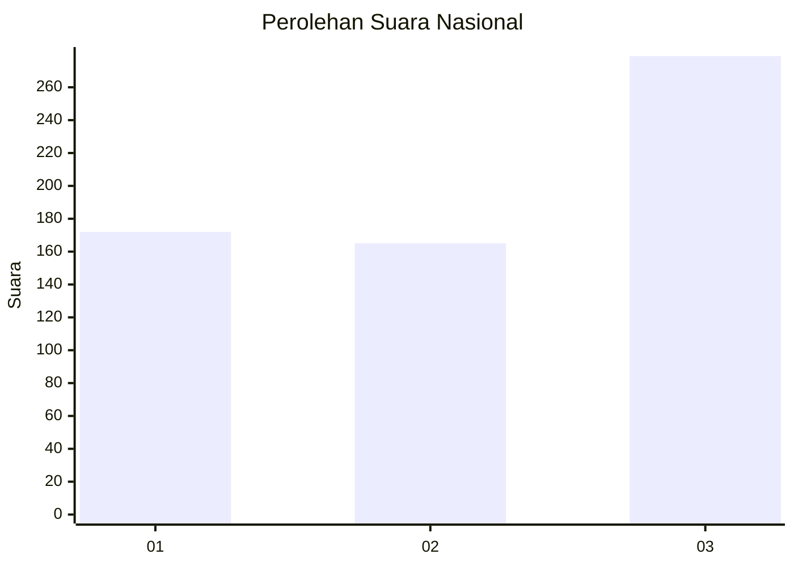
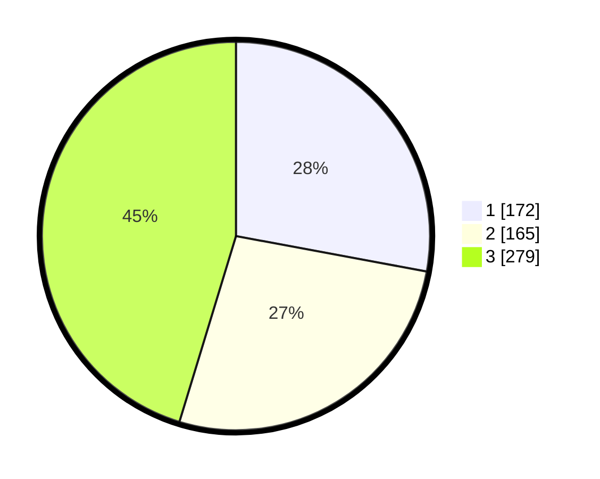

# Hasil

## Grafik

## Tabel

| No. | Nama Paslon    | Suara | Suara (raw) | Persentase |
|:--- |:-------------- | -----:| -----------:| ----------:|
| 1   | ANIES MUHAIMIN | 172   | [172][p-1]  | 27,92      |
| 2   | PRABOWO GIBRAN | 165   | [165][p-2]  | 26,79      |
| 3   | GANJAR MAHFUD  | 279   | [279][p-3]  | 45,29      |

[p-1]: https://github.com/gigit-pemilu/pemilu-2024/blob/main/pilpres/hitung-suara/sub/99-luar-negeri/sub/36-den-haag-belanda/sub/01-den-haag-belanda/sub/0001-den-haag-belanda/sub/003-tps-001/sub/paslon-1.txt
[p-2]: https://github.com/gigit-pemilu/pemilu-2024/blob/main/pilpres/hitung-suara/sub/99-luar-negeri/sub/36-den-haag-belanda/sub/01-den-haag-belanda/sub/0001-den-haag-belanda/sub/003-tps-001/sub/paslon-2.txt
[p-3]: https://github.com/gigit-pemilu/pemilu-2024/blob/main/pilpres/hitung-suara/sub/99-luar-negeri/sub/36-den-haag-belanda/sub/01-den-haag-belanda/sub/0001-den-haag-belanda/sub/003-tps-001/sub/paslon-3.txt

## Foto C Plano

https://sirekap-obj-formc.kpu.go.id/ccb1/pemilu/ppwp/99/36/01/00/01/9936010001003-20240215-014930--a076b7de-55a7-43e2-b96f-d244f83a7d45.jpg

https://sirekap-obj-formc.kpu.go.id/ccb1/pemilu/ppwp/99/36/01/00/01/9936010001003-20240215-015723--04e47f94-4674-4cfb-921f-a9412fe6c5da.jpg

https://sirekap-obj-formc.kpu.go.id/ccb1/pemilu/ppwp/99/36/01/00/01/9936010001003-20240215-015807--e0995453-63cc-441b-abbc-d1dc24798e3f.jpg

## Metadata

| Key        | Value               |
| ---------- | ------------------- |
| Time Stamp | 2024-02-15 17:30:25 |

## DATA PEMILIH TETAP

Jumlah pemilih dalam DPT: **1748**.
 * L: **590**.
 * P: **1158**.

## DATA PENGGUNA HAK PILIH

Jumlah pengguna hak pilih dalam DPT: **392**.
 * L: **138**.
 * P: **254**.

Jumlah pengguna hak pilih dalam DPTb: **193**.
 * L: **72**.
 * P: **121**.

Jumlah pengguna hak pilih dalam DPK: **38**.
 * L: **10**.
 * P: **28**.

Jumlah pengguna hak pilih: **623**.
 * L: **220**.
 * P: **403**.

## JUMLAH SUARA SAH DAN TIDAK SAH

JUMLAH SELURUH SUARA SAH: **616**.

JUMLAH SUARA TIDAK SAH: **7**.

JUMLAH SELURUH SUARA SAH DAN SUARA TIDAK SAH: **623**.

