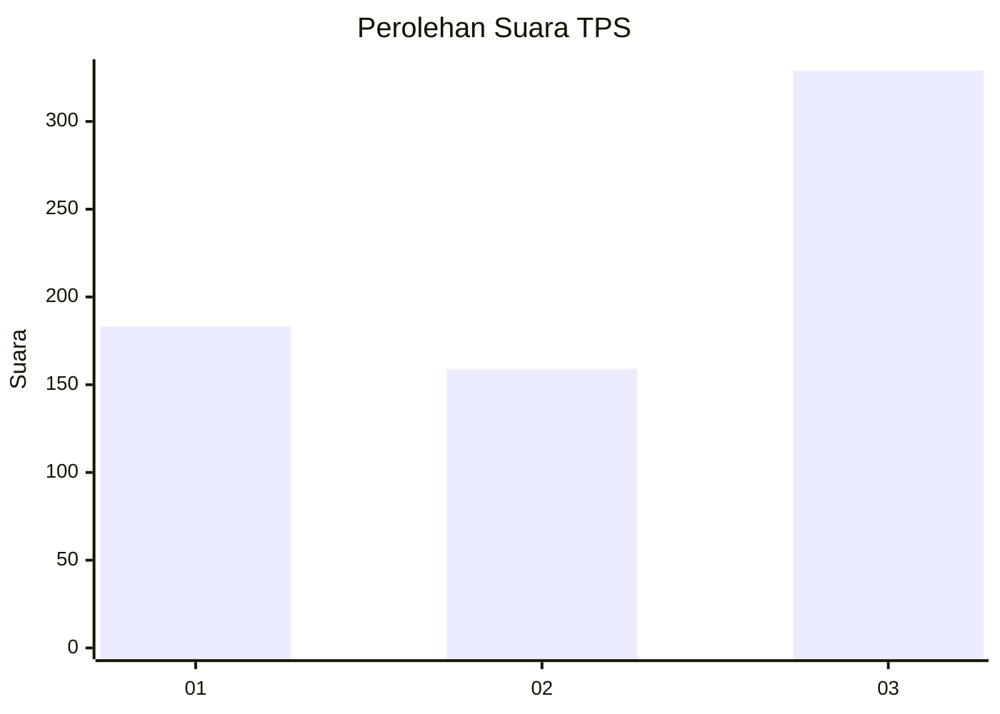
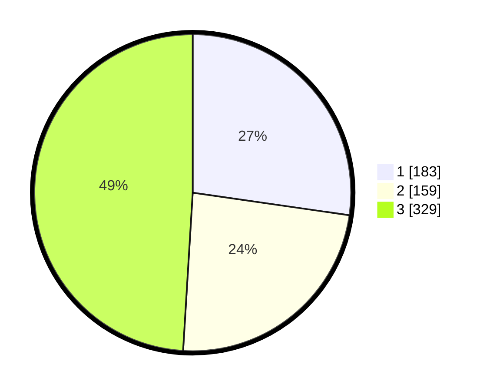

# Hasil

## Grafik

## Tabel

| No. | Nama Paslon    | Suara | Suara (raw) | Persentase |
|:--- |:-------------- | -----:| -----------:| ----------:|
| 1   | ANIES MUHAIMIN | 183   | [183][p-1]  | 27,27      |
| 2   | PRABOWO GIBRAN | 159   | [159][p-2]  | 23,70      |
| 3   | GANJAR MAHFUD  | 329   | [329][p-3]  | 49,03      |

[p-1]: https://github.com/gigit-pemilu/pemilu-2024-99-luar-negeri/blob/main/pilpres/hitung-suara/sub/99-luar-negeri/sub/36-den-haag-belanda/sub/01-den-haag-belanda/sub/0001-den-haag-belanda/sub/005-tps-003/sub/paslon-1.txt
[p-2]: https://github.com/gigit-pemilu/pemilu-2024-99-luar-negeri/blob/main/pilpres/hitung-suara/sub/99-luar-negeri/sub/36-den-haag-belanda/sub/01-den-haag-belanda/sub/0001-den-haag-belanda/sub/005-tps-003/sub/paslon-2.txt
[p-3]: https://github.com/gigit-pemilu/pemilu-2024-99-luar-negeri/blob/main/pilpres/hitung-suara/sub/99-luar-negeri/sub/36-den-haag-belanda/sub/01-den-haag-belanda/sub/0001-den-haag-belanda/sub/005-tps-003/sub/paslon-3.txt

## Foto C Plano

https://sirekap-obj-formc.kpu.go.id/0140/pemilu/ppwp/99/36/01/00/01/9936010001005-20240215-000123--7b663e43-41fe-42d7-bbbc-acb9a75359b1.jpg

https://sirekap-obj-formc.kpu.go.id/0140/pemilu/ppwp/99/36/01/00/01/9936010001005-20240215-000036--557cc53d-a6bb-40d0-911d-0f1f53ea6440.jpg

https://sirekap-obj-formc.kpu.go.id/0140/pemilu/ppwp/99/36/01/00/01/9936010001005-20240215-000133--ad43415a-d248-40f5-aef7-712df04ab7ee.jpg

## Metadata

| Key        | Value               |
| ---------- | ------------------- |
| Time Stamp | 2024-02-15 17:30:25 |

## DATA PEMILIH TETAP

Jumlah pemilih dalam DPT: **1702**.
 * L: **552**.
 * P: **1150**.

## DATA PENGGUNA HAK PILIH

Jumlah pengguna hak pilih dalam DPT: **440**.
 * L: **142**.
 * P: **298**.

Jumlah pengguna hak pilih dalam DPTb: **206**.
 * L: **47**.
 * P: **132**.

Jumlah pengguna hak pilih dalam DPK: **34**.
 * L: **13**.
 * P: **21**.

Jumlah pengguna hak pilih: **680**.
 * L: **229**.
 * P: **451**.

## JUMLAH SUARA SAH DAN TIDAK SAH

JUMLAH SELURUH SUARA SAH: **671**.

JUMLAH SUARA TIDAK SAH: **10**.

JUMLAH SELURUH SUARA SAH DAN SUARA TIDAK SAH: **681**.

