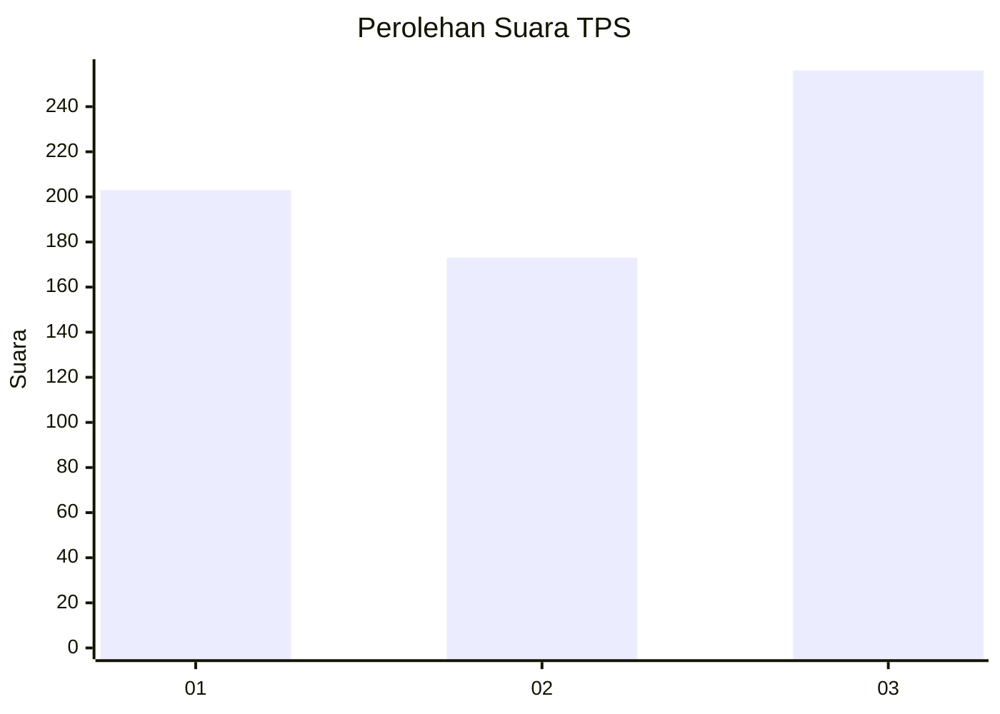
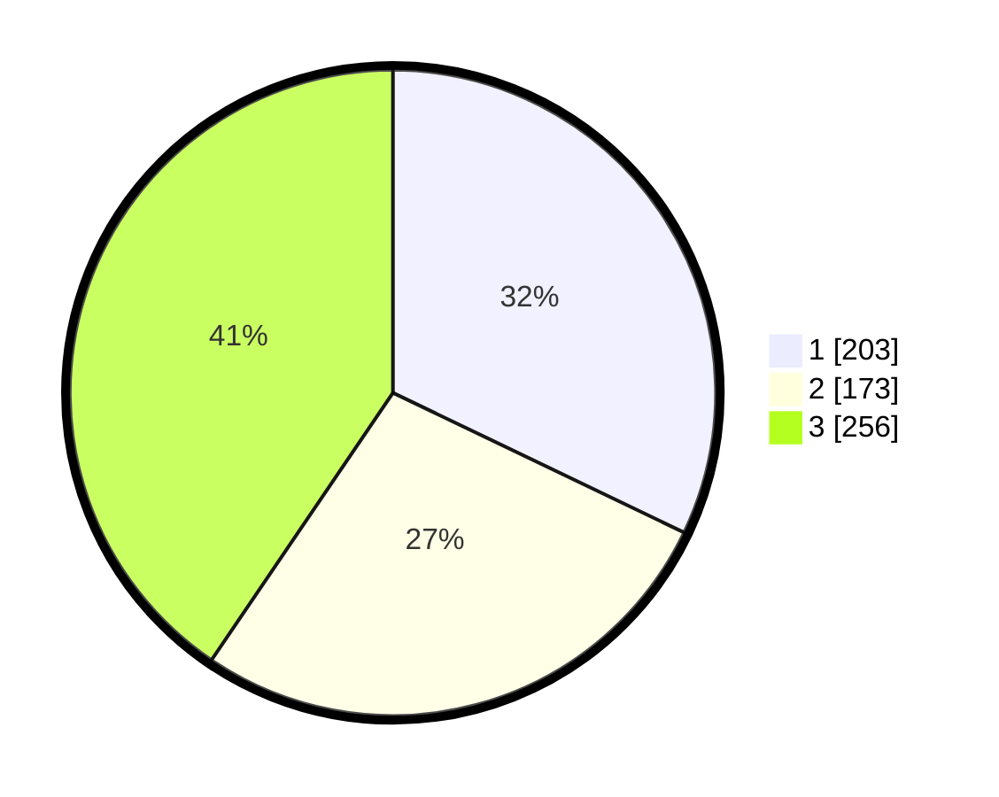

# Hasil

## Grafik

## Tabel

| No. | Nama Paslon    | Suara | Suara (raw) | Persentase |
|:--- |:-------------- | -----:| -----------:| ----------:|
| 1   | ANIES MUHAIMIN | 203   | [203][p-1]  | 32,12      |
| 2   | PRABOWO GIBRAN | 173   | [173][p-2]  | 27,37      |
| 3   | GANJAR MAHFUD  | 256   | [256][p-3]  | 40,51      |

[p-1]: https://github.com/gigit-pemilu/pemilu-2024-99-luar-negeri/blob/main/pilpres/hitung-suara/sub/99-luar-negeri/sub/36-den-haag-belanda/sub/01-den-haag-belanda/sub/0001-den-haag-belanda/sub/006-tps-004/sub/paslon-1.txt
[p-2]: https://github.com/gigit-pemilu/pemilu-2024-99-luar-negeri/blob/main/pilpres/hitung-suara/sub/99-luar-negeri/sub/36-den-haag-belanda/sub/01-den-haag-belanda/sub/0001-den-haag-belanda/sub/006-tps-004/sub/paslon-2.txt
[p-3]: https://github.com/gigit-pemilu/pemilu-2024-99-luar-negeri/blob/main/pilpres/hitung-suara/sub/99-luar-negeri/sub/36-den-haag-belanda/sub/01-den-haag-belanda/sub/0001-den-haag-belanda/sub/006-tps-004/sub/paslon-3.txt

## Foto C Plano

https://sirekap-obj-formc.kpu.go.id/c5b9/pemilu/ppwp/99/36/01/00/01/9936010001006-20240215-013752--3dd98aa8-d9fe-4a8f-931a-99169056452a.jpg

https://sirekap-obj-formc.kpu.go.id/c5b9/pemilu/ppwp/99/36/01/00/01/9936010001006-20240215-013837--d3ee8e58-9094-4684-a258-40481f4319c4.jpg

https://sirekap-obj-formc.kpu.go.id/c5b9/pemilu/ppwp/99/36/01/00/01/9936010001006-20240215-013926--9fdbc7e9-e71f-492e-8c8c-2089199203b4.jpg

## Metadata

| Key        | Value               |
| ---------- | ------------------- |
| Time Stamp | 2024-02-16 01:00:27 |

## DATA PEMILIH TETAP

Jumlah pemilih dalam DPT: **1714**.
 * L: **533**.
 * P: **1181**.

## DATA PENGGUNA HAK PILIH

Jumlah pengguna hak pilih dalam DPT: **346**.
 * L: **108**.
 * P: **238**.

Jumlah pengguna hak pilih dalam DPTb: **199**.
 * L: **74**.
 * P: **125**.

Jumlah pengguna hak pilih dalam DPK: **93**.
 * L: **46**.
 * P: **47**.

Jumlah pengguna hak pilih: **638**.
 * L: **228**.
 * P: **410**.

## JUMLAH SUARA SAH DAN TIDAK SAH

JUMLAH SELURUH SUARA SAH: **632**.

JUMLAH SUARA TIDAK SAH: **6**.

JUMLAH SELURUH SUARA SAH DAN SUARA TIDAK SAH: **638**.

