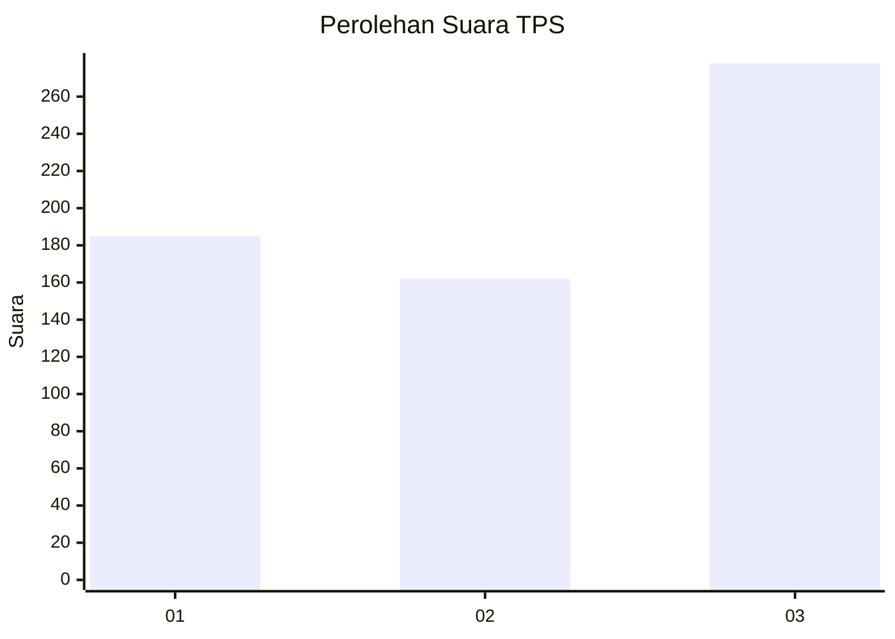
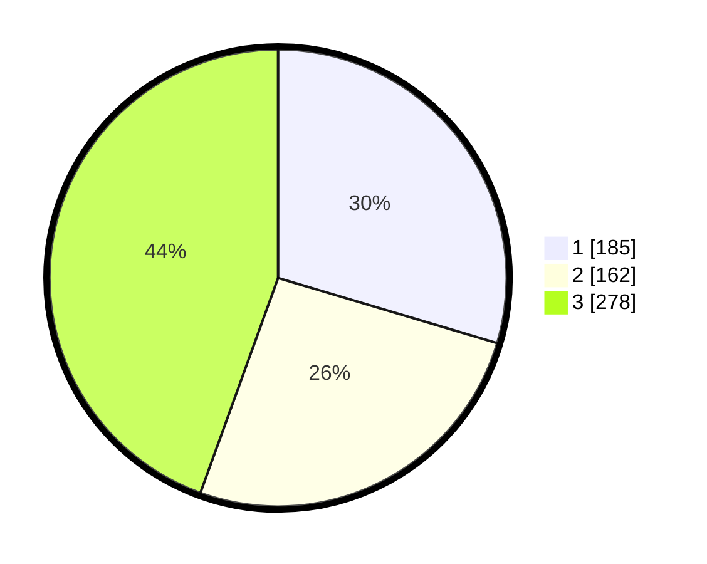

# Hasil

## Grafik

## Tabel

| No. | Nama Paslon    | Suara | Suara (raw) | Persentase |
|:--- |:-------------- | -----:| -----------:| ----------:|
| 1   | ANIES MUHAIMIN | 185   | [185][p-1]  | 29,60      |
| 2   | PRABOWO GIBRAN | 162   | [162][p-2]  | 25,92      |
| 3   | GANJAR MAHFUD  | 278   | [278][p-3]  | 44,48      |

[p-1]: https://github.com/gigit-pemilu/pemilu-2024-99-luar-negeri/blob/main/pilpres/hitung-suara/sub/99-luar-negeri/sub/36-den-haag-belanda/sub/01-den-haag-belanda/sub/0001-den-haag-belanda/sub/007-tps-005/sub/paslon-1.txt
[p-2]: https://github.com/gigit-pemilu/pemilu-2024-99-luar-negeri/blob/main/pilpres/hitung-suara/sub/99-luar-negeri/sub/36-den-haag-belanda/sub/01-den-haag-belanda/sub/0001-den-haag-belanda/sub/007-tps-005/sub/paslon-2.txt
[p-3]: https://github.com/gigit-pemilu/pemilu-2024-99-luar-negeri/blob/main/pilpres/hitung-suara/sub/99-luar-negeri/sub/36-den-haag-belanda/sub/01-den-haag-belanda/sub/0001-den-haag-belanda/sub/007-tps-005/sub/paslon-3.txt

## Foto C Plano

https://sirekap-obj-formc.kpu.go.id/1545/pemilu/ppwp/99/36/01/00/01/9936010001007-20240215-024501--325d41bd-fbf9-4ecd-864a-277a6bd79fa5.jpg

https://sirekap-obj-formc.kpu.go.id/1545/pemilu/ppwp/99/36/01/00/01/9936010001007-20240215-023748--e125e8da-9ca7-4f22-a01f-f40c23490920.jpg

https://sirekap-obj-formc.kpu.go.id/1545/pemilu/ppwp/99/36/01/00/01/9936010001007-20240215-024331--f0796d49-4b45-48a5-9bb5-e5c719ffc882.jpg

## Metadata

| Key        | Value               |
| ---------- | ------------------- |
| Time Stamp | 2024-02-17 19:30:00 |

## DATA PEMILIH TETAP

Jumlah pemilih dalam DPT: **1671**.
 * L: **541**.
 * P: **1130**.

## DATA PENGGUNA HAK PILIH

Jumlah pengguna hak pilih dalam DPT: **424**.
 * L: **132**.
 * P: **292**.

Jumlah pengguna hak pilih dalam DPTb: **188**.
 * L: **78**.
 * P: **110**.

Jumlah pengguna hak pilih dalam DPK: **25**.
 * L: **8**.
 * P: **17**.

Jumlah pengguna hak pilih: **637**.
 * L: **218**.
 * P: **419**.

## JUMLAH SUARA SAH DAN TIDAK SAH

JUMLAH SELURUH SUARA SAH: **625**.

JUMLAH SUARA TIDAK SAH: **12**.

JUMLAH SELURUH SUARA SAH DAN SUARA TIDAK SAH: **637**.

