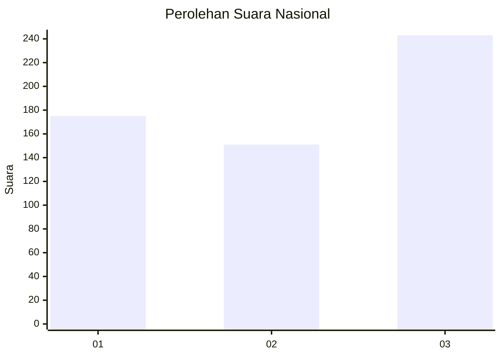
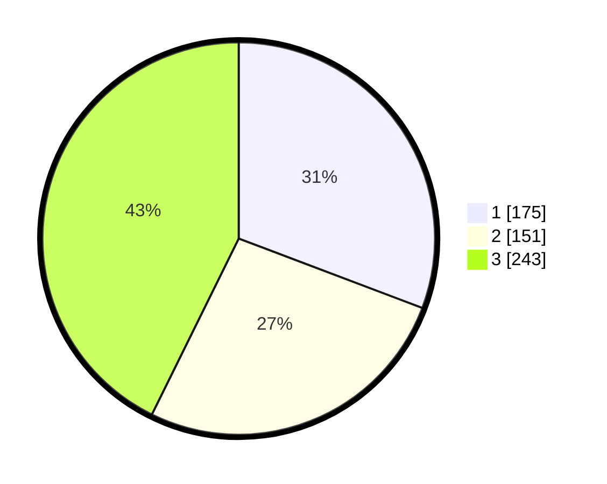

# Hasil

## Grafik

## Tabel

| No. | Nama Paslon    | Suara | Suara (raw) | Persentase |
|:--- |:-------------- | -----:| -----------:| ----------:|
| 1   | ANIES MUHAIMIN | 175   | [175][p-1]  | 30,76      |
| 2   | PRABOWO GIBRAN | 151   | [151][p-2]  | 26,54      |
| 3   | GANJAR MAHFUD  | 243   | [243][p-3]  | 42,71      |

[p-1]: https://github.com/gigit-pemilu/pemilu-2024/blob/main/pilpres/hitung-suara/sub/99-luar-negeri/sub/36-den-haag-belanda/sub/01-den-haag-belanda/sub/0001-den-haag-belanda/sub/008-tps-006/sub/paslon-1.txt
[p-2]: https://github.com/gigit-pemilu/pemilu-2024/blob/main/pilpres/hitung-suara/sub/99-luar-negeri/sub/36-den-haag-belanda/sub/01-den-haag-belanda/sub/0001-den-haag-belanda/sub/008-tps-006/sub/paslon-2.txt
[p-3]: https://github.com/gigit-pemilu/pemilu-2024/blob/main/pilpres/hitung-suara/sub/99-luar-negeri/sub/36-den-haag-belanda/sub/01-den-haag-belanda/sub/0001-den-haag-belanda/sub/008-tps-006/sub/paslon-3.txt

## Foto C Plano

https://sirekap-obj-formc.kpu.go.id/1525/pemilu/ppwp/99/36/01/00/01/9936010001008-20240216-034403--46b3a817-c347-42d9-8158-854160c10144.jpg

https://sirekap-obj-formc.kpu.go.id/1525/pemilu/ppwp/99/36/01/00/01/9936010001008-20240216-040054--923be3da-0440-458c-b713-08748166788a.jpg

https://sirekap-obj-formc.kpu.go.id/1525/pemilu/ppwp/99/36/01/00/01/9936010001008-20240215-014626--520c0b02-14d9-42ec-9579-ed81eda329eb.jpg

## Metadata

| Key        | Value               |
| ---------- | ------------------- |
| Time Stamp | 2024-02-16 13:30:32 |

## DATA PEMILIH TETAP

Jumlah pemilih dalam DPT: **1690**.
 * L: **532**.
 * P: **1158**.

## DATA PENGGUNA HAK PILIH

Jumlah pengguna hak pilih dalam DPT: **339**.
 * L: **114**.
 * P: **225**.

Jumlah pengguna hak pilih dalam DPTb: **200**.
 * L: **81**.
 * P: **119**.

Jumlah pengguna hak pilih dalam DPK: **35**.
 * L: **10**.
 * P: **25**.

Jumlah pengguna hak pilih: **574**.
 * L: **205**.
 * P: **369**.

## JUMLAH SUARA SAH DAN TIDAK SAH

JUMLAH SELURUH SUARA SAH: **569**.

JUMLAH SUARA TIDAK SAH: **5**.

JUMLAH SELURUH SUARA SAH DAN SUARA TIDAK SAH: **574**.

