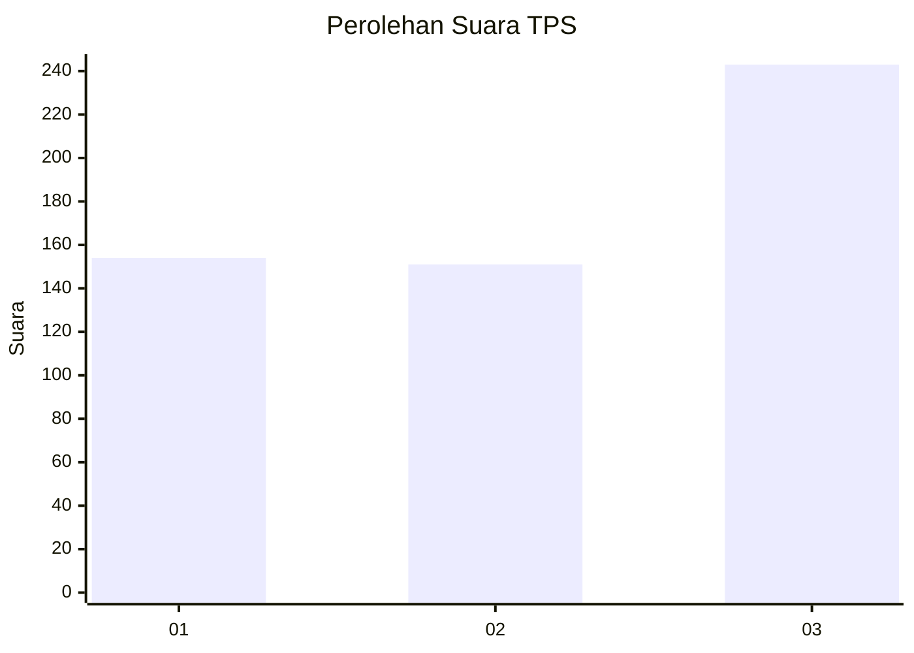
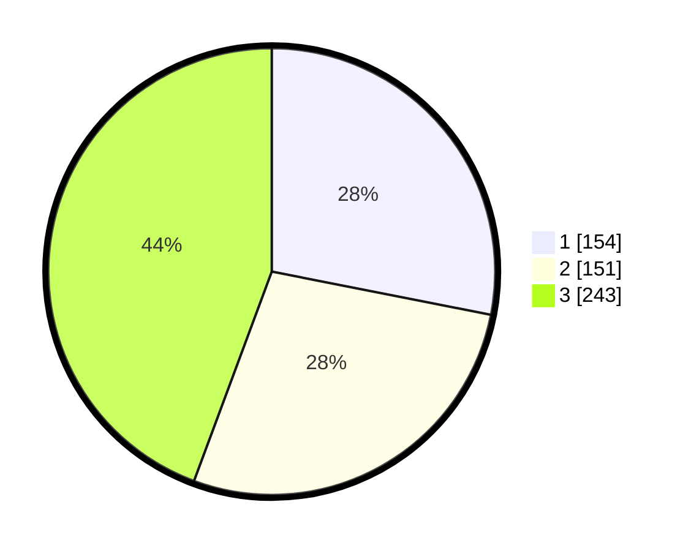

# Hasil

## Grafik

## Tabel

| No. | Nama Paslon    | Suara | Suara (raw) | Persentase |
|:--- |:-------------- | -----:| -----------:| ----------:|
| 1   | ANIES MUHAIMIN | 154   | [154][p-1]  | 28,10      |
| 2   | PRABOWO GIBRAN | 151   | [151][p-2]  | 27,55      |
| 3   | GANJAR MAHFUD  | 243   | [243][p-3]  | 44,34      |

[p-1]: https://github.com/gigit-pemilu/pemilu-2024-99-luar-negeri/blob/main/pilpres/hitung-suara/sub/99-luar-negeri/sub/36-den-haag-belanda/sub/01-den-haag-belanda/sub/0001-den-haag-belanda/sub/009-tps-007/sub/paslon-1.txt
[p-2]: https://github.com/gigit-pemilu/pemilu-2024-99-luar-negeri/blob/main/pilpres/hitung-suara/sub/99-luar-negeri/sub/36-den-haag-belanda/sub/01-den-haag-belanda/sub/0001-den-haag-belanda/sub/009-tps-007/sub/paslon-2.txt
[p-3]: https://github.com/gigit-pemilu/pemilu-2024-99-luar-negeri/blob/main/pilpres/hitung-suara/sub/99-luar-negeri/sub/36-den-haag-belanda/sub/01-den-haag-belanda/sub/0001-den-haag-belanda/sub/009-tps-007/sub/paslon-3.txt

## Foto C Plano

https://sirekap-obj-formc.kpu.go.id/aabe/pemilu/ppwp/99/36/01/00/01/9936010001009-20240215-021245--60fe8053-6c9f-4f7d-b56d-178f9d6cd893.jpg

https://sirekap-obj-formc.kpu.go.id/aabe/pemilu/ppwp/99/36/01/00/01/9936010001009-20240215-022427--b49e4249-3692-45cb-9747-f70037f15c6e.jpg

https://sirekap-obj-formc.kpu.go.id/aabe/pemilu/ppwp/99/36/01/00/01/9936010001009-20240217-172835--6a9b2c11-2654-4bb0-9a8b-f0f420ba98a5.jpg

## Metadata

| Key        | Value               |
| ---------- | ------------------- |
| Time Stamp | 2024-02-17 18:00:00 |

## DATA PEMILIH TETAP

Jumlah pemilih dalam DPT: **1591**.
 * L: **480**.
 * P: **1111**.

## DATA PENGGUNA HAK PILIH

Jumlah pengguna hak pilih dalam DPT: **337**.
 * L: **88**.
 * P: **249**.

Jumlah pengguna hak pilih dalam DPTb: **199**.
 * L: **75**.
 * P: **124**.

Jumlah pengguna hak pilih dalam DPK: **18**.
 * L: **5**.
 * P: **13**.

Jumlah pengguna hak pilih: **554**.
 * L: **168**.
 * P: **386**.

## JUMLAH SUARA SAH DAN TIDAK SAH

JUMLAH SELURUH SUARA SAH: **548**.

JUMLAH SUARA TIDAK SAH: **6**.

JUMLAH SELURUH SUARA SAH DAN SUARA TIDAK SAH: **554**.

