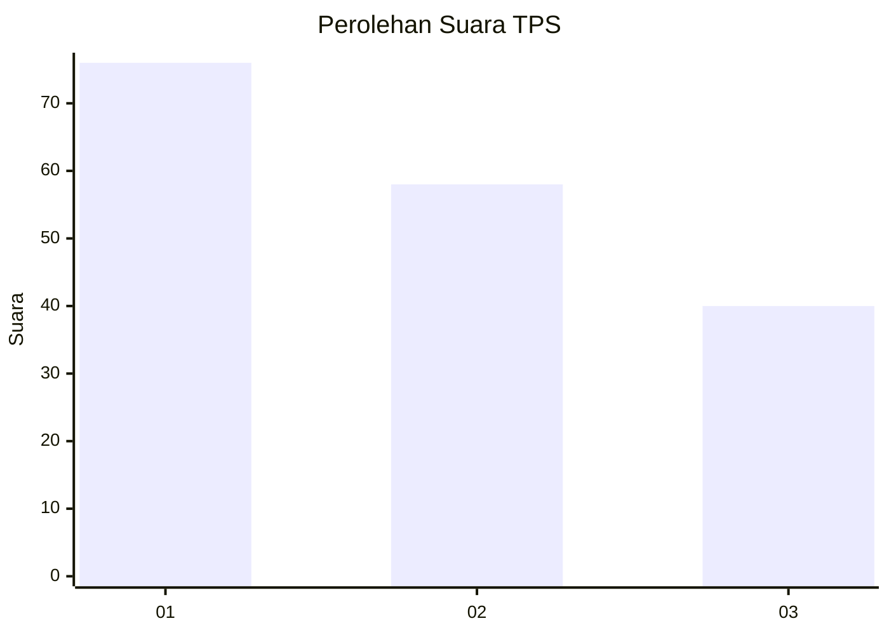
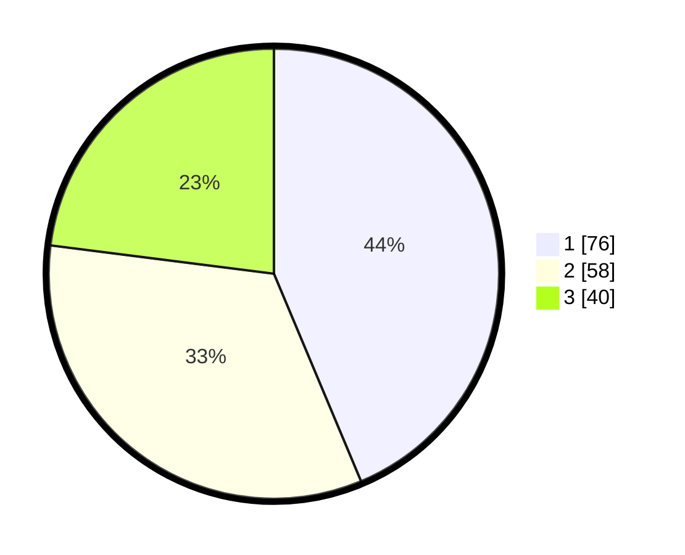

# Hasil

## Grafik

## Tabel

| No. | Nama Paslon    | Suara | Suara (raw) | Persentase |
|:--- |:-------------- | -----:| -----------:| ----------:|
| 1   | ANIES MUHAIMIN | 76    | [76][p-1]   | 43,68      |
| 2   | PRABOWO GIBRAN | 58    | [58][p-2]   | 33,33      |
| 3   | GANJAR MAHFUD  | 40    | [40][p-3]   | 22,99      |

[p-1]: https://github.com/gigit-pemilu/pemilu-2024-99-luar-negeri/blob/main/pilpres/hitung-suara/sub/99-luar-negeri/sub/37-dhaka-bangladesh/sub/01-dhaka-bangladesh/sub/0001-dhaka-bangladesh/sub/002-tps-001/sub/paslon-1.txt
[p-2]: https://github.com/gigit-pemilu/pemilu-2024-99-luar-negeri/blob/main/pilpres/hitung-suara/sub/99-luar-negeri/sub/37-dhaka-bangladesh/sub/01-dhaka-bangladesh/sub/0001-dhaka-bangladesh/sub/002-tps-001/sub/paslon-2.txt
[p-3]: https://github.com/gigit-pemilu/pemilu-2024-99-luar-negeri/blob/main/pilpres/hitung-suara/sub/99-luar-negeri/sub/37-dhaka-bangladesh/sub/01-dhaka-bangladesh/sub/0001-dhaka-bangladesh/sub/002-tps-001/sub/paslon-3.txt

## Foto C Plano

https://sirekap-obj-formc.kpu.go.id/598b/pemilu/ppwp/99/37/01/00/01/9937010001002-20240214-215624--5098471d-7aac-4ad9-b2d9-b657ef0f2628.jpg

https://sirekap-obj-formc.kpu.go.id/598b/pemilu/ppwp/99/37/01/00/01/9937010001002-20240214-195649--247b087e-572a-4e19-b34a-c9f8f7cb6bf7.jpg

https://sirekap-obj-formc.kpu.go.id/598b/pemilu/ppwp/99/37/01/00/01/9937010001002-20240214-195903--67714e2e-2a8a-494b-88e9-ead1d34e2386.jpg

## Metadata

| Key        | Value               |
| ---------- | ------------------- |
| Time Stamp | 2024-02-19 12:00:00 |

## DATA PEMILIH TETAP

Jumlah pemilih dalam DPT: **156**.
 * L: **31**.
 * P: **125**.

## DATA PENGGUNA HAK PILIH

Jumlah pengguna hak pilih dalam DPT: **124**.
 * L: **25**.
 * P: **99**.

Jumlah pengguna hak pilih dalam DPTb: **38**.
 * L: **26**.
 * P: **12**.

Jumlah pengguna hak pilih dalam DPK: **13**.
 * L: **7**.
 * P: **6**.

Jumlah pengguna hak pilih: **175**.
 * L: **58**.
 * P: **117**.

## JUMLAH SUARA SAH DAN TIDAK SAH

JUMLAH SELURUH SUARA SAH: **174**.

JUMLAH SUARA TIDAK SAH: **1**.

JUMLAH SELURUH SUARA SAH DAN SUARA TIDAK SAH: **175**.

