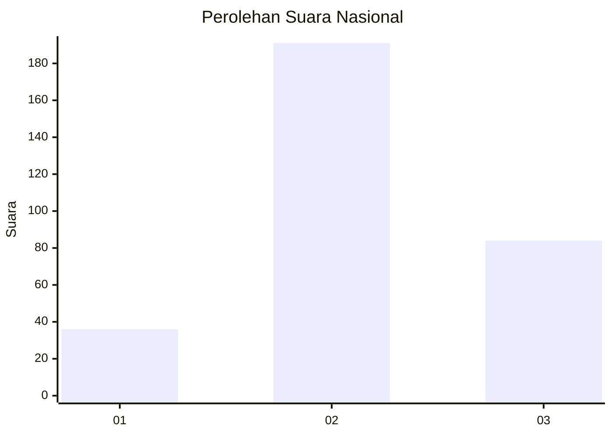
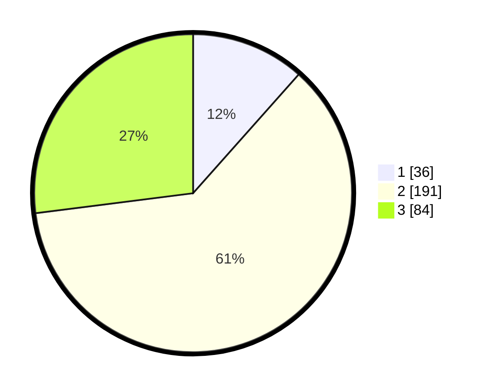

# Hasil

## Grafik

## Tabel

| No. | Nama Paslon    | Suara | Suara (raw) | Persentase |
|:--- |:-------------- | -----:| -----------:| ----------:|
| 1   | ANIES MUHAIMIN | 36    | [36][p-1]   | 11,58      |
| 2   | PRABOWO GIBRAN | 191   | [191][p-2]  | 61,41      |
| 3   | GANJAR MAHFUD  | 84    | [84][p-3]   | 27,01      |

[p-1]: https://github.com/gigit-pemilu/pemilu-2024/blob/main/pilpres/hitung-suara/sub/99-luar-negeri/sub/38-dili-timor-leste/sub/01-dili-timor-leste/sub/0001-dili-timor-leste/sub/001-tps/sub/paslon-1.txt
[p-2]: https://github.com/gigit-pemilu/pemilu-2024/blob/main/pilpres/hitung-suara/sub/99-luar-negeri/sub/38-dili-timor-leste/sub/01-dili-timor-leste/sub/0001-dili-timor-leste/sub/001-tps/sub/paslon-2.txt
[p-3]: https://github.com/gigit-pemilu/pemilu-2024/blob/main/pilpres/hitung-suara/sub/99-luar-negeri/sub/38-dili-timor-leste/sub/01-dili-timor-leste/sub/0001-dili-timor-leste/sub/001-tps/sub/paslon-3.txt

## Foto C Plano

https://sirekap-obj-formc.kpu.go.id/361f/pemilu/ppwp/99/38/01/00/01/9938010001001-20240216-084937--026a1823-ff89-4575-83a2-ba624089a706.jpg

https://sirekap-obj-formc.kpu.go.id/361f/pemilu/ppwp/99/38/01/00/01/9938010001001-20240216-085400--28d06d9f-853a-4c41-a3de-284a2737ecaa.jpg

https://sirekap-obj-formc.kpu.go.id/361f/pemilu/ppwp/99/38/01/00/01/9938010001001-20240216-085558--f31934dd-091b-45f4-ab5f-f52fa5059a1f.jpg

## Metadata

| Key        | Value               |
| ---------- | ------------------- |
| Time Stamp | 2024-02-16 09:00:28 |

## DATA PEMILIH TETAP

Jumlah pemilih dalam DPT: **587**.
 * L: **441**.
 * P: **146**.

## DATA PENGGUNA HAK PILIH

Jumlah pengguna hak pilih dalam DPT: **223**.
 * L: **146**.
 * P: **77**.

Jumlah pengguna hak pilih dalam DPTb: **34**.
 * L: **22**.
 * P: **12**.

Jumlah pengguna hak pilih dalam DPK: **54**.
 * L: **35**.
 * P: **19**.

Jumlah pengguna hak pilih: **311**.
 * L: **203**.
 * P: **108**.

## JUMLAH SUARA SAH DAN TIDAK SAH

JUMLAH SELURUH SUARA SAH: **311**.

JUMLAH SUARA TIDAK SAH: **0**.

JUMLAH SELURUH SUARA SAH DAN SUARA TIDAK SAH: **311**.

