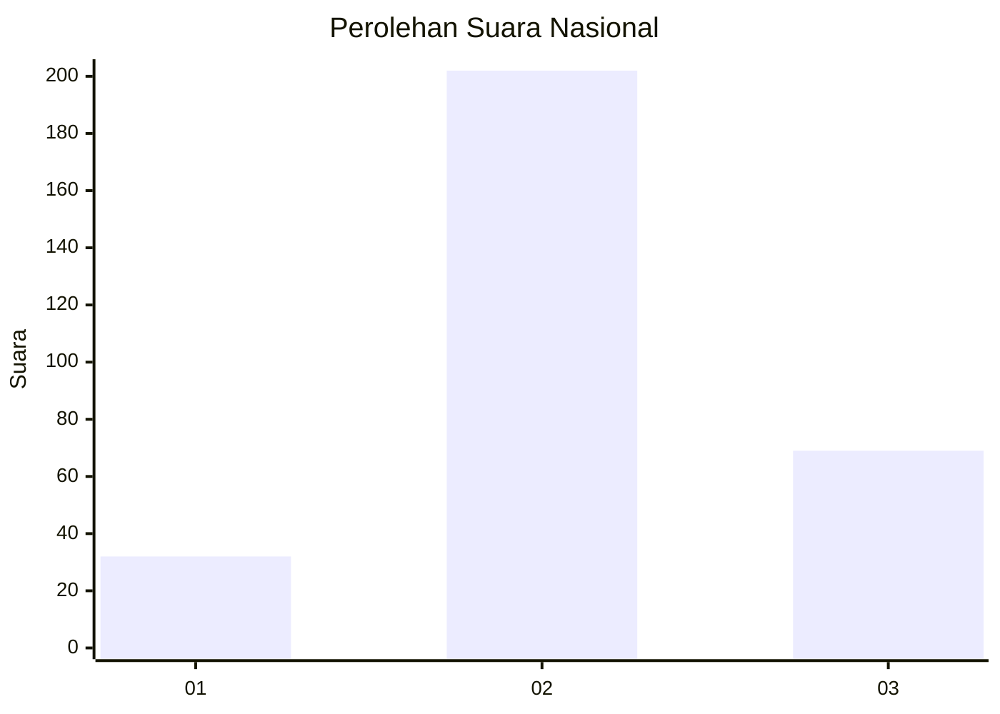
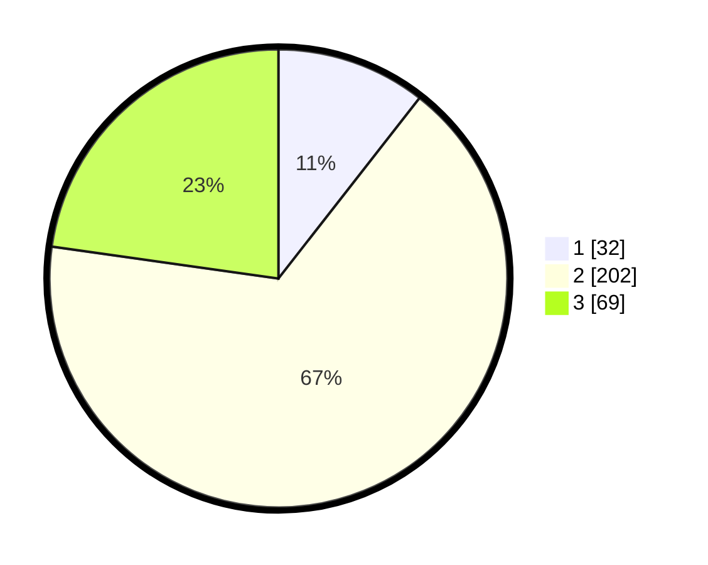

# Hasil

## Grafik

## Tabel

| No. | Nama Paslon    | Suara | Suara (raw) | Persentase |
|:--- |:-------------- | -----:| -----------:| ----------:|
| 1   | ANIES MUHAIMIN | 32    | [32][p-1]   | 10,56      |
| 2   | PRABOWO GIBRAN | 202   | [202][p-2]  | 66,67      |
| 3   | GANJAR MAHFUD  | 69    | [69][p-3]   | 22,77      |

[p-1]: https://github.com/gigit-pemilu/pemilu-2024/blob/main/pilpres/hitung-suara/sub/99-luar-negeri/sub/38-dili-timor-leste/sub/01-dili-timor-leste/sub/0001-dili-timor-leste/sub/002-tps/sub/paslon-1.txt
[p-2]: https://github.com/gigit-pemilu/pemilu-2024/blob/main/pilpres/hitung-suara/sub/99-luar-negeri/sub/38-dili-timor-leste/sub/01-dili-timor-leste/sub/0001-dili-timor-leste/sub/002-tps/sub/paslon-2.txt
[p-3]: https://github.com/gigit-pemilu/pemilu-2024/blob/main/pilpres/hitung-suara/sub/99-luar-negeri/sub/38-dili-timor-leste/sub/01-dili-timor-leste/sub/0001-dili-timor-leste/sub/002-tps/sub/paslon-3.txt

## Foto C Plano

https://sirekap-obj-formc.kpu.go.id/5042/pemilu/ppwp/99/38/01/00/01/9938010001002-20240216-145624--ff5c5497-dbb0-4927-8ad2-6e29d4662bfd.jpg

https://sirekap-obj-formc.kpu.go.id/5042/pemilu/ppwp/99/38/01/00/01/9938010001002-20240216-124928--596a46ae-3595-4dc7-aaac-6f0f45cc66ee.jpg

https://sirekap-obj-formc.kpu.go.id/5042/pemilu/ppwp/99/38/01/00/01/9938010001002-20240216-125029--2ca7a46d-4674-4c90-ad13-bd869ed83a06.jpg

## Metadata

| Key        | Value               |
| ---------- | ------------------- |
| Time Stamp | 2024-02-16 16:25:10 |

## DATA PEMILIH TETAP

Jumlah pemilih dalam DPT: **588**.
 * L: **384**.
 * P: **204**.

## DATA PENGGUNA HAK PILIH

Jumlah pengguna hak pilih dalam DPT: **211**.
 * L: **99**.
 * P: **112**.

Jumlah pengguna hak pilih dalam DPTb: **38**.
 * L: **22**.
 * P: **16**.

Jumlah pengguna hak pilih dalam DPK: **54**.
 * L: **38**.
 * P: **16**.

Jumlah pengguna hak pilih: **303**.
 * L: **159**.
 * P: **144**.

## JUMLAH SUARA SAH DAN TIDAK SAH

JUMLAH SELURUH SUARA SAH: **303**.

JUMLAH SUARA TIDAK SAH: **0**.

JUMLAH SELURUH SUARA SAH DAN SUARA TIDAK SAH: **303**.

