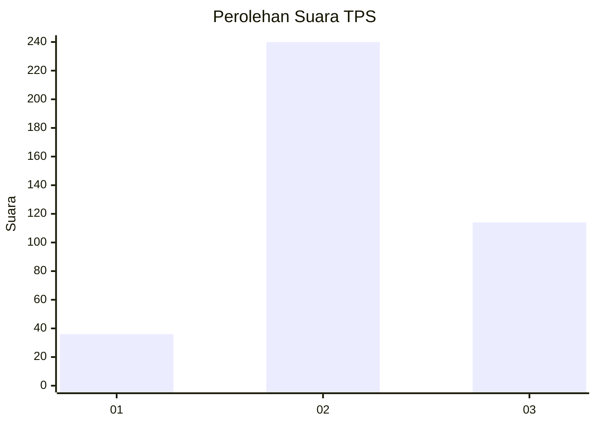
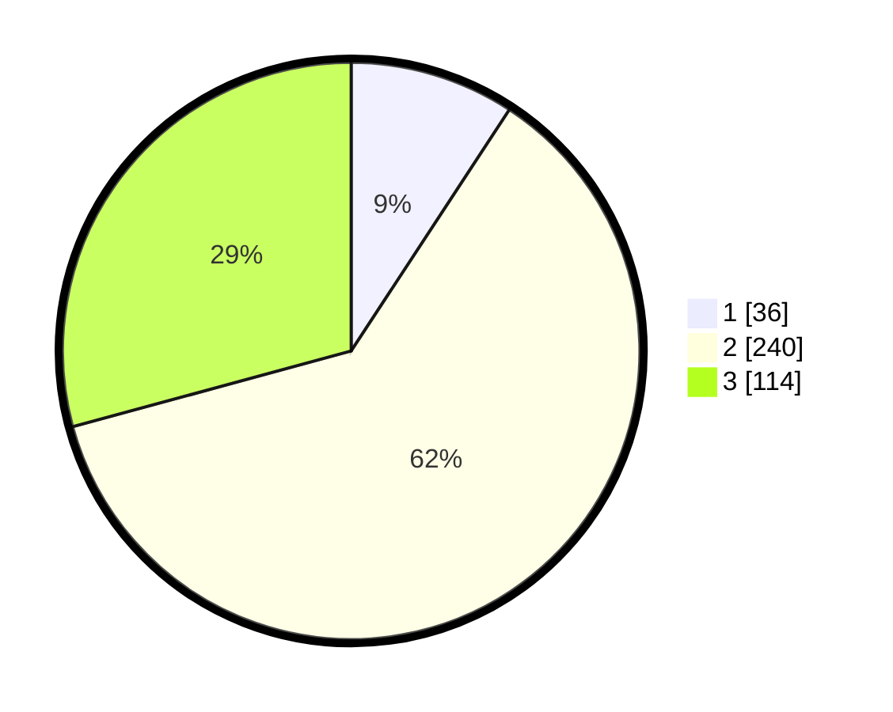

# Hasil

## Grafik

## Tabel

| No. | Nama Paslon    | Suara | Suara (raw) | Persentase |
|:--- |:-------------- | -----:| -----------:| ----------:|
| 1   | ANIES MUHAIMIN | 36    | [36][p-1]   | 9,23       |
| 2   | PRABOWO GIBRAN | 240   | [240][p-2]  | 61,54      |
| 3   | GANJAR MAHFUD  | 114   | [114][p-3]  | 29,23      |

[p-1]: https://github.com/gigit-pemilu/pemilu-2024-99-luar-negeri/blob/main/pilpres/hitung-suara/sub/99-luar-negeri/sub/38-dili-timor-leste/sub/01-dili-timor-leste/sub/0001-dili-timor-leste/sub/003-tps/sub/paslon-1.txt
[p-2]: https://github.com/gigit-pemilu/pemilu-2024-99-luar-negeri/blob/main/pilpres/hitung-suara/sub/99-luar-negeri/sub/38-dili-timor-leste/sub/01-dili-timor-leste/sub/0001-dili-timor-leste/sub/003-tps/sub/paslon-2.txt
[p-3]: https://github.com/gigit-pemilu/pemilu-2024-99-luar-negeri/blob/main/pilpres/hitung-suara/sub/99-luar-negeri/sub/38-dili-timor-leste/sub/01-dili-timor-leste/sub/0001-dili-timor-leste/sub/003-tps/sub/paslon-3.txt

## Foto C Plano

https://sirekap-obj-formc.kpu.go.id/830b/pemilu/ppwp/99/38/01/00/01/9938010001003-20240216-095903--11751dfb-860f-4302-88a1-604b707023ca.jpg

https://sirekap-obj-formc.kpu.go.id/830b/pemilu/ppwp/99/38/01/00/01/9938010001003-20240216-095654--72a0be02-5c06-423a-82ec-538c7c46cd2f.jpg

https://sirekap-obj-formc.kpu.go.id/830b/pemilu/ppwp/99/38/01/00/01/9938010001003-20240216-095923--2af68929-084b-4c67-a65a-1d92681c825e.jpg

## Metadata

| Key        | Value               |
| ---------- | ------------------- |
| Time Stamp | 2024-02-19 16:00:00 |

## DATA PEMILIH TETAP

Jumlah pemilih dalam DPT: **590**.
 * L: **390**.
 * P: **200**.

## DATA PENGGUNA HAK PILIH

Jumlah pengguna hak pilih dalam DPT: **219**.
 * L: **119**.
 * P: **100**.

Jumlah pengguna hak pilih dalam DPTb: **35**.
 * L: **22**.
 * P: **13**.

Jumlah pengguna hak pilih dalam DPK: **136**.
 * L: **82**.
 * P: **54**.

Jumlah pengguna hak pilih: **390**.
 * L: **223**.
 * P: **167**.

## JUMLAH SUARA SAH DAN TIDAK SAH

JUMLAH SELURUH SUARA SAH: **390**.

JUMLAH SUARA TIDAK SAH: **0**.

JUMLAH SELURUH SUARA SAH DAN SUARA TIDAK SAH: **390**.

