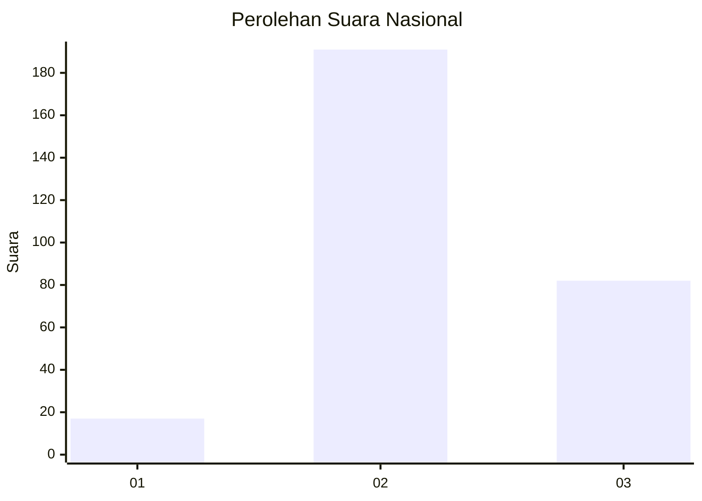
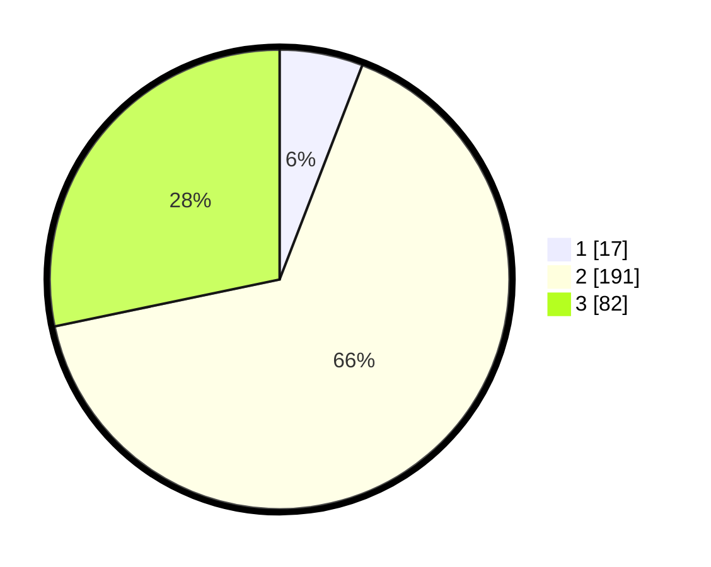

# Hasil

## Grafik

## Tabel

| No. | Nama Paslon    | Suara | Suara (raw) | Persentase |
|:--- |:-------------- | -----:| -----------:| ----------:|
| 1   | ANIES MUHAIMIN | 17    | [17][p-1]   | 5,86       |
| 2   | PRABOWO GIBRAN | 191   | [191][p-2]  | 65,86      |
| 3   | GANJAR MAHFUD  | 82    | [82][p-3]   | 28,28      |

[p-1]: https://github.com/gigit-pemilu/pemilu-2024/blob/main/pilpres/hitung-suara/sub/99-luar-negeri/sub/38-dili-timor-leste/sub/01-dili-timor-leste/sub/0001-dili-timor-leste/sub/004-tps/sub/paslon-1.txt
[p-2]: https://github.com/gigit-pemilu/pemilu-2024/blob/main/pilpres/hitung-suara/sub/99-luar-negeri/sub/38-dili-timor-leste/sub/01-dili-timor-leste/sub/0001-dili-timor-leste/sub/004-tps/sub/paslon-2.txt
[p-3]: https://github.com/gigit-pemilu/pemilu-2024/blob/main/pilpres/hitung-suara/sub/99-luar-negeri/sub/38-dili-timor-leste/sub/01-dili-timor-leste/sub/0001-dili-timor-leste/sub/004-tps/sub/paslon-3.txt

## Foto C Plano

https://sirekap-obj-formc.kpu.go.id/834f/pemilu/ppwp/99/38/01/00/01/9938010001004-20240216-121028--274a33ca-bb87-4f46-947a-941d7ff3614b.jpg

https://sirekap-obj-formc.kpu.go.id/834f/pemilu/ppwp/99/38/01/00/01/9938010001004-20240216-121335--4ff4933e-df4e-455d-b6a8-7daa707ce6eb.jpg

https://sirekap-obj-formc.kpu.go.id/834f/pemilu/ppwp/99/38/01/00/01/9938010001004-20240216-121431--043b93b2-60f6-40a6-bbc3-63b86d18d3d6.jpg

## Metadata

| Key        | Value               |
| ---------- | ------------------- |
| Time Stamp | 2024-02-19 16:00:00 |

## DATA PEMILIH TETAP

Jumlah pemilih dalam DPT: **590**.
 * L: **364**.
 * P: **226**.

## DATA PENGGUNA HAK PILIH

Jumlah pengguna hak pilih dalam DPT: **212**.
 * L: **105**.
 * P: **107**.

Jumlah pengguna hak pilih dalam DPTb: **30**.
 * L: **17**.
 * P: **13**.

Jumlah pengguna hak pilih dalam DPK: **49**.
 * L: **40**.
 * P: **9**.

Jumlah pengguna hak pilih: **291**.
 * L: **162**.
 * P: **129**.

## JUMLAH SUARA SAH DAN TIDAK SAH

JUMLAH SELURUH SUARA SAH: **290**.

JUMLAH SUARA TIDAK SAH: **1**.

JUMLAH SELURUH SUARA SAH DAN SUARA TIDAK SAH: **291**.

