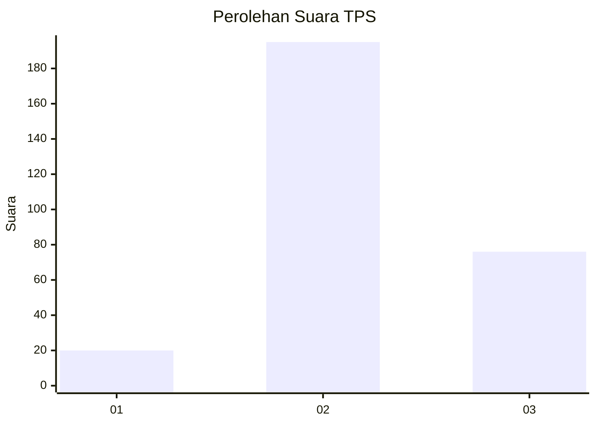
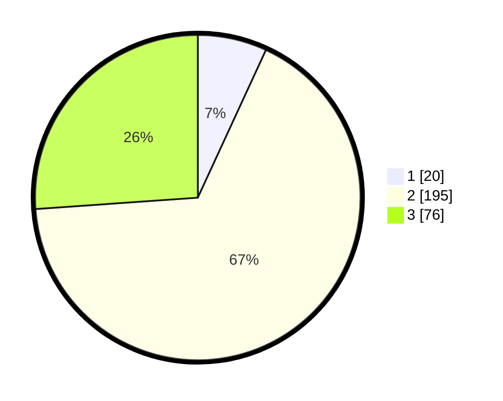

# Hasil

## Grafik

## Tabel

| No. | Nama Paslon    | Suara | Suara (raw) | Persentase |
|:--- |:-------------- | -----:| -----------:| ----------:|
| 1   | ANIES MUHAIMIN | 20    | [20][p-1]   | 6,87       |
| 2   | PRABOWO GIBRAN | 195   | [195][p-2]  | 67,01      |
| 3   | GANJAR MAHFUD  | 76    | [76][p-3]   | 26,12      |

[p-1]: https://github.com/gigit-pemilu/pemilu-2024-99-luar-negeri/blob/main/pilpres/hitung-suara/sub/99-luar-negeri/sub/38-dili-timor-leste/sub/01-dili-timor-leste/sub/0001-dili-timor-leste/sub/005-tps/sub/paslon-1.txt
[p-2]: https://github.com/gigit-pemilu/pemilu-2024-99-luar-negeri/blob/main/pilpres/hitung-suara/sub/99-luar-negeri/sub/38-dili-timor-leste/sub/01-dili-timor-leste/sub/0001-dili-timor-leste/sub/005-tps/sub/paslon-2.txt
[p-3]: https://github.com/gigit-pemilu/pemilu-2024-99-luar-negeri/blob/main/pilpres/hitung-suara/sub/99-luar-negeri/sub/38-dili-timor-leste/sub/01-dili-timor-leste/sub/0001-dili-timor-leste/sub/005-tps/sub/paslon-3.txt

## Foto C Plano

https://sirekap-obj-formc.kpu.go.id/d1ab/pemilu/ppwp/99/38/01/00/01/9938010001005-20240216-124607--5810ee39-0d8b-4a7b-92bd-b6eb137c9d61.jpg

https://sirekap-obj-formc.kpu.go.id/d1ab/pemilu/ppwp/99/38/01/00/01/9938010001005-20240216-124931--7e4e66df-f2a6-4a67-b70b-d0642df671cc.jpg

https://sirekap-obj-formc.kpu.go.id/d1ab/pemilu/ppwp/99/38/01/00/01/9938010001005-20240216-125601--4a480bb7-e3cd-48b2-94a9-bb853770e590.jpg

## Metadata

| Key        | Value               |
| ---------- | ------------------- |
| Time Stamp | 2024-02-16 13:00:29 |

## DATA PEMILIH TETAP

Jumlah pemilih dalam DPT: **601**.
 * L: **257**.
 * P: **344**.

## DATA PENGGUNA HAK PILIH

Jumlah pengguna hak pilih dalam DPT: **207**.
 * L: **93**.
 * P: **114**.

Jumlah pengguna hak pilih dalam DPTb: **38**.
 * L: **26**.
 * P: **12**.

Jumlah pengguna hak pilih dalam DPK: **48**.
 * L: **29**.
 * P: **19**.

Jumlah pengguna hak pilih: **293**.
 * L: **148**.
 * P: **145**.

## JUMLAH SUARA SAH DAN TIDAK SAH

JUMLAH SELURUH SUARA SAH: **291**.

JUMLAH SUARA TIDAK SAH: **2**.

JUMLAH SELURUH SUARA SAH DAN SUARA TIDAK SAH: **293**.

