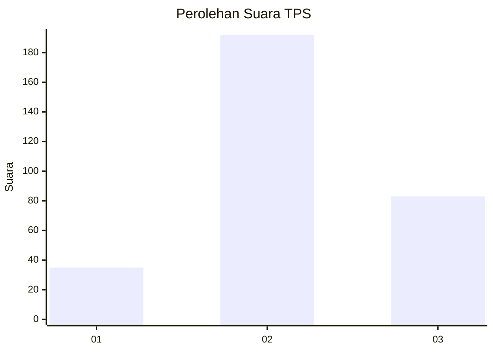
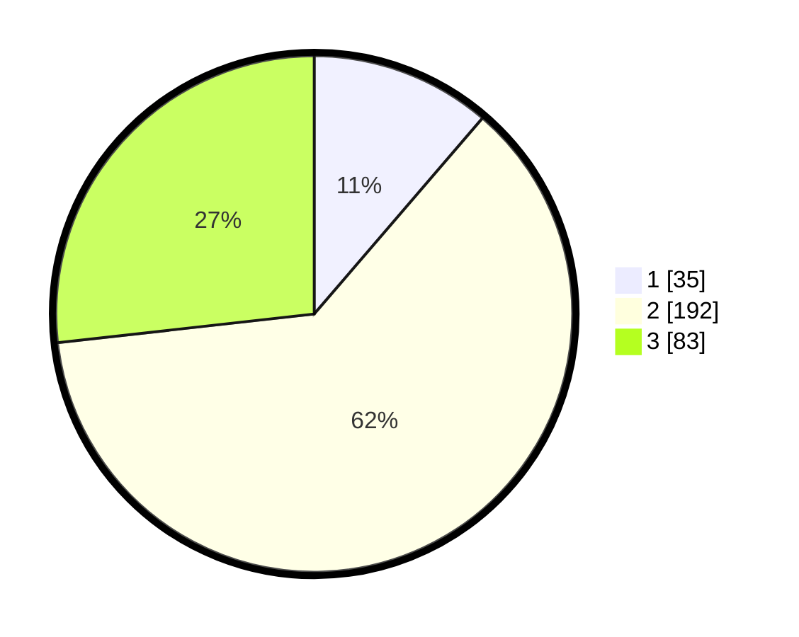

# Hasil

## Grafik

## Tabel

| No. | Nama Paslon    | Suara | Suara (raw) | Persentase |
|:--- |:-------------- | -----:| -----------:| ----------:|
| 1   | ANIES MUHAIMIN | 35    | [35][p-1]   | 11,29      |
| 2   | PRABOWO GIBRAN | 192   | [192][p-2]  | 61,94      |
| 3   | GANJAR MAHFUD  | 83    | [83][p-3]   | 26,77      |

[p-1]: https://github.com/gigit-pemilu/pemilu-2024-99-luar-negeri/blob/main/pilpres/hitung-suara/sub/99-luar-negeri/sub/38-dili-timor-leste/sub/01-dili-timor-leste/sub/0001-dili-timor-leste/sub/006-tps/sub/paslon-1.txt
[p-2]: https://github.com/gigit-pemilu/pemilu-2024-99-luar-negeri/blob/main/pilpres/hitung-suara/sub/99-luar-negeri/sub/38-dili-timor-leste/sub/01-dili-timor-leste/sub/0001-dili-timor-leste/sub/006-tps/sub/paslon-2.txt
[p-3]: https://github.com/gigit-pemilu/pemilu-2024-99-luar-negeri/blob/main/pilpres/hitung-suara/sub/99-luar-negeri/sub/38-dili-timor-leste/sub/01-dili-timor-leste/sub/0001-dili-timor-leste/sub/006-tps/sub/paslon-3.txt

## Foto C Plano

https://sirekap-obj-formc.kpu.go.id/04c8/pemilu/ppwp/99/38/01/00/01/9938010001006-20240216-131613--8932f6f6-abee-4f11-a27b-62da0d07f570.jpg

https://sirekap-obj-formc.kpu.go.id/04c8/pemilu/ppwp/99/38/01/00/01/9938010001006-20240216-132006--2d50d072-f63c-4f19-baa3-0f0371b3856b.jpg

https://sirekap-obj-formc.kpu.go.id/04c8/pemilu/ppwp/99/38/01/00/01/9938010001006-20240216-132131--57be4d90-b2c2-466f-8258-517f241ebf35.jpg

## Metadata

| Key        | Value               |
| ---------- | ------------------- |
| Time Stamp | 2024-02-16 13:30:32 |

## DATA PEMILIH TETAP

Jumlah pemilih dalam DPT: **592**.
 * L: **339**.
 * P: **253**.

## DATA PENGGUNA HAK PILIH

Jumlah pengguna hak pilih dalam DPT: **227**.
 * L: **110**.
 * P: **117**.

Jumlah pengguna hak pilih dalam DPTb: **33**.
 * L: **22**.
 * P: **11**.

Jumlah pengguna hak pilih dalam DPK: **52**.
 * L: **36**.
 * P: **16**.

Jumlah pengguna hak pilih: **312**.
 * L: **168**.
 * P: **144**.

## JUMLAH SUARA SAH DAN TIDAK SAH

JUMLAH SELURUH SUARA SAH: **310**.

JUMLAH SUARA TIDAK SAH: **2**.

JUMLAH SELURUH SUARA SAH DAN SUARA TIDAK SAH: **312**.

