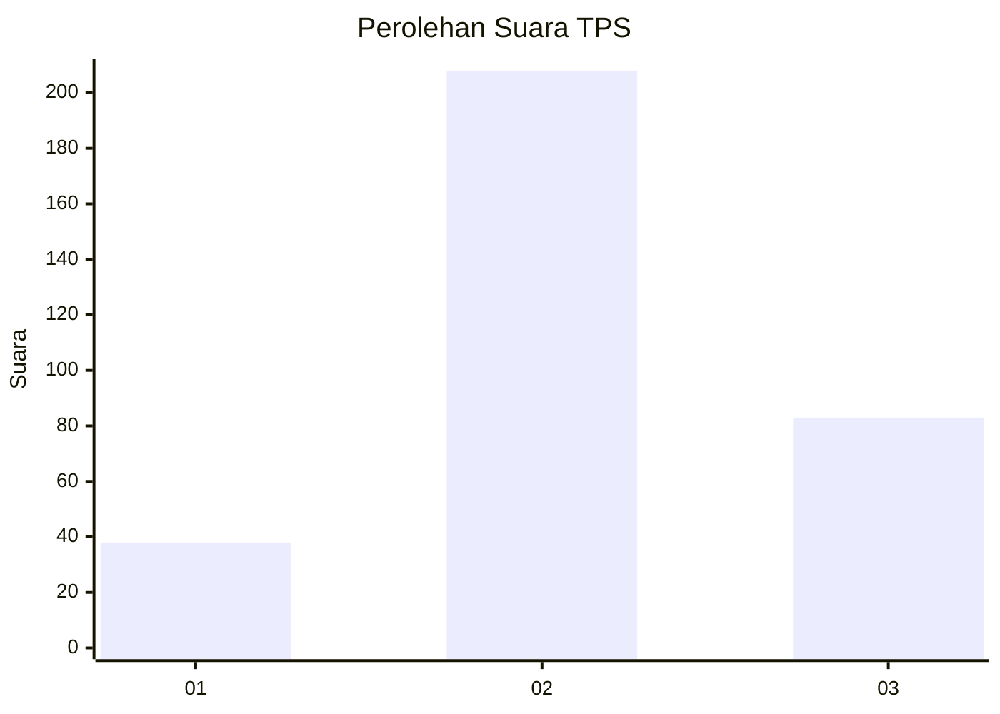
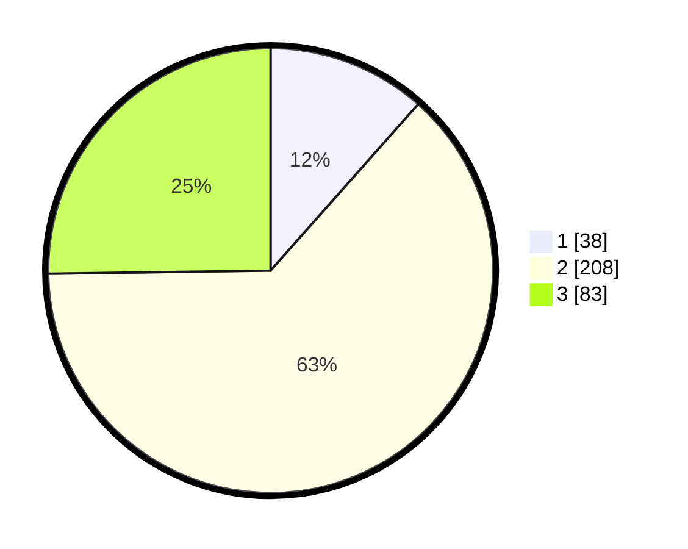

# Hasil

## Grafik

## Tabel

| No. | Nama Paslon    | Suara | Suara (raw) | Persentase |
|:--- |:-------------- | -----:| -----------:| ----------:|
| 1   | ANIES MUHAIMIN | 38    | [38][p-1]   | 11,55      |
| 2   | PRABOWO GIBRAN | 208   | [208][p-2]  | 63,22      |
| 3   | GANJAR MAHFUD  | 83    | [83][p-3]   | 25,23      |

[p-1]: https://github.com/gigit-pemilu/pemilu-2024-99-luar-negeri/blob/main/pilpres/hitung-suara/sub/99-luar-negeri/sub/38-dili-timor-leste/sub/01-dili-timor-leste/sub/0001-dili-timor-leste/sub/007-tps/sub/paslon-1.txt
[p-2]: https://github.com/gigit-pemilu/pemilu-2024-99-luar-negeri/blob/main/pilpres/hitung-suara/sub/99-luar-negeri/sub/38-dili-timor-leste/sub/01-dili-timor-leste/sub/0001-dili-timor-leste/sub/007-tps/sub/paslon-2.txt
[p-3]: https://github.com/gigit-pemilu/pemilu-2024-99-luar-negeri/blob/main/pilpres/hitung-suara/sub/99-luar-negeri/sub/38-dili-timor-leste/sub/01-dili-timor-leste/sub/0001-dili-timor-leste/sub/007-tps/sub/paslon-3.txt

## Foto C Plano

https://sirekap-obj-formc.kpu.go.id/ce61/pemilu/ppwp/99/38/01/00/01/9938010001007-20240216-165726--2c6e88f2-173e-4af9-98ff-5b1010fe1bb4.jpg

https://sirekap-obj-formc.kpu.go.id/ce61/pemilu/ppwp/99/38/01/00/01/9938010001007-20240216-170812--b112764b-21d3-4598-bdb0-7c879fb44827.jpg

https://sirekap-obj-formc.kpu.go.id/ce61/pemilu/ppwp/99/38/01/00/01/9938010001007-20240216-171325--d1770958-2c54-4010-90dc-b3e96e7d04d6.jpg

## Metadata

| Key        | Value               |
| ---------- | ------------------- |
| Time Stamp | 2024-02-16 17:30:00 |

## DATA PEMILIH TETAP

Jumlah pemilih dalam DPT: **590**.
 * L: **396**.
 * P: **194**.

## DATA PENGGUNA HAK PILIH

Jumlah pengguna hak pilih dalam DPT: **194**.
 * L: **114**.
 * P: **80**.

Jumlah pengguna hak pilih dalam DPTb: **33**.
 * L: **15**.
 * P: **18**.

Jumlah pengguna hak pilih dalam DPK: **104**.
 * L: **67**.
 * P: **37**.

Jumlah pengguna hak pilih: **331**.
 * L: **196**.
 * P: **135**.

## JUMLAH SUARA SAH DAN TIDAK SAH

JUMLAH SELURUH SUARA SAH: **329**.

JUMLAH SUARA TIDAK SAH: **2**.

JUMLAH SELURUH SUARA SAH DAN SUARA TIDAK SAH: **331**.

