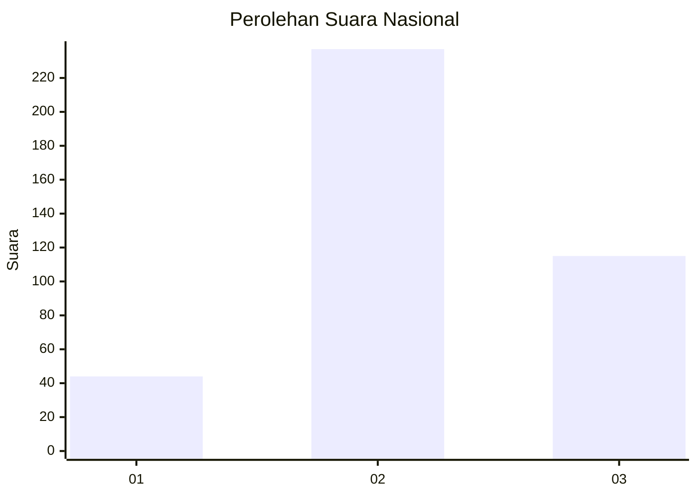
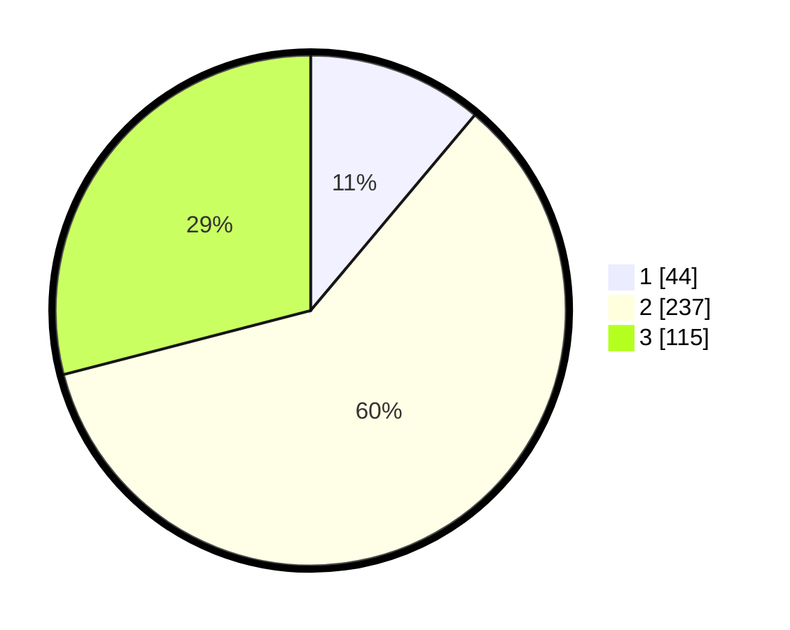

# Hasil

## Grafik

## Tabel

| No. | Nama Paslon    | Suara | Suara (raw) | Persentase |
|:--- |:-------------- | -----:| -----------:| ----------:|
| 1   | ANIES MUHAIMIN | 44    | [44][p-1]   | 11,11      |
| 2   | PRABOWO GIBRAN | 237   | [237][p-2]  | 59,85      |
| 3   | GANJAR MAHFUD  | 115   | [115][p-3]  | 29,04      |

[p-1]: https://github.com/gigit-pemilu/pemilu-2024/blob/main/pilpres/hitung-suara/sub/99-luar-negeri/sub/38-dili-timor-leste/sub/01-dili-timor-leste/sub/0001-dili-timor-leste/sub/008-tps/sub/paslon-1.txt
[p-2]: https://github.com/gigit-pemilu/pemilu-2024/blob/main/pilpres/hitung-suara/sub/99-luar-negeri/sub/38-dili-timor-leste/sub/01-dili-timor-leste/sub/0001-dili-timor-leste/sub/008-tps/sub/paslon-2.txt
[p-3]: https://github.com/gigit-pemilu/pemilu-2024/blob/main/pilpres/hitung-suara/sub/99-luar-negeri/sub/38-dili-timor-leste/sub/01-dili-timor-leste/sub/0001-dili-timor-leste/sub/008-tps/sub/paslon-3.txt

## Foto C Plano

https://sirekap-obj-formc.kpu.go.id/c778/pemilu/ppwp/99/38/01/00/01/9938010001008-20240216-141801--1a1a5b4b-3adb-4817-8550-cc9b710f5212.jpg

https://sirekap-obj-formc.kpu.go.id/c778/pemilu/ppwp/99/38/01/00/01/9938010001008-20240216-141821--84bcd24c-5c8e-4bc9-8b4c-8a6ce82cc88c.jpg

https://sirekap-obj-formc.kpu.go.id/c778/pemilu/ppwp/99/38/01/00/01/9938010001008-20240216-141839--ac72b774-2ff6-4280-a36c-f2f6b9c11934.jpg

## Metadata

| Key        | Value               |
| ---------- | ------------------- |
| Time Stamp | 2024-02-19 16:00:00 |

## DATA PEMILIH TETAP

Jumlah pemilih dalam DPT: **601**.
 * L: **362**.
 * P: **239**.

## DATA PENGGUNA HAK PILIH

Jumlah pengguna hak pilih dalam DPT: **232**.
 * L: **114**.
 * P: **118**.

Jumlah pengguna hak pilih dalam DPTb: **30**.
 * L: **18**.
 * P: **12**.

Jumlah pengguna hak pilih dalam DPK: **136**.
 * L: **94**.
 * P: **42**.

Jumlah pengguna hak pilih: **398**.
 * L: **226**.
 * P: **172**.

## JUMLAH SUARA SAH DAN TIDAK SAH

JUMLAH SELURUH SUARA SAH: **396**.

JUMLAH SUARA TIDAK SAH: **2**.

JUMLAH SELURUH SUARA SAH DAN SUARA TIDAK SAH: **398**.

