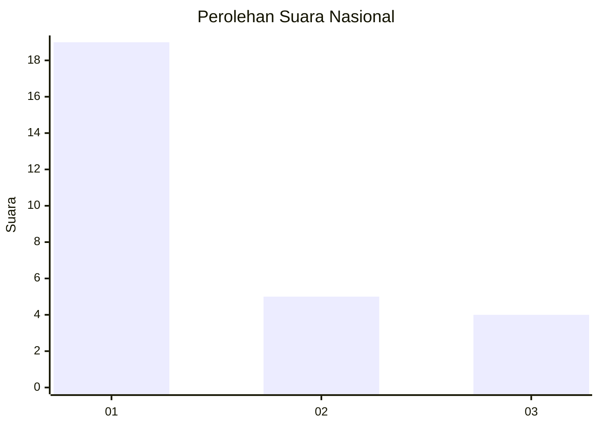
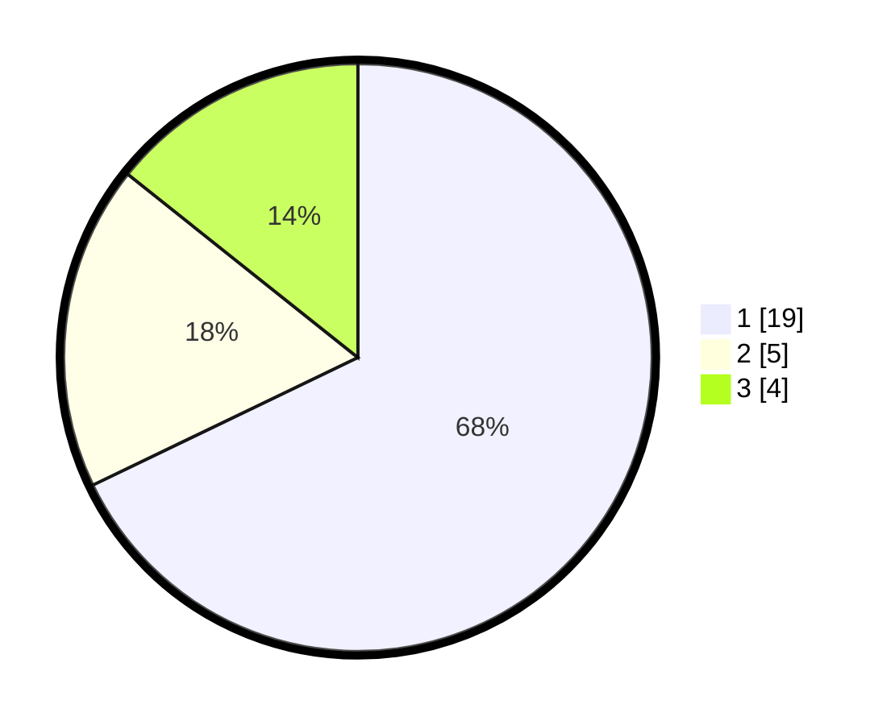

# Hasil

## Grafik

## Tabel

| No. | Nama Paslon    | Suara | Suara (raw) | Persentase |
|:--- |:-------------- | -----:| -----------:| ----------:|
| 1   | ANIES MUHAIMIN | 19    | [19][p-1]   | 67,86      |
| 2   | PRABOWO GIBRAN | 5     | [5][p-2]    | 17,86      |
| 3   | GANJAR MAHFUD  | 4     | [4][p-3]    | 14,29      |

[p-1]: https://github.com/gigit-pemilu/pemilu-2024/blob/main/pilpres/hitung-suara/sub/99-luar-negeri/sub/39-doha-qatar/sub/01-doha-qatar/sub/0001-doha-qatar/sub/001-pos-001/sub/paslon-1.txt
[p-2]: https://github.com/gigit-pemilu/pemilu-2024/blob/main/pilpres/hitung-suara/sub/99-luar-negeri/sub/39-doha-qatar/sub/01-doha-qatar/sub/0001-doha-qatar/sub/001-pos-001/sub/paslon-2.txt
[p-3]: https://github.com/gigit-pemilu/pemilu-2024/blob/main/pilpres/hitung-suara/sub/99-luar-negeri/sub/39-doha-qatar/sub/01-doha-qatar/sub/0001-doha-qatar/sub/001-pos-001/sub/paslon-3.txt

## Foto C Plano

https://sirekap-obj-formc.kpu.go.id/e15e/pemilu/ppwp/99/39/01/00/01/9939010001001-20240215-224034--ead6a632-b4e2-4921-8ae5-ccc01ffb923a.jpg

https://sirekap-obj-formc.kpu.go.id/e15e/pemilu/ppwp/99/39/01/00/01/9939010001001-20240215-224041--7b2e1ed2-8605-404d-ab42-28f78cd655a4.jpg

https://sirekap-obj-formc.kpu.go.id/e15e/pemilu/ppwp/99/39/01/00/01/9939010001001-20240215-224037--78eb8f67-7a19-46f0-834d-36e569f152c2.jpg

## Metadata

| Key        | Value               |
| ---------- | ------------------- |
| Time Stamp | 2024-02-16 17:30:00 |

## DATA PEMILIH TETAP

Jumlah pemilih dalam DPT: **42**.
 * L: **39**.
 * P: **3**.

## DATA PENGGUNA HAK PILIH

Jumlah pengguna hak pilih dalam DPT: **31**.
 * L: **30**.
 * P: **1**.

Jumlah pengguna hak pilih dalam DPTb: **0**.
 * L: **0**.
 * P: **0**.

Jumlah pengguna hak pilih dalam DPK: **0**.
 * L: **0**.
 * P: **0**.

Jumlah pengguna hak pilih: **31**.
 * L: **30**.
 * P: **1**.

## JUMLAH SUARA SAH DAN TIDAK SAH

JUMLAH SELURUH SUARA SAH: **28**.

JUMLAH SUARA TIDAK SAH: **3**.

JUMLAH SELURUH SUARA SAH DAN SUARA TIDAK SAH: **31**.

