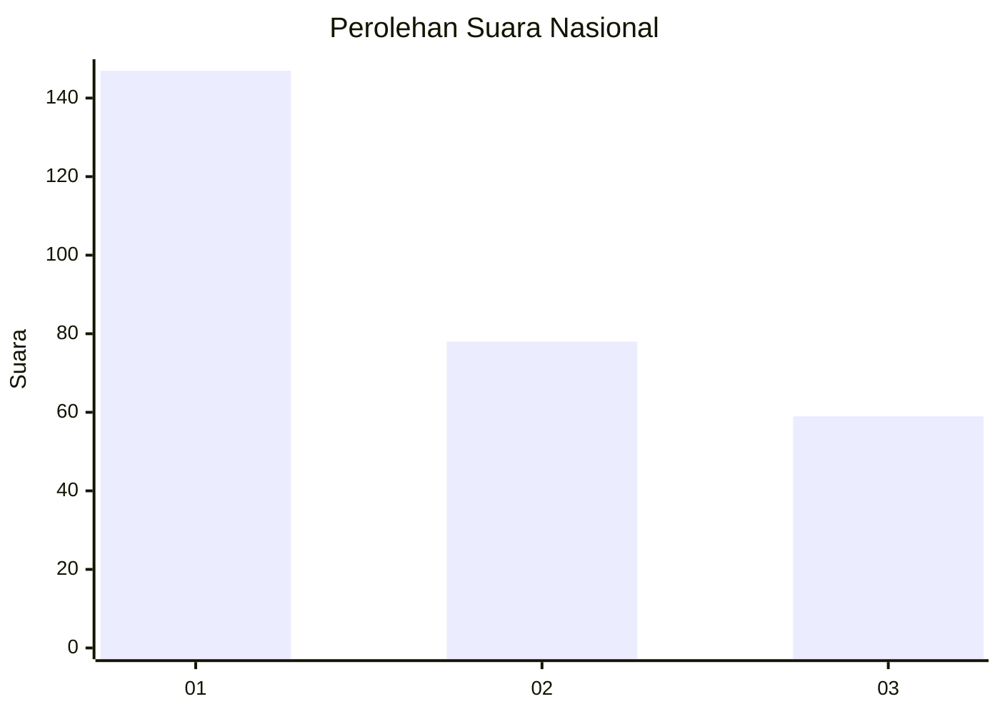
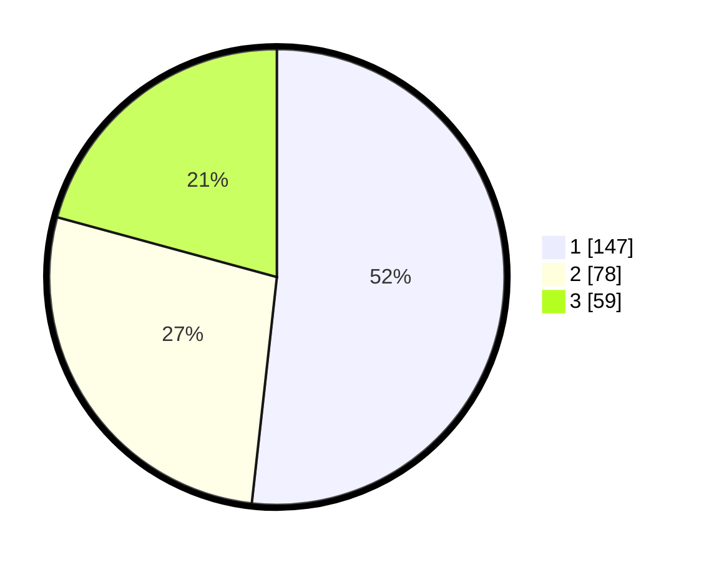

# Hasil

## Grafik

## Tabel

| No. | Nama Paslon    | Suara | Suara (raw) | Persentase |
|:--- |:-------------- | -----:| -----------:| ----------:|
| 1   | ANIES MUHAIMIN | 147   | [147][p-1]  | 51,76      |
| 2   | PRABOWO GIBRAN | 78    | [78][p-2]   | 27,46      |
| 3   | GANJAR MAHFUD  | 59    | [59][p-3]   | 20,77      |

[p-1]: https://github.com/gigit-pemilu/pemilu-2024/blob/main/pilpres/hitung-suara/sub/99-luar-negeri/sub/39-doha-qatar/sub/01-doha-qatar/sub/0001-doha-qatar/sub/003-tps-002/sub/paslon-1.txt
[p-2]: https://github.com/gigit-pemilu/pemilu-2024/blob/main/pilpres/hitung-suara/sub/99-luar-negeri/sub/39-doha-qatar/sub/01-doha-qatar/sub/0001-doha-qatar/sub/003-tps-002/sub/paslon-2.txt
[p-3]: https://github.com/gigit-pemilu/pemilu-2024/blob/main/pilpres/hitung-suara/sub/99-luar-negeri/sub/39-doha-qatar/sub/01-doha-qatar/sub/0001-doha-qatar/sub/003-tps-002/sub/paslon-3.txt

## Foto C Plano

https://sirekap-obj-formc.kpu.go.id/e91e/pemilu/ppwp/99/39/01/00/01/9939010001003-20240214-210805--6b3e8011-6336-451d-a714-99d11ea712c8.jpg

https://sirekap-obj-formc.kpu.go.id/e91e/pemilu/ppwp/99/39/01/00/01/9939010001003-20240214-211236--52cdca60-87bf-47a9-952b-1a1f273beed3.jpg

https://sirekap-obj-formc.kpu.go.id/e91e/pemilu/ppwp/99/39/01/00/01/9939010001003-20240214-211650--f6bd09a9-2cb0-4224-8cff-0448873afc46.jpg

## Metadata

| Key        | Value               |
| ---------- | ------------------- |
| Time Stamp | 2024-02-15 15:00:29 |

## DATA PEMILIH TETAP

Jumlah pemilih dalam DPT: **655**.
 * L: **265**.
 * P: **390**.

## DATA PENGGUNA HAK PILIH

Jumlah pengguna hak pilih dalam DPT: **248**.
 * L: **131**.
 * P: **117**.

Jumlah pengguna hak pilih dalam DPTb: **21**.
 * L: **14**.
 * P: **7**.

Jumlah pengguna hak pilih dalam DPK: **16**.
 * L: **11**.
 * P: **5**.

Jumlah pengguna hak pilih: **285**.
 * L: **156**.
 * P: **129**.

## JUMLAH SUARA SAH DAN TIDAK SAH

JUMLAH SELURUH SUARA SAH: **284**.

JUMLAH SUARA TIDAK SAH: **1**.

JUMLAH SELURUH SUARA SAH DAN SUARA TIDAK SAH: **285**.

