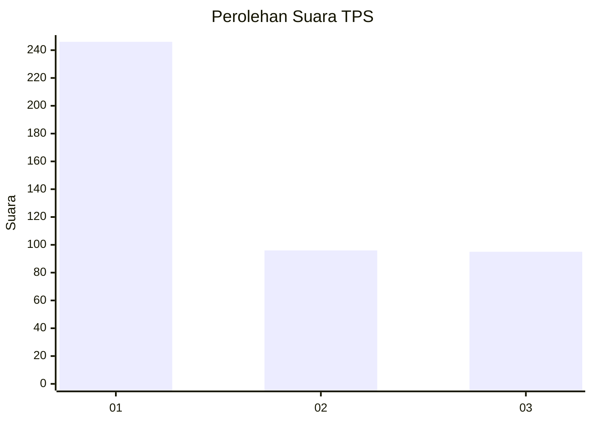
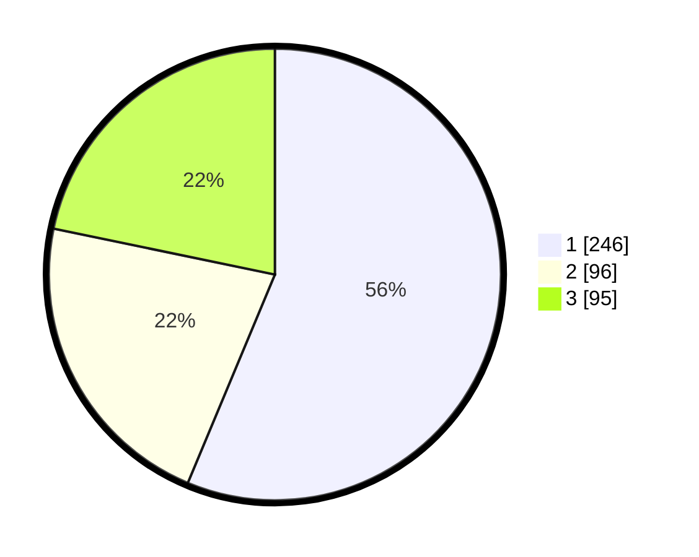

# Hasil

## Grafik

## Tabel

| No. | Nama Paslon    | Suara | Suara (raw) | Persentase |
|:--- |:-------------- | -----:| -----------:| ----------:|
| 1   | ANIES MUHAIMIN | 246   | [246][p-1]  | 56,29      |
| 2   | PRABOWO GIBRAN | 96    | [96][p-2]   | 21,97      |
| 3   | GANJAR MAHFUD  | 95    | [95][p-3]   | 21,74      |

[p-1]: https://github.com/gigit-pemilu/pemilu-2024-99-luar-negeri/blob/main/pilpres/hitung-suara/sub/99-luar-negeri/sub/39-doha-qatar/sub/01-doha-qatar/sub/0001-doha-qatar/sub/004-tps-003/sub/paslon-1.txt
[p-2]: https://github.com/gigit-pemilu/pemilu-2024-99-luar-negeri/blob/main/pilpres/hitung-suara/sub/99-luar-negeri/sub/39-doha-qatar/sub/01-doha-qatar/sub/0001-doha-qatar/sub/004-tps-003/sub/paslon-2.txt
[p-3]: https://github.com/gigit-pemilu/pemilu-2024-99-luar-negeri/blob/main/pilpres/hitung-suara/sub/99-luar-negeri/sub/39-doha-qatar/sub/01-doha-qatar/sub/0001-doha-qatar/sub/004-tps-003/sub/paslon-3.txt

## Foto C Plano

https://sirekap-obj-formc.kpu.go.id/158e/pemilu/ppwp/99/39/01/00/01/9939010001004-20240216-142210--d414bbd1-9818-42a7-89a2-59811988ae03.jpg

https://sirekap-obj-formc.kpu.go.id/158e/pemilu/ppwp/99/39/01/00/01/9939010001004-20240214-225927--2e92eccd-5e01-4b3c-8c84-732b67fc243c.jpg

https://sirekap-obj-formc.kpu.go.id/158e/pemilu/ppwp/99/39/01/00/01/9939010001004-20240214-230121--acc9e8de-b86d-4856-99be-bdf1c1d682f8.jpg

## Metadata

| Key        | Value               |
| ---------- | ------------------- |
| Time Stamp | 2024-02-17 16:36:25 |

## DATA PEMILIH TETAP

Jumlah pemilih dalam DPT: **652**.
 * L: **279**.
 * P: **373**.

## DATA PENGGUNA HAK PILIH

Jumlah pengguna hak pilih dalam DPT: **412**.
 * L: **192**.
 * P: **220**.

Jumlah pengguna hak pilih dalam DPTb: **22**.
 * L: **10**.
 * P: **12**.

Jumlah pengguna hak pilih dalam DPK: **5**.
 * L: **5**.
 * P: **0**.

Jumlah pengguna hak pilih: **439**.
 * L: **207**.
 * P: **232**.

## JUMLAH SUARA SAH DAN TIDAK SAH

JUMLAH SELURUH SUARA SAH: **437**.

JUMLAH SUARA TIDAK SAH: **2**.

JUMLAH SELURUH SUARA SAH DAN SUARA TIDAK SAH: **439**.

