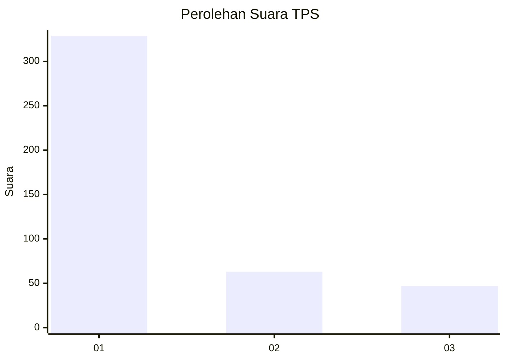
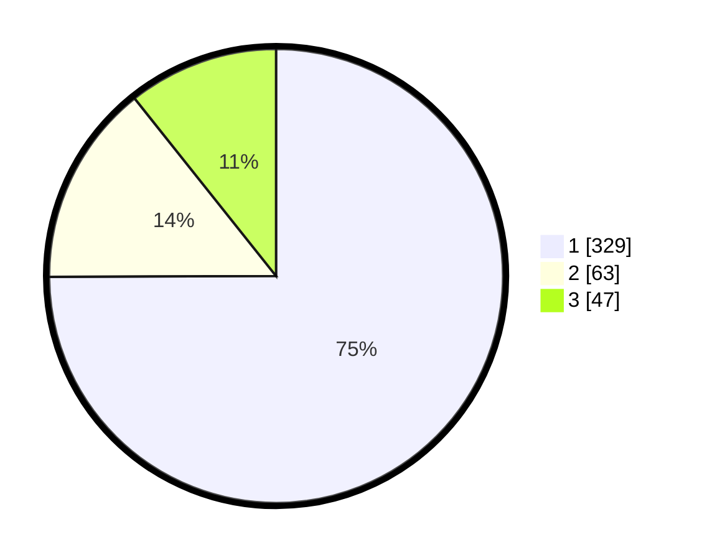

# Hasil

## Grafik

## Tabel

| No. | Nama Paslon    | Suara | Suara (raw) | Persentase |
|:--- |:-------------- | -----:| -----------:| ----------:|
| 1   | ANIES MUHAIMIN | 329   | [329][p-1]  | 74,94      |
| 2   | PRABOWO GIBRAN | 63    | [63][p-2]   | 14,35      |
| 3   | GANJAR MAHFUD  | 47    | [47][p-3]   | 10,71      |

[p-1]: https://github.com/gigit-pemilu/pemilu-2024-99-luar-negeri/blob/main/pilpres/hitung-suara/sub/99-luar-negeri/sub/39-doha-qatar/sub/01-doha-qatar/sub/0001-doha-qatar/sub/012-tps-011/sub/paslon-1.txt
[p-2]: https://github.com/gigit-pemilu/pemilu-2024-99-luar-negeri/blob/main/pilpres/hitung-suara/sub/99-luar-negeri/sub/39-doha-qatar/sub/01-doha-qatar/sub/0001-doha-qatar/sub/012-tps-011/sub/paslon-2.txt
[p-3]: https://github.com/gigit-pemilu/pemilu-2024-99-luar-negeri/blob/main/pilpres/hitung-suara/sub/99-luar-negeri/sub/39-doha-qatar/sub/01-doha-qatar/sub/0001-doha-qatar/sub/012-tps-011/sub/paslon-3.txt

## Foto C Plano

https://sirekap-obj-formc.kpu.go.id/8a8c/pemilu/ppwp/99/39/01/00/01/9939010001012-20240214-213516--bbacea4c-7d81-41a4-ad9f-3afb904b10c1.jpg

https://sirekap-obj-formc.kpu.go.id/8a8c/pemilu/ppwp/99/39/01/00/01/9939010001012-20240214-213629--dd0234f7-5d22-447b-a12b-767bacf7db37.jpg

https://sirekap-obj-formc.kpu.go.id/8a8c/pemilu/ppwp/99/39/01/00/01/9939010001012-20240214-194713--59fd3ad1-d929-4921-b2a5-0f382bc6c55e.jpg

## Metadata

| Key        | Value               |
| ---------- | ------------------- |
| Time Stamp | 2024-02-15 15:00:29 |

## DATA PEMILIH TETAP

Jumlah pemilih dalam DPT: **562**.
 * L: **276**.
 * P: **286**.

## DATA PENGGUNA HAK PILIH

Jumlah pengguna hak pilih dalam DPT: **394**.
 * L: **200**.
 * P: **194**.

Jumlah pengguna hak pilih dalam DPTb: **34**.
 * L: **21**.
 * P: **13**.

Jumlah pengguna hak pilih dalam DPK: **13**.
 * L: **8**.
 * P: **5**.

Jumlah pengguna hak pilih: **441**.
 * L: **229**.
 * P: **212**.

## JUMLAH SUARA SAH DAN TIDAK SAH

JUMLAH SELURUH SUARA SAH: **439**.

JUMLAH SUARA TIDAK SAH: **2**.

JUMLAH SELURUH SUARA SAH DAN SUARA TIDAK SAH: **441**.

