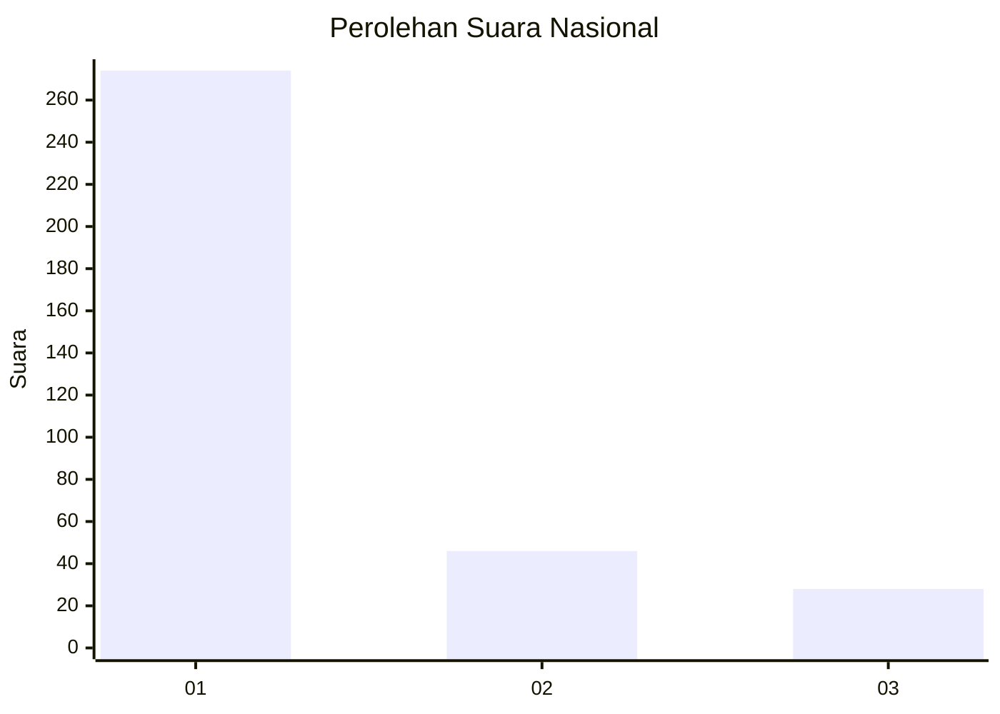
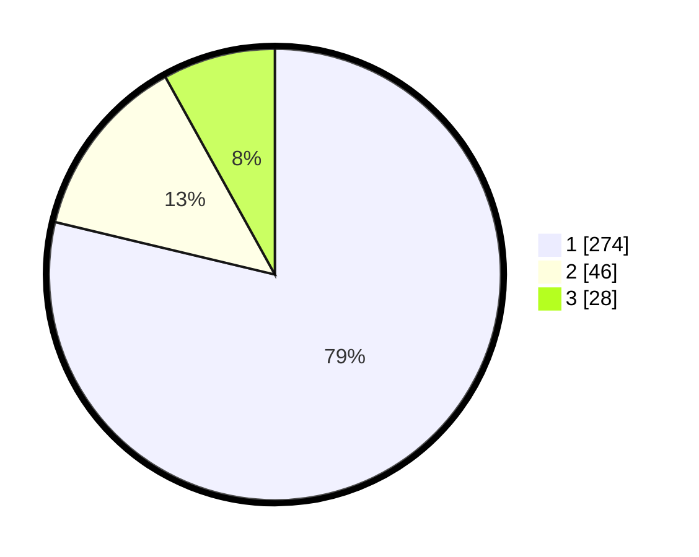

# Hasil

## Grafik

## Tabel

| No. | Nama Paslon    | Suara | Suara (raw) | Persentase |
|:--- |:-------------- | -----:| -----------:| ----------:|
| 1   | ANIES MUHAIMIN | 274   | [274][p-1]  | 78,74      |
| 2   | PRABOWO GIBRAN | 46    | [46][p-2]   | 13,22      |
| 3   | GANJAR MAHFUD  | 28    | [28][p-3]   | 8,05       |

[p-1]: https://github.com/gigit-pemilu/pemilu-2024/blob/main/pilpres/hitung-suara/sub/99-luar-negeri/sub/39-doha-qatar/sub/01-doha-qatar/sub/0001-doha-qatar/sub/013-tps-012/sub/paslon-1.txt
[p-2]: https://github.com/gigit-pemilu/pemilu-2024/blob/main/pilpres/hitung-suara/sub/99-luar-negeri/sub/39-doha-qatar/sub/01-doha-qatar/sub/0001-doha-qatar/sub/013-tps-012/sub/paslon-2.txt
[p-3]: https://github.com/gigit-pemilu/pemilu-2024/blob/main/pilpres/hitung-suara/sub/99-luar-negeri/sub/39-doha-qatar/sub/01-doha-qatar/sub/0001-doha-qatar/sub/013-tps-012/sub/paslon-3.txt

## Foto C Plano

https://sirekap-obj-formc.kpu.go.id/0439/pemilu/ppwp/99/39/01/00/01/9939010001013-20240214-190640--d4eae9cd-a00e-4fa3-abb5-5c10e6235837.jpg

https://sirekap-obj-formc.kpu.go.id/0439/pemilu/ppwp/99/39/01/00/01/9939010001013-20240214-193537--19feca04-ce99-4505-a0a4-7a6ebb3faf2d.jpg

https://sirekap-obj-formc.kpu.go.id/0439/pemilu/ppwp/99/39/01/00/01/9939010001013-20240214-192543--a9796c13-5f85-44a7-8861-76ff64e7838b.jpg

## Metadata

| Key        | Value               |
| ---------- | ------------------- |
| Time Stamp | 2024-02-14 21:46:01 |

## DATA PEMILIH TETAP

Jumlah pemilih dalam DPT: **547**.
 * L: **263**.
 * P: **284**.

## DATA PENGGUNA HAK PILIH

Jumlah pengguna hak pilih dalam DPT: **302**.
 * L: **169**.
 * P: **133**.

Jumlah pengguna hak pilih dalam DPTb: **31**.
 * L: **20**.
 * P: **11**.

Jumlah pengguna hak pilih dalam DPK: **19**.
 * L: **12**.
 * P: **7**.

Jumlah pengguna hak pilih: **352**.
 * L: **201**.
 * P: **151**.

## JUMLAH SUARA SAH DAN TIDAK SAH

JUMLAH SELURUH SUARA SAH: **348**.

JUMLAH SUARA TIDAK SAH: **4**.

JUMLAH SELURUH SUARA SAH DAN SUARA TIDAK SAH: **352**.

