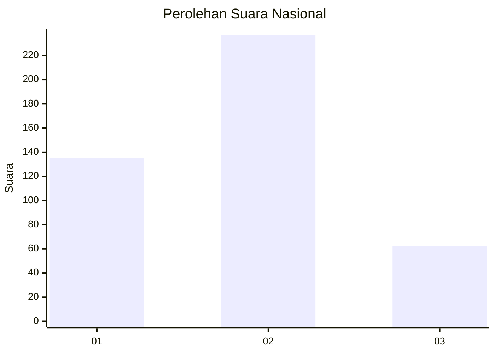
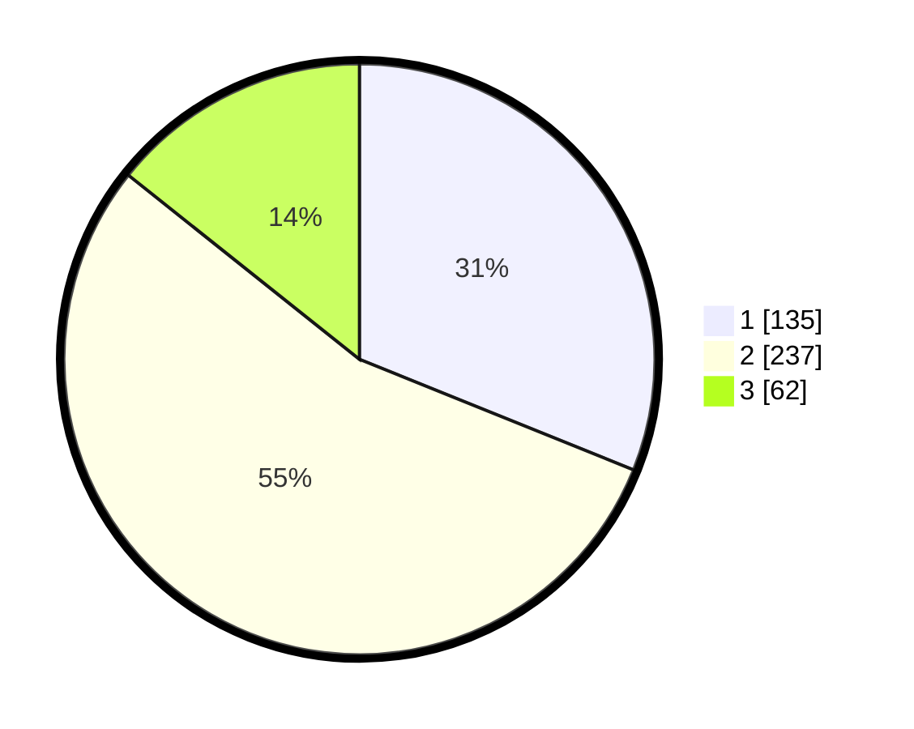

# Hasil

## Grafik

## Tabel

| No. | Nama Paslon    | Suara | Suara (raw) | Persentase |
|:--- |:-------------- | -----:| -----------:| ----------:|
| 1   | ANIES MUHAIMIN | 135   | [135][p-1]  | 31,11      |
| 2   | PRABOWO GIBRAN | 237   | [237][p-2]  | 54,61      |
| 3   | GANJAR MAHFUD  | 62    | [62][p-3]   | 14,29      |

[p-1]: https://github.com/gigit-pemilu/pemilu-2024/blob/main/pilpres/hitung-suara/sub/99-luar-negeri/sub/40-dubai-uni-emirat-arab/sub/01-dubai-uni-emirat-arab/sub/0001-dubai-uni-emirat-arab/sub/001-tps/sub/paslon-1.txt
[p-2]: https://github.com/gigit-pemilu/pemilu-2024/blob/main/pilpres/hitung-suara/sub/99-luar-negeri/sub/40-dubai-uni-emirat-arab/sub/01-dubai-uni-emirat-arab/sub/0001-dubai-uni-emirat-arab/sub/001-tps/sub/paslon-2.txt
[p-3]: https://github.com/gigit-pemilu/pemilu-2024/blob/main/pilpres/hitung-suara/sub/99-luar-negeri/sub/40-dubai-uni-emirat-arab/sub/01-dubai-uni-emirat-arab/sub/0001-dubai-uni-emirat-arab/sub/001-tps/sub/paslon-3.txt

## Foto C Plano

https://sirekap-obj-formc.kpu.go.id/9953/pemilu/ppwp/99/40/01/00/01/9940010001001-20240217-040450--c294e468-c5b2-4daf-9946-12d4b6d88a9b.jpg

https://sirekap-obj-formc.kpu.go.id/9953/pemilu/ppwp/99/40/01/00/01/9940010001001-20240217-040451--ebcc1e57-ea97-4ee7-af16-6298b5277eaf.jpg

https://sirekap-obj-formc.kpu.go.id/9953/pemilu/ppwp/99/40/01/00/01/9940010001001-20240217-040450--24f78053-699e-4926-a1e7-6a1fa3ef9b02.jpg

## Metadata

| Key        | Value               |
| ---------- | ------------------- |
| Time Stamp | 2024-02-17 13:37:34 |

## DATA PEMILIH TETAP

Jumlah pemilih dalam DPT: **513**.
 * L: **187**.
 * P: **326**.

## DATA PENGGUNA HAK PILIH

Jumlah pengguna hak pilih dalam DPT: **209**.
 * L: **95**.
 * P: **114**.

Jumlah pengguna hak pilih dalam DPTb: **189**.
 * L: **58**.
 * P: **131**.

Jumlah pengguna hak pilih dalam DPK: **44**.
 * L: **7**.
 * P: **37**.

Jumlah pengguna hak pilih: **442**.
 * L: **160**.
 * P: **282**.

## JUMLAH SUARA SAH DAN TIDAK SAH

JUMLAH SELURUH SUARA SAH: **434**.

JUMLAH SUARA TIDAK SAH: **8**.

JUMLAH SELURUH SUARA SAH DAN SUARA TIDAK SAH: **442**.

