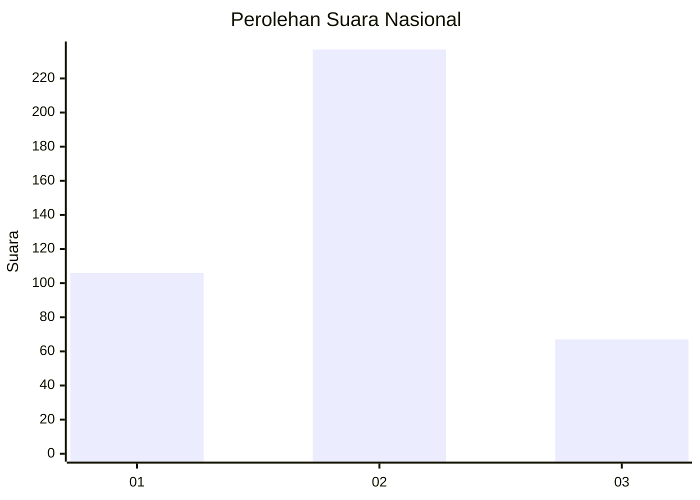

# Hasil

## Grafik

## Tabel

| No. | Nama Paslon    | Suara | Suara (raw) | Persentase |
|:--- |:-------------- | -----:| -----------:| ----------:|
| 1   | ANIES MUHAIMIN | 106   | [106][p-1]  | 25,85      |
| 2   | PRABOWO GIBRAN | 237   | [237][p-2]  | 57,80      |
| 3   | GANJAR MAHFUD  | 67    | [67][p-3]   | 16,34      |

[p-1]: https://github.com/gigit-pemilu/pemilu-2024/blob/main/pilpres/hitung-suara/sub/99-luar-negeri/sub/40-dubai-uni-emirat-arab/sub/01-dubai-uni-emirat-arab/sub/0001-dubai-uni-emirat-arab/sub/002-tps/sub/paslon-1.txt
[p-2]: https://github.com/gigit-pemilu/pemilu-2024/blob/main/pilpres/hitung-suara/sub/99-luar-negeri/sub/40-dubai-uni-emirat-arab/sub/01-dubai-uni-emirat-arab/sub/0001-dubai-uni-emirat-arab/sub/002-tps/sub/paslon-2.txt
[p-3]: https://github.com/gigit-pemilu/pemilu-2024/blob/main/pilpres/hitung-suara/sub/99-luar-negeri/sub/40-dubai-uni-emirat-arab/sub/01-dubai-uni-emirat-arab/sub/0001-dubai-uni-emirat-arab/sub/002-tps/sub/paslon-3.txt

## Foto C Plano

https://sirekap-obj-formc.kpu.go.id/f308/pemilu/ppwp/99/40/01/00/01/9940010001002-20240216-035014--1f7a3f84-b1bb-433e-ae0f-7cd560beaf4f.jpg

https://sirekap-obj-formc.kpu.go.id/f308/pemilu/ppwp/99/40/01/00/01/9940010001002-20240216-035024--37d3f905-9a56-4430-a8cb-8762858271c2.jpg

https://sirekap-obj-formc.kpu.go.id/f308/pemilu/ppwp/99/40/01/00/01/9940010001002-20240216-035018--9ed15f26-95f3-4f2d-b408-a2343ec2e09d.jpg

## Metadata

| Key        | Value               |
| ---------- | ------------------- |
| Time Stamp | 2024-02-16 23:45:47 |

## DATA PEMILIH TETAP

Jumlah pemilih dalam DPT: **513**.
 * L: **154**.
 * P: **359**.

## DATA PENGGUNA HAK PILIH

Jumlah pengguna hak pilih dalam DPT: **207**.
 * L: **74**.
 * P: **133**.

Jumlah pengguna hak pilih dalam DPTb: **173**.
 * L: **46**.
 * P: **127**.

Jumlah pengguna hak pilih dalam DPK: **35**.
 * L: **4**.
 * P: **31**.

Jumlah pengguna hak pilih: **415**.
 * L: **124**.
 * P: **291**.

## JUMLAH SUARA SAH DAN TIDAK SAH

JUMLAH SELURUH SUARA SAH: **410**.

JUMLAH SUARA TIDAK SAH: **5**.

JUMLAH SELURUH SUARA SAH DAN SUARA TIDAK SAH: **415**.

