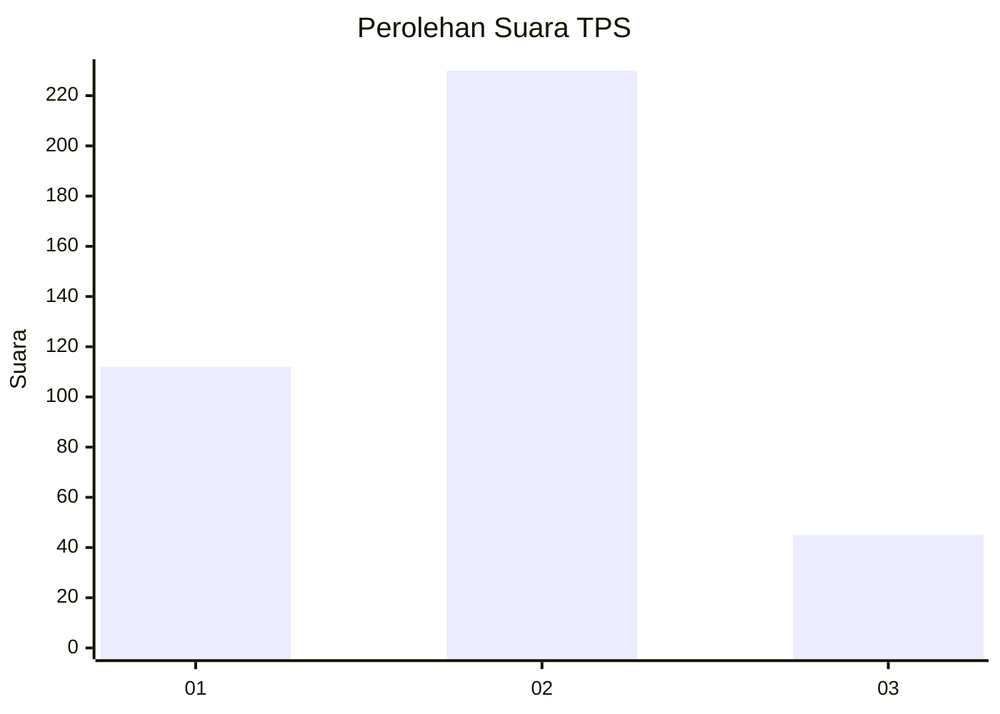
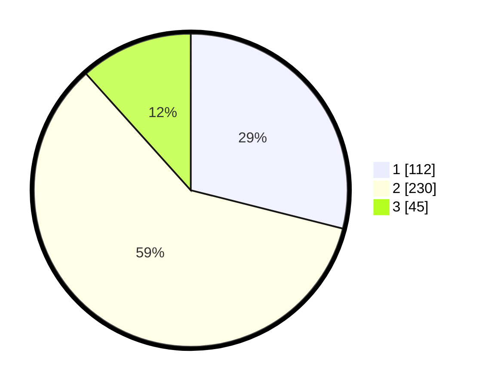

# Hasil

## Grafik

## Tabel

| No. | Nama Paslon    | Suara | Suara (raw) | Persentase |
|:--- |:-------------- | -----:| -----------:| ----------:|
| 1   | ANIES MUHAIMIN | 112   | [112][p-1]  | 28,94      |
| 2   | PRABOWO GIBRAN | 230   | [230][p-2]  | 59,43      |
| 3   | GANJAR MAHFUD  | 45    | [45][p-3]   | 11,63      |

[p-1]: https://github.com/gigit-pemilu/pemilu-2024-99-luar-negeri/blob/main/pilpres/hitung-suara/sub/99-luar-negeri/sub/40-dubai-uni-emirat-arab/sub/01-dubai-uni-emirat-arab/sub/0001-dubai-uni-emirat-arab/sub/003-tps/sub/paslon-1.txt
[p-2]: https://github.com/gigit-pemilu/pemilu-2024-99-luar-negeri/blob/main/pilpres/hitung-suara/sub/99-luar-negeri/sub/40-dubai-uni-emirat-arab/sub/01-dubai-uni-emirat-arab/sub/0001-dubai-uni-emirat-arab/sub/003-tps/sub/paslon-2.txt
[p-3]: https://github.com/gigit-pemilu/pemilu-2024-99-luar-negeri/blob/main/pilpres/hitung-suara/sub/99-luar-negeri/sub/40-dubai-uni-emirat-arab/sub/01-dubai-uni-emirat-arab/sub/0001-dubai-uni-emirat-arab/sub/003-tps/sub/paslon-3.txt

## Foto C Plano

https://sirekap-obj-formc.kpu.go.id/69d0/pemilu/ppwp/99/40/01/00/01/9940010001003-20240217-102019--511d6ce6-58e8-4a86-bbba-99d41a3c9736.jpg

https://sirekap-obj-formc.kpu.go.id/69d0/pemilu/ppwp/99/40/01/00/01/9940010001003-20240217-102020--f9f7c2a9-0de5-4581-b9b0-a945c3698b0a.jpg

https://sirekap-obj-formc.kpu.go.id/69d0/pemilu/ppwp/99/40/01/00/01/9940010001003-20240217-102020--ae2a87a1-1c4a-4e4d-99a4-07229529c241.jpg

## Metadata

| Key        | Value               |
| ---------- | ------------------- |
| Time Stamp | 2024-02-17 13:37:34 |

## DATA PEMILIH TETAP

Jumlah pemilih dalam DPT: **514**.
 * L: **120**.
 * P: **394**.

## DATA PENGGUNA HAK PILIH

Jumlah pengguna hak pilih dalam DPT: **132**.
 * L: **43**.
 * P: **89**.

Jumlah pengguna hak pilih dalam DPTb: **193**.
 * L: **64**.
 * P: **129**.

Jumlah pengguna hak pilih dalam DPK: **70**.
 * L: **10**.
 * P: **60**.

Jumlah pengguna hak pilih: **395**.
 * L: **117**.
 * P: **278**.

## JUMLAH SUARA SAH DAN TIDAK SAH

JUMLAH SELURUH SUARA SAH: **387**.

JUMLAH SUARA TIDAK SAH: **8**.

JUMLAH SELURUH SUARA SAH DAN SUARA TIDAK SAH: **395**.

