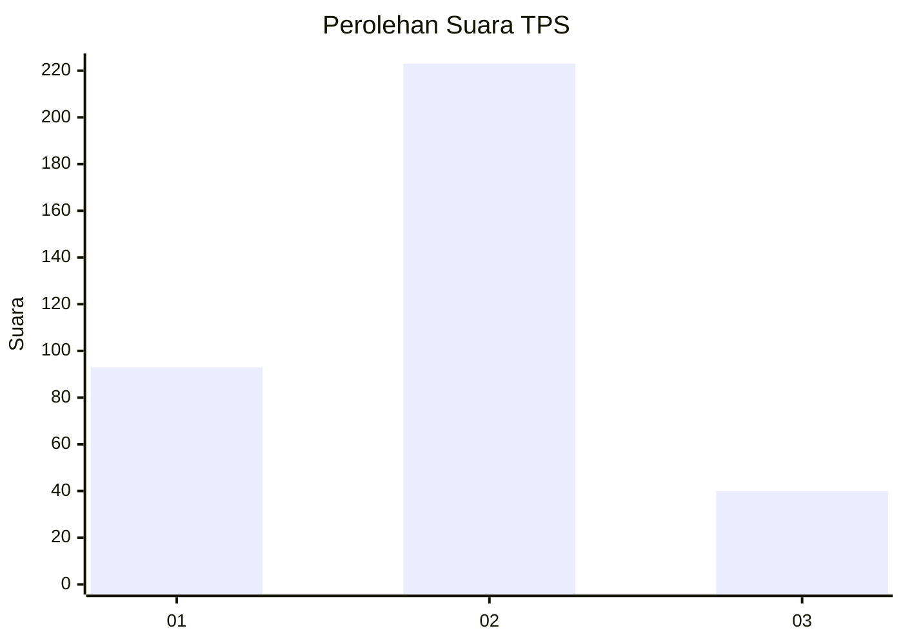
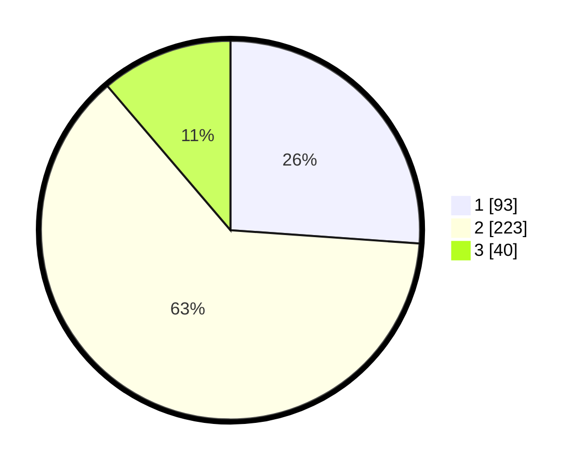

# Hasil

## Grafik

## Tabel

| No. | Nama Paslon    | Suara | Suara (raw) | Persentase |
|:--- |:-------------- | -----:| -----------:| ----------:|
| 1   | ANIES MUHAIMIN | 93    | [93][p-1]   | 26,12      |
| 2   | PRABOWO GIBRAN | 223   | [223][p-2]  | 62,64      |
| 3   | GANJAR MAHFUD  | 40    | [40][p-3]   | 11,24      |

[p-1]: https://github.com/gigit-pemilu/pemilu-2024-99-luar-negeri/blob/main/pilpres/hitung-suara/sub/99-luar-negeri/sub/40-dubai-uni-emirat-arab/sub/01-dubai-uni-emirat-arab/sub/0001-dubai-uni-emirat-arab/sub/004-tps/sub/paslon-1.txt
[p-2]: https://github.com/gigit-pemilu/pemilu-2024-99-luar-negeri/blob/main/pilpres/hitung-suara/sub/99-luar-negeri/sub/40-dubai-uni-emirat-arab/sub/01-dubai-uni-emirat-arab/sub/0001-dubai-uni-emirat-arab/sub/004-tps/sub/paslon-2.txt
[p-3]: https://github.com/gigit-pemilu/pemilu-2024-99-luar-negeri/blob/main/pilpres/hitung-suara/sub/99-luar-negeri/sub/40-dubai-uni-emirat-arab/sub/01-dubai-uni-emirat-arab/sub/0001-dubai-uni-emirat-arab/sub/004-tps/sub/paslon-3.txt

## Foto C Plano

https://sirekap-obj-formc.kpu.go.id/e53d/pemilu/ppwp/99/40/01/00/01/9940010001004-20240214-211313--513b00fb-bcf3-4771-bad9-59c73e7ca9b7.jpg

https://sirekap-obj-formc.kpu.go.id/e53d/pemilu/ppwp/99/40/01/00/01/9940010001004-20240217-171356--ec3d1d9e-4e59-4b7a-8e0c-d5966f969677.jpg

https://sirekap-obj-formc.kpu.go.id/e53d/pemilu/ppwp/99/40/01/00/01/9940010001004-20240214-211647--774b77d3-20ab-4e47-84d9-f21b5ae28395.jpg

## Metadata

| Key        | Value               |
| ---------- | ------------------- |
| Time Stamp | 2024-02-17 18:00:00 |

## DATA PEMILIH TETAP

Jumlah pemilih dalam DPT: **515**.
 * L: **122**.
 * P: **393**.

## DATA PENGGUNA HAK PILIH

Jumlah pengguna hak pilih dalam DPT: **142**.
 * L: **50**.
 * P: **92**.

Jumlah pengguna hak pilih dalam DPTb: **166**.
 * L: **36**.
 * P: **130**.

Jumlah pengguna hak pilih dalam DPK: **51**.
 * L: **5**.
 * P: **46**.

Jumlah pengguna hak pilih: **359**.
 * L: **91**.
 * P: **268**.

## JUMLAH SUARA SAH DAN TIDAK SAH

JUMLAH SELURUH SUARA SAH: **356**.

JUMLAH SUARA TIDAK SAH: **3**.

JUMLAH SELURUH SUARA SAH DAN SUARA TIDAK SAH: **359**.

