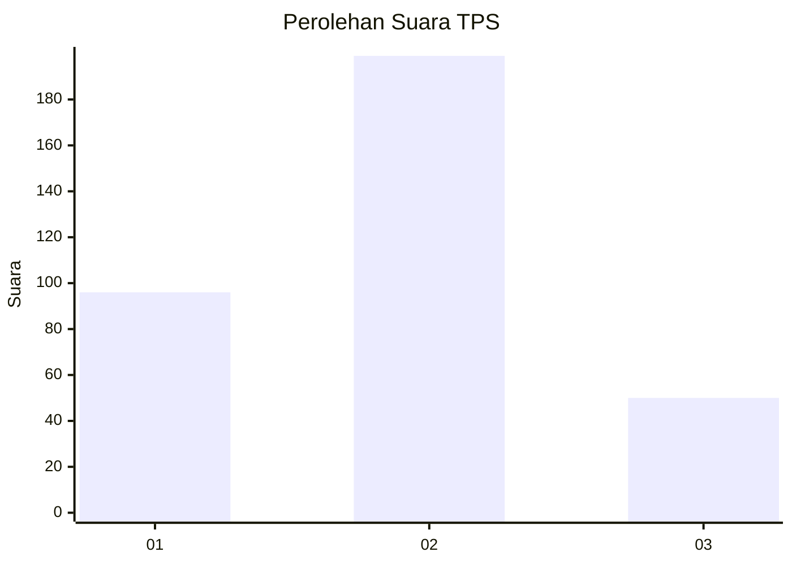
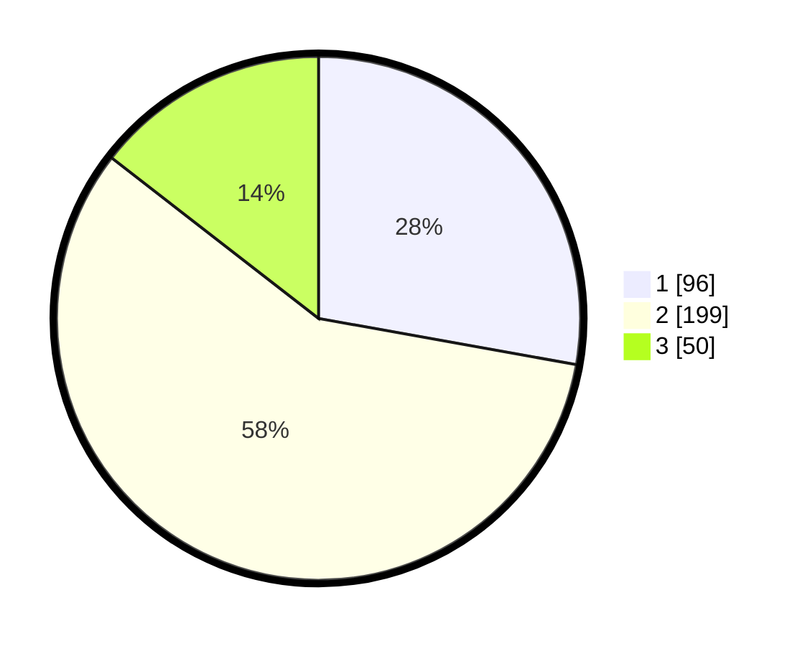

# Hasil

## Grafik

## Tabel

| No. | Nama Paslon    | Suara | Suara (raw) | Persentase |
|:--- |:-------------- | -----:| -----------:| ----------:|
| 1   | ANIES MUHAIMIN | 96    | [96][p-1]   | 27,83      |
| 2   | PRABOWO GIBRAN | 199   | [199][p-2]  | 57,68      |
| 3   | GANJAR MAHFUD  | 50    | [50][p-3]   | 14,49      |

[p-1]: https://github.com/gigit-pemilu/pemilu-2024-99-luar-negeri/blob/main/pilpres/hitung-suara/sub/99-luar-negeri/sub/40-dubai-uni-emirat-arab/sub/01-dubai-uni-emirat-arab/sub/0001-dubai-uni-emirat-arab/sub/005-tps/sub/paslon-1.txt
[p-2]: https://github.com/gigit-pemilu/pemilu-2024-99-luar-negeri/blob/main/pilpres/hitung-suara/sub/99-luar-negeri/sub/40-dubai-uni-emirat-arab/sub/01-dubai-uni-emirat-arab/sub/0001-dubai-uni-emirat-arab/sub/005-tps/sub/paslon-2.txt
[p-3]: https://github.com/gigit-pemilu/pemilu-2024-99-luar-negeri/blob/main/pilpres/hitung-suara/sub/99-luar-negeri/sub/40-dubai-uni-emirat-arab/sub/01-dubai-uni-emirat-arab/sub/0001-dubai-uni-emirat-arab/sub/005-tps/sub/paslon-3.txt

## Foto C Plano

https://sirekap-obj-formc.kpu.go.id/d28a/pemilu/ppwp/99/40/01/00/01/9940010001005-20240217-031651--1a5cc849-ff3c-40b5-abbe-7621920f819e.jpg

https://sirekap-obj-formc.kpu.go.id/d28a/pemilu/ppwp/99/40/01/00/01/9940010001005-20240217-031652--76af4e37-d4fc-42fa-8bdc-3bcf90e244c8.jpg

https://sirekap-obj-formc.kpu.go.id/d28a/pemilu/ppwp/99/40/01/00/01/9940010001005-20240217-031651--e3daaaeb-623d-47e1-bc17-eae0c7441fb8.jpg

## Metadata

| Key        | Value               |
| ---------- | ------------------- |
| Time Stamp | 2024-02-17 13:37:34 |

## DATA PEMILIH TETAP

Jumlah pemilih dalam DPT: **513**.
 * L: **103**.
 * P: **410**.

## DATA PENGGUNA HAK PILIH

Jumlah pengguna hak pilih dalam DPT: **136**.
 * L: **31**.
 * P: **105**.

Jumlah pengguna hak pilih dalam DPTb: **166**.
 * L: **36**.
 * P: **130**.

Jumlah pengguna hak pilih dalam DPK: **46**.
 * L: **7**.
 * P: **39**.

Jumlah pengguna hak pilih: **348**.
 * L: **74**.
 * P: **274**.

## JUMLAH SUARA SAH DAN TIDAK SAH

JUMLAH SELURUH SUARA SAH: **345**.

JUMLAH SUARA TIDAK SAH: **3**.

JUMLAH SELURUH SUARA SAH DAN SUARA TIDAK SAH: **348**.

