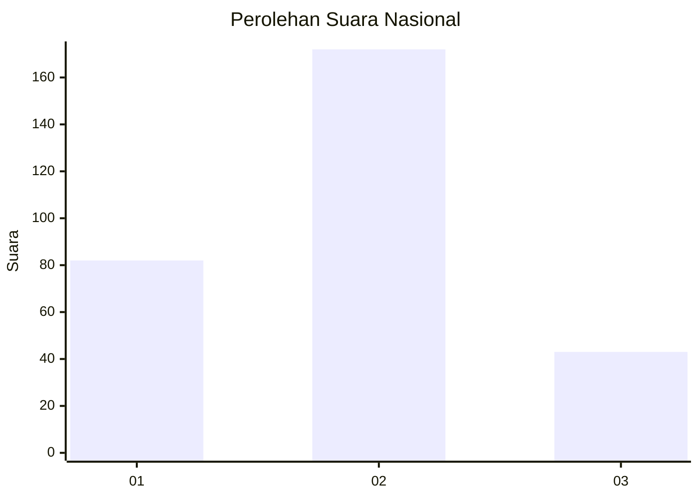
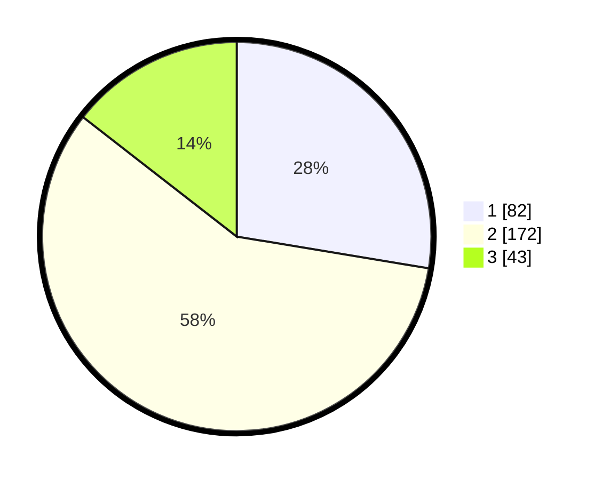

# Hasil

## Grafik

## Tabel

| No. | Nama Paslon    | Suara | Suara (raw) | Persentase |
|:--- |:-------------- | -----:| -----------:| ----------:|
| 1   | ANIES MUHAIMIN | 82    | [82][p-1]   | 27,61      |
| 2   | PRABOWO GIBRAN | 172   | [172][p-2]  | 57,91      |
| 3   | GANJAR MAHFUD  | 43    | [43][p-3]   | 14,48      |

[p-1]: https://github.com/gigit-pemilu/pemilu-2024/blob/main/pilpres/hitung-suara/sub/99-luar-negeri/sub/40-dubai-uni-emirat-arab/sub/01-dubai-uni-emirat-arab/sub/0001-dubai-uni-emirat-arab/sub/006-tps/sub/paslon-1.txt
[p-2]: https://github.com/gigit-pemilu/pemilu-2024/blob/main/pilpres/hitung-suara/sub/99-luar-negeri/sub/40-dubai-uni-emirat-arab/sub/01-dubai-uni-emirat-arab/sub/0001-dubai-uni-emirat-arab/sub/006-tps/sub/paslon-2.txt
[p-3]: https://github.com/gigit-pemilu/pemilu-2024/blob/main/pilpres/hitung-suara/sub/99-luar-negeri/sub/40-dubai-uni-emirat-arab/sub/01-dubai-uni-emirat-arab/sub/0001-dubai-uni-emirat-arab/sub/006-tps/sub/paslon-3.txt

## Foto C Plano

https://sirekap-obj-formc.kpu.go.id/1cd0/pemilu/ppwp/99/40/01/00/01/9940010001006-20240217-163002--7ee9a1e4-f384-4084-a848-7f788f82e999.jpg

https://sirekap-obj-formc.kpu.go.id/1cd0/pemilu/ppwp/99/40/01/00/01/9940010001006-20240217-163003--41407318-2bbd-44d0-bdb5-1e10da5ecfeb.jpg

https://sirekap-obj-formc.kpu.go.id/1cd0/pemilu/ppwp/99/40/01/00/01/9940010001006-20240217-163002--967c70a9-bdab-4f75-9d78-be8d17575224.jpg

## Metadata

| Key        | Value               |
| ---------- | ------------------- |
| Time Stamp | 2024-02-17 18:30:00 |

## DATA PEMILIH TETAP

Jumlah pemilih dalam DPT: **514**.
 * L: **122**.
 * P: **392**.

## DATA PENGGUNA HAK PILIH

Jumlah pengguna hak pilih dalam DPT: **164**.
 * L: **51**.
 * P: **113**.

Jumlah pengguna hak pilih dalam DPTb: **102**.
 * L: **27**.
 * P: **75**.

Jumlah pengguna hak pilih dalam DPK: **33**.
 * L: **7**.
 * P: **26**.

Jumlah pengguna hak pilih: **299**.
 * L: **85**.
 * P: **214**.

## JUMLAH SUARA SAH DAN TIDAK SAH

JUMLAH SELURUH SUARA SAH: **297**.

JUMLAH SUARA TIDAK SAH: **2**.

JUMLAH SELURUH SUARA SAH DAN SUARA TIDAK SAH: **299**.

