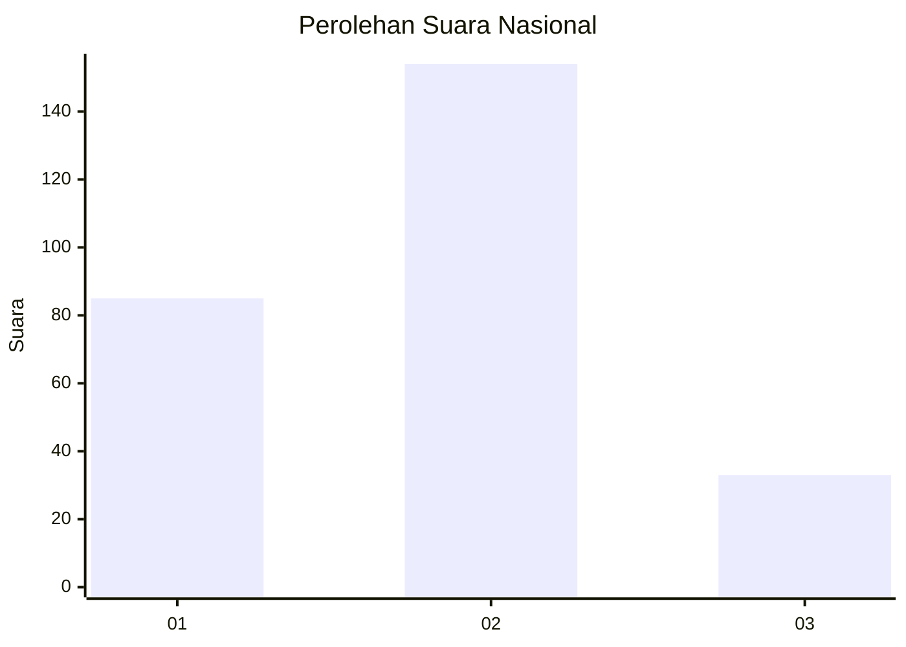
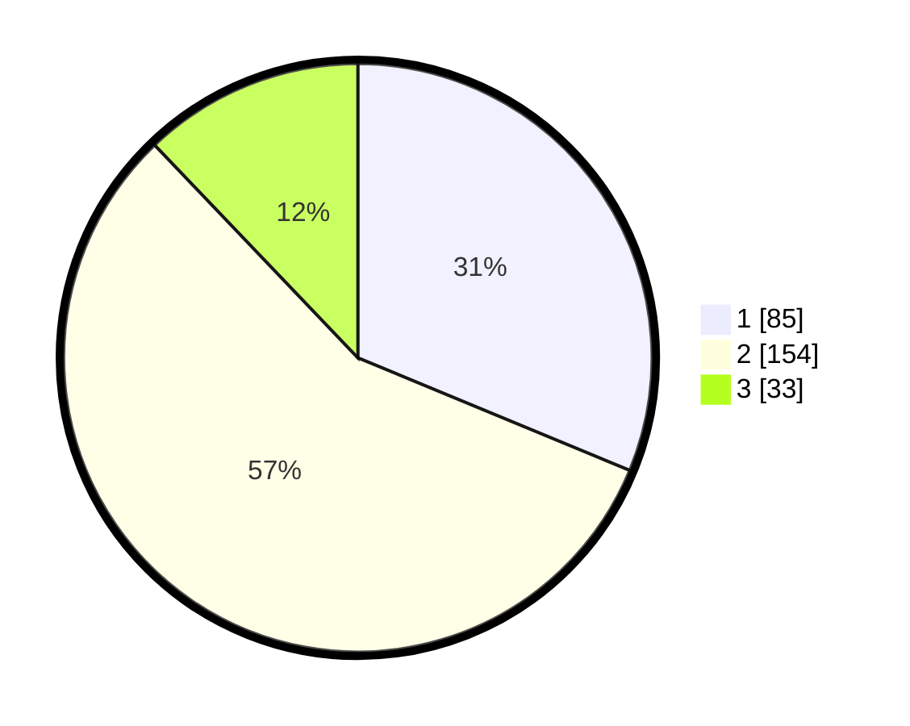

# Hasil

## Grafik

## Tabel

| No. | Nama Paslon    | Suara | Suara (raw) | Persentase |
|:--- |:-------------- | -----:| -----------:| ----------:|
| 1   | ANIES MUHAIMIN | 85    | [85][p-1]   | 31,25      |
| 2   | PRABOWO GIBRAN | 154   | [154][p-2]  | 56,62      |
| 3   | GANJAR MAHFUD  | 33    | [33][p-3]   | 12,13      |

[p-1]: https://github.com/gigit-pemilu/pemilu-2024/blob/main/pilpres/hitung-suara/sub/99-luar-negeri/sub/40-dubai-uni-emirat-arab/sub/01-dubai-uni-emirat-arab/sub/0001-dubai-uni-emirat-arab/sub/007-tps/sub/paslon-1.txt
[p-2]: https://github.com/gigit-pemilu/pemilu-2024/blob/main/pilpres/hitung-suara/sub/99-luar-negeri/sub/40-dubai-uni-emirat-arab/sub/01-dubai-uni-emirat-arab/sub/0001-dubai-uni-emirat-arab/sub/007-tps/sub/paslon-2.txt
[p-3]: https://github.com/gigit-pemilu/pemilu-2024/blob/main/pilpres/hitung-suara/sub/99-luar-negeri/sub/40-dubai-uni-emirat-arab/sub/01-dubai-uni-emirat-arab/sub/0001-dubai-uni-emirat-arab/sub/007-tps/sub/paslon-3.txt

## Foto C Plano

https://sirekap-obj-formc.kpu.go.id/30c0/pemilu/ppwp/99/40/01/00/01/9940010001007-20240216-034829--b36a132b-d411-45ed-b064-431073b2f0b0.jpg

https://sirekap-obj-formc.kpu.go.id/30c0/pemilu/ppwp/99/40/01/00/01/9940010001007-20240216-034849--2d831c26-eaa0-4c7a-9f35-857128882999.jpg

https://sirekap-obj-formc.kpu.go.id/30c0/pemilu/ppwp/99/40/01/00/01/9940010001007-20240216-040819--e6eb42cb-5575-42c2-83d7-7b909699b764.jpg

## Metadata

| Key        | Value               |
| ---------- | ------------------- |
| Time Stamp | 2024-02-16 23:45:47 |

## DATA PEMILIH TETAP

Jumlah pemilih dalam DPT: **515**.
 * L: **101**.
 * P: **414**.

## DATA PENGGUNA HAK PILIH

Jumlah pengguna hak pilih dalam DPT: **119**.
 * L: **31**.
 * P: **88**.

Jumlah pengguna hak pilih dalam DPTb: **108**.
 * L: **38**.
 * P: **70**.

Jumlah pengguna hak pilih dalam DPK: **49**.
 * L: **4**.
 * P: **45**.

Jumlah pengguna hak pilih: **276**.
 * L: **73**.
 * P: **203**.

## JUMLAH SUARA SAH DAN TIDAK SAH

JUMLAH SELURUH SUARA SAH: **272**.

JUMLAH SUARA TIDAK SAH: **4**.

JUMLAH SELURUH SUARA SAH DAN SUARA TIDAK SAH: **276**.

