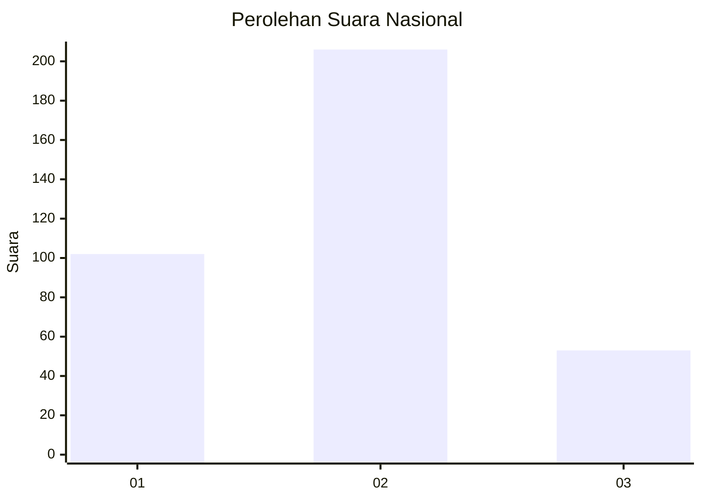
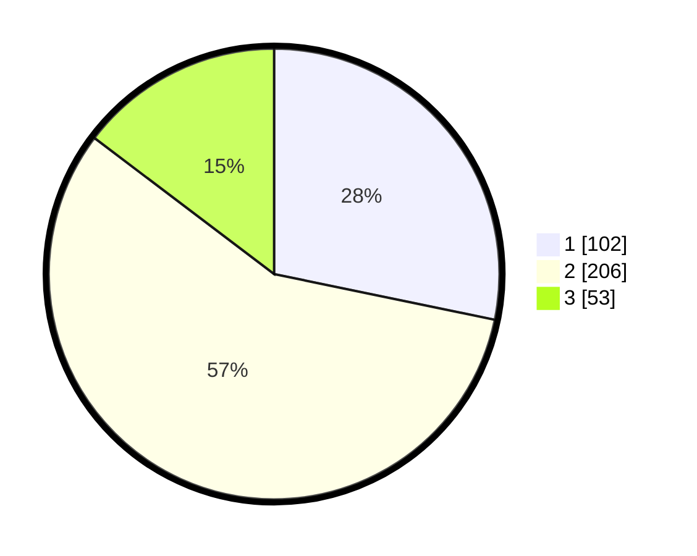

# Hasil

## Grafik

## Tabel

| No. | Nama Paslon    | Suara | Suara (raw) | Persentase |
|:--- |:-------------- | -----:| -----------:| ----------:|
| 1   | ANIES MUHAIMIN | 102   | [102][p-1]  | 28,25      |
| 2   | PRABOWO GIBRAN | 206   | [206][p-2]  | 57,06      |
| 3   | GANJAR MAHFUD  | 53    | [53][p-3]   | 14,68      |

[p-1]: https://github.com/gigit-pemilu/pemilu-2024/blob/main/pilpres/hitung-suara/sub/99-luar-negeri/sub/40-dubai-uni-emirat-arab/sub/01-dubai-uni-emirat-arab/sub/0001-dubai-uni-emirat-arab/sub/008-tps/sub/paslon-1.txt
[p-2]: https://github.com/gigit-pemilu/pemilu-2024/blob/main/pilpres/hitung-suara/sub/99-luar-negeri/sub/40-dubai-uni-emirat-arab/sub/01-dubai-uni-emirat-arab/sub/0001-dubai-uni-emirat-arab/sub/008-tps/sub/paslon-2.txt
[p-3]: https://github.com/gigit-pemilu/pemilu-2024/blob/main/pilpres/hitung-suara/sub/99-luar-negeri/sub/40-dubai-uni-emirat-arab/sub/01-dubai-uni-emirat-arab/sub/0001-dubai-uni-emirat-arab/sub/008-tps/sub/paslon-3.txt

## Foto C Plano

https://sirekap-obj-formc.kpu.go.id/9613/pemilu/ppwp/99/40/01/00/01/9940010001008-20240216-035152--27cba1aa-fbc2-438a-bf97-2beb00764211.jpg

https://sirekap-obj-formc.kpu.go.id/9613/pemilu/ppwp/99/40/01/00/01/9940010001008-20240216-035153--dbe186ce-6ea6-4bc3-a9b3-c6b6f9db44e4.jpg

https://sirekap-obj-formc.kpu.go.id/9613/pemilu/ppwp/99/40/01/00/01/9940010001008-20240216-035153--8b017484-89fd-4dcc-8c5e-0a196fdfe0ab.jpg

## Metadata

| Key        | Value               |
| ---------- | ------------------- |
| Time Stamp | 2024-02-17 00:28:35 |

## DATA PEMILIH TETAP

Jumlah pemilih dalam DPT: **506**.
 * L: **130**.
 * P: **376**.

## DATA PENGGUNA HAK PILIH

Jumlah pengguna hak pilih dalam DPT: **163**.
 * L: **47**.
 * P: **116**.

Jumlah pengguna hak pilih dalam DPTb: **167**.
 * L: **43**.
 * P: **124**.

Jumlah pengguna hak pilih dalam DPK: **35**.
 * L: **3**.
 * P: **32**.

Jumlah pengguna hak pilih: **365**.
 * L: **93**.
 * P: **272**.

## JUMLAH SUARA SAH DAN TIDAK SAH

JUMLAH SELURUH SUARA SAH: **361**.

JUMLAH SUARA TIDAK SAH: **4**.

JUMLAH SELURUH SUARA SAH DAN SUARA TIDAK SAH: **365**.

