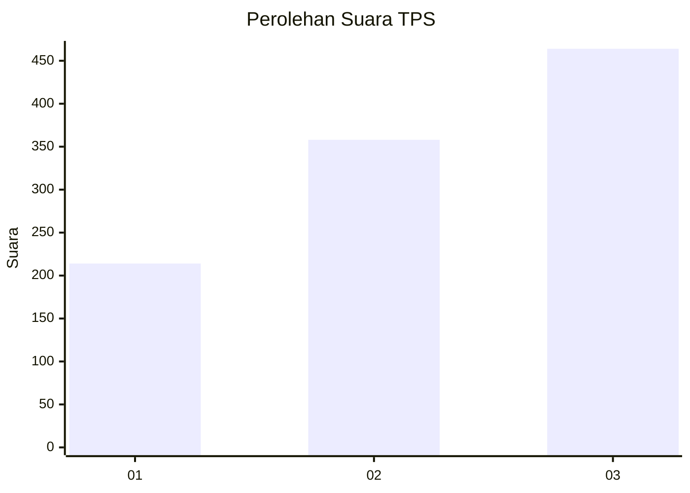
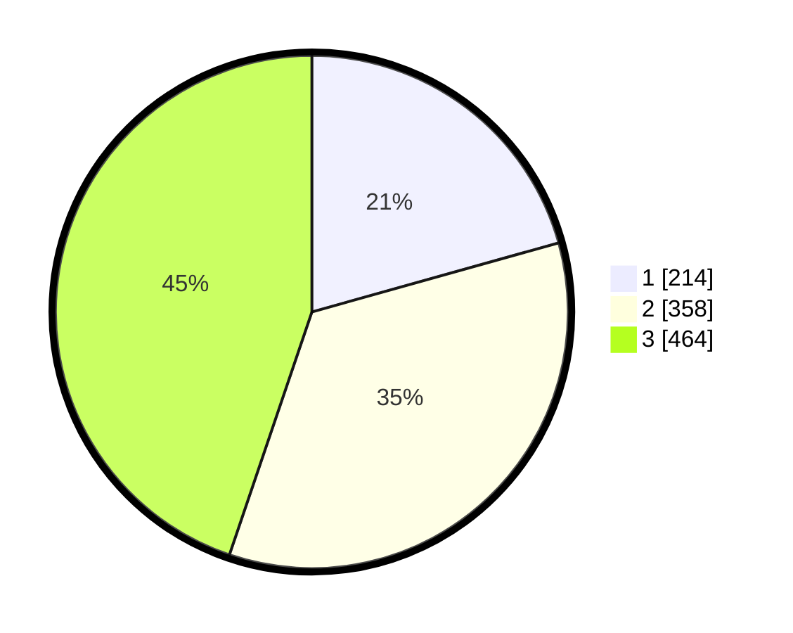

# Hasil

## Grafik

## Tabel

| No. | Nama Paslon    | Suara | Suara (raw) | Persentase |
|:--- |:-------------- | -----:| -----------:| ----------:|
| 1   | ANIES MUHAIMIN | 214   | [214][p-1]  | 20,66      |
| 2   | PRABOWO GIBRAN | 358   | [358][p-2]  | 34,56      |
| 3   | GANJAR MAHFUD  | 464   | [464][p-3]  | 44,79      |

[p-1]: https://github.com/gigit-pemilu/pemilu-2024-99-luar-negeri/blob/main/pilpres/hitung-suara/sub/99-luar-negeri/sub/41-frankfurt-jerman/sub/01-frankfurt-jerman/sub/0001-frankfurt-jerman/sub/001-pos-001/sub/paslon-1.txt
[p-2]: https://github.com/gigit-pemilu/pemilu-2024-99-luar-negeri/blob/main/pilpres/hitung-suara/sub/99-luar-negeri/sub/41-frankfurt-jerman/sub/01-frankfurt-jerman/sub/0001-frankfurt-jerman/sub/001-pos-001/sub/paslon-2.txt
[p-3]: https://github.com/gigit-pemilu/pemilu-2024-99-luar-negeri/blob/main/pilpres/hitung-suara/sub/99-luar-negeri/sub/41-frankfurt-jerman/sub/01-frankfurt-jerman/sub/0001-frankfurt-jerman/sub/001-pos-001/sub/paslon-3.txt

## Foto C Plano

https://sirekap-obj-formc.kpu.go.id/089d/pemilu/ppwp/99/41/01/00/01/9941010001001-20240217-211932--d5fe39e0-4db8-4544-bd6e-1b0a353d8e2d.jpg

https://sirekap-obj-formc.kpu.go.id/089d/pemilu/ppwp/99/41/01/00/01/9941010001001-20240217-213436--1a3b5f9b-5ddc-474b-bf65-1b9af16ecf3c.jpg

https://sirekap-obj-formc.kpu.go.id/089d/pemilu/ppwp/99/41/01/00/01/9941010001001-20240217-212213--196e86ee-a03e-47df-9e56-ff49dc0f35e4.jpg

## Metadata

| Key        | Value               |
| ---------- | ------------------- |
| Time Stamp | 2024-02-19 06:16:00 |

## DATA PEMILIH TETAP

Jumlah pemilih dalam DPT: **1430**.
 * L: **513**.
 * P: **917**.

## DATA PENGGUNA HAK PILIH

Jumlah pengguna hak pilih dalam DPT: **1078**.
 * L: **385**.
 * P: **693**.

Jumlah pengguna hak pilih dalam DPTb: **13**.
 * L: **1**.
 * P: **12**.

Jumlah pengguna hak pilih dalam DPK: **0**.
 * L: **0**.
 * P: **0**.

Jumlah pengguna hak pilih: **1091**.
 * L: **386**.
 * P: **705**.

## JUMLAH SUARA SAH DAN TIDAK SAH

JUMLAH SELURUH SUARA SAH: **1036**.

JUMLAH SUARA TIDAK SAH: **55**.

JUMLAH SELURUH SUARA SAH DAN SUARA TIDAK SAH: **1091**.

